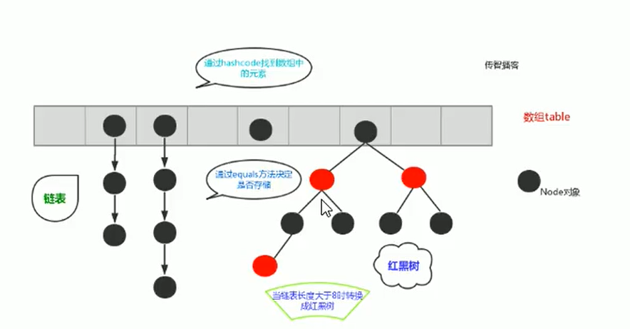
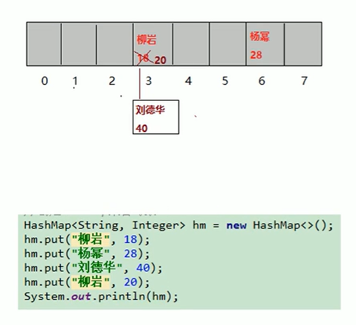
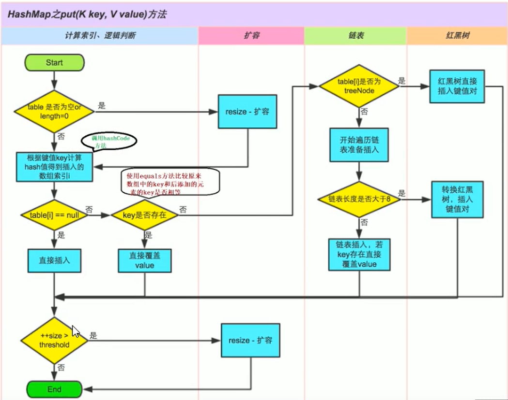
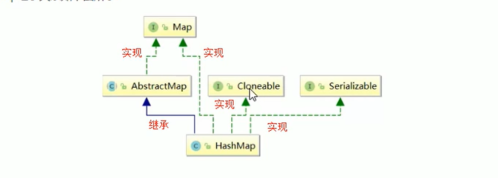
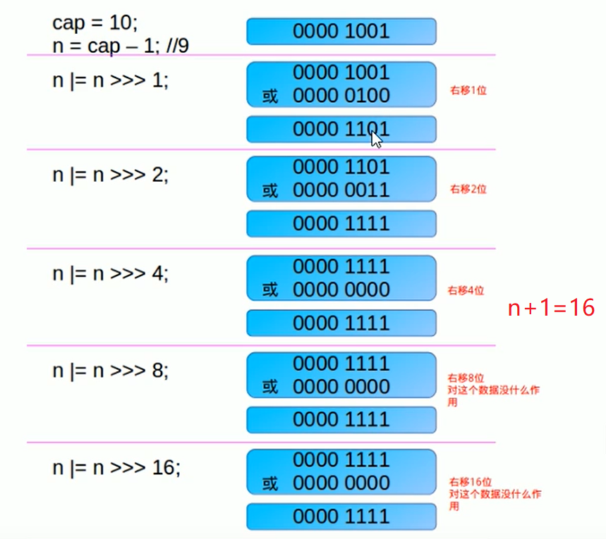
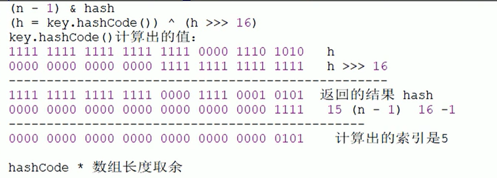
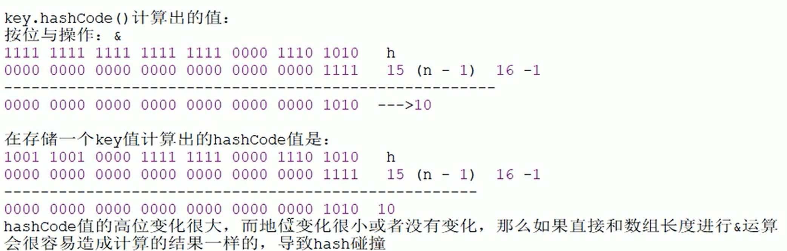
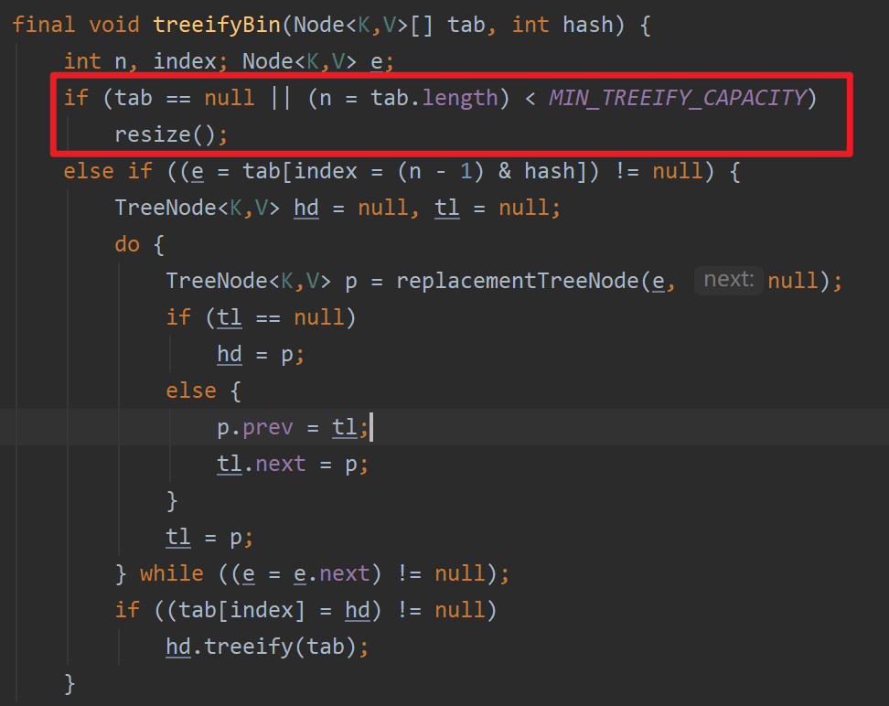
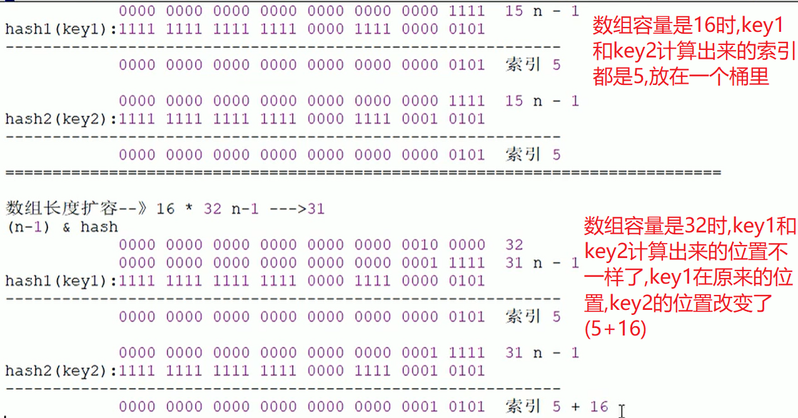

# HashMap

### 1.HashMap 集合介绍

HashMap 是基于哈希表的Map就扣实现,是以key,value的形式存在.

1. hashMap的实现不是同步的,这意味着它不是线程安全的

2. HaspMap中的映射不是有序的

3. 键和值都可以是null.但是键的null只能有一个

4. JDK1.8之前HashMa由`数组+链表`组成,数组是HashMap的主体,链表是为了解决hash冲突

5. JDK1.8之后,数据结构是`数组+链表+红黑树`在解决Hash冲突方面有了很大的变化.当`链表长度大于8`(红黑树的边界值),并且当前`数组的长度大于64`时,此时索引上的所有数据改为使用红黑树存储

   

6. 这样做的目的是为了在数组长度较小时尽量避开红黑树结构,在这种情况下变为红黑树的结构会降低效率,同时若数组长度小于64,搜索时间要快些


### 2.HashMap底层数据结构



1. 当创建HashMap集合对象的时候,在jdk1.8之前,构造方法中创建一个长度是16的`Entry[] table`

   用来存放键值对.jdk1.8之后不会在创建HaspMap对象的时候创建数组了,而是在第一次调用put方法的时候创建`Node[] table`来存储键值对

2. 假设现在像hash表中存储柳岩-18数据,根据"柳岩"这个字符串调用`hashcode`方法计算出哈希值,然后结合`数组长度`采用某种算法计算出索引值.如果计算出的索引值出的空间没有值,直接向柳岩-18键值对存进去

3. 向hash表中存储刘德华-40时,假设这个key计算出的索引值也是3,此时底层机会比较,"柳岩"和"刘德华"的hash值是否相等,如果不相等就将刘德华-40按照链表的形式链接在柳岩-18之后

4. 假设现在想hash表中存储柳岩-20数据,计算出的索引值也是3,那么此时就会出现`两者hash值和计算出的索引值`都相等的情况,此时就会将上一个柳岩的18覆盖掉

   > 其实底层做了很多,并不想我们看到的这么简单:
   >
   > 前面提到如果:**索引值相等但是hash值不相等**的情况下,底层会采用拉链法将两个节点进行链接
   >
   > 另外一种情况:如果出现**两个key的hash值和索引值相等**的情况:
   >
   > 1. 首先会调用equals方法,如果两个key 的内容完全相等,则将后者的value覆盖前者的value
   >
   > 2. 如果key的内容不相等,就按照拉链法,继续将这个键值对链接在发生碰撞的索引下
   >
   > 3. 你可能会问:如果两个key的内容不一样,两个计算出来的hash值也会相等吗?
   >
   >    答案是肯定的,不信的话可以去试一试"重地".hashcode() 和"通话".hashcode(),你会发现这两者的hash值是一样的


**面试题**

1. 哈希表底层采用什么方法计算出键值对存储的位置?还有哪些方法可以?

   * 底层采用的是key的`hashcode函数`+`无符号右移(>>>)`,`按位异或(^)`,`按位于运算(&)`,计算出索引

   * 还可以采用平方取中法,取余法,伪随机数法

   * 位运算的效率较高

2. 当两个对象的hashCode值相等时会发生什么?

   会 发生hash碰撞,若key值相等则替换旧的value.不然链接到链表后面,链表的长度超过超过阈值8就转换为红黑树存储

3. 何时会发生哈希碰撞,如何解决hash碰撞?

   只要两个元素的key值计算出来的hash值相同就会发生hash碰撞.jdk8之前采用链表的形式解决hash碰撞,jdk8之后采用链表+红黑树的方式解决hash碰撞

4. 如果两个键的hashcode值相等,如何存储键值对?

   会调用equals方法,比较两个键的内容是否相等.如果键的内容相等,后者就会将value覆盖前者的value

   如果不相等,将新的键值对存储到哈希表中,拉链法


**总结**

hash表存储过程图示




### 3.HashMap的继承关系



说明:

* Cloneable空接口,表示可以克隆,创建并返回HashMap对象的一个副本
* Serializable序列化,属于标记性接口,HashMap对象可以被序列化和反序列化
* AbstractMap父类提供了Map实现接口,以最大限度减少实现此接口需要的工作


### 4.HashMap集合类的成员

#### 4.1 成员变量

1. 序列化版本号

   ```java
    private static final long serialVersionUID = 362498820763181265L;
   ```

2. 集合的初始化容量(**必须是2的n次幂**)默认是16

   ```java
   static final int DEFAULT_INITIAL_CAPACITY = 1 << 4; // aka 16
   ```

   问题:**为什么必须是2的n次幂**

   因为HashMap底层在得到hash值计算索引的时候采用的方法是取余法:

   hash % (length - 1),这样可以降低发生hash碰撞的概率(length为2的n次幂,length-1则是一个奇数,可以降低碰撞,如果不是比如length=9,length-1等于8,很容易发生碰撞)

   > 如果给的不是2的n次幂,底层就会将HashMap的容量设置成大于输入值的最小的2的n次幂,7-->8,15-->16.通无`符号右移以及按位或运算`来得到
   >
   > ```java
   >   /**
   >      * Returns a power of two size for the given target capacity.
   >      */
   >     static final int tableSizeFor(int cap) {
   >         int n = cap - 1;//为了防止出现cap等于2的n次幂的情况
   >         n |= n >>> 1;
   >         n |= n >>> 2;
   >         n |= n >>> 4;
   >         n |= n >>> 8;
   >         n |= n >>> 16;
   >         return (n < 0) ? 1 : (n >= MAXIMUM_CAPACITY) ? MAXIMUM_CAPACITY : n + 1;
   >     }
   > ```
   >
   > 
   >
   > 每次都将下一位变成,最终的效果是变成连续的几个1,然后+1

3. 负载因子

   ```java
   static final float DEFAULT_LOAD_FACTOR = 0.75f;
   ```

   当数组中的元素数量达到负载因子*数组长度时,会进行扩容.比如,负载因子为0.75,数组容量是16,当数组长度达到12时就会扩容为32

4. 集合最大容量

   ```java
   static final int MAXIMUM_CAPACITY = 1 << 30;//2^30
   ```

5. 当链表的长度大于8时会转换为红黑树(1.8新增)[并且数组长度>64]

   ```java
   static final int TREEIFY_THRESHOLD = 8;
   ```

   **面试题**:为什么链表的长度大于8时会转换为红黑树?(时间效率和空间效率的综合考虑)

   1. 因为红黑树的节点占得空间比链表节点多,因此在链表长度大于8时会转换为红黑树以提高查找效率.综合从空间和时间效率来考虑.因为8符合泊松分布,当超过8时,概率已经很小了,所以选择了8作为门限值
   2. 红黑树的平均查找长度是log(n),链表的平均查找长度是n/2.当n=8,时,红黑树的平均查找长度是3,链表的平均查找长度是4,时间效率得到提升.
   3. 当n=6时,红黑树的平均查找长度等于2.6,链表的平均查找长度是3,虽然快了一点点,但是在删除数据时红黑树会进行复杂的左旋右旋操作来使得红黑树重新达到平衡,综合来看当n=6时,红黑树的时间效率不见得就比链表高,因此没有必要将链表装换为红黑树

6. 当链表的值小于6时则会从红黑树退化为链表

   ```java
   //红黑树的节点个数小于6时红黑树会退化为链表
   static final int UNTREEIFY_THRESHOLD = 6;
   ```

7. 当Map中数组的长度超过这个值时,表中的桶才进行树形化,否则当桶中数据太多时只会扩容,而不是树形化.为了避免避免进行扩容以及树形化选择的冲突,这个值不能小于`4*TREEIFY_THRESHOLD(8)`

   ```java
   static final int MIN_TREEIFY_CAPACITY = 64;
   ```

8. table用来初始化(必须是2个n次幂)(重点)

   ```java
   transient Node<K,V>[] table;
   ```

   jdk8之前数组类型是`Entry<K,V>`类型,从jdk8之后是`Node<K,V>`.两个实现了同一个接口`Map.Entry<K,V>`

9. 用来存放缓存

   ```java
   //存放具体元素的集合
   transient Set<Map.Entry<K,V>> entrySet;
   ```

10. HashMap中元素的个数,不是table的长度

    ```java
    transient int size;
    ```

    size是HashMap中K-V的实时数量,不是数组table的长度

11. 用来记录HashMap的修改次数

    ```java
    //每次扩容和更改map结构的计数器
    transient int modCount;
    ```

12. 用来调整大小,下一个扩容容量的值的门限计算方式(`容量*负载因子`)

    ```java
    int threshold;
    ```

13. 哈希表的加载因子(重点)

    ```java
    final float loadFactor;
    ```

    * HashMap的实时加载因子=size/capacity(默认0.75f不建议改).综合考虑到数组利用率又考虑链表不要太多
    * 加载因子太小,会导致数组容量还没有被充分即扩容,会导致频繁的扩容
    * 加载因子太大,可能会导致严重的哈希碰撞,而使得链表长度过大,导致查找效率降低
    * 当size>threshold(capacity*loadFactor),扩容.扩容后的容量是原来的两倍

#### 4.2 HashMap的构造方法

1. 构造一个空的HashMap,默认的初始容量是16和默认的加载因子(0.75)

   ```java
   public HashMap() {
       this.loadFactor = DEFAULT_LOAD_FACTOR; // 初始化的时候没有创建数组
   }
   
   ```

2. 构造一个具有指定的初始容量和默认负载因子(0.75)的HashMap

   ```java
   public HashMap(int initialCapacity) {
       this(initialCapacity, DEFAULT_LOAD_FACTOR);
   }
   ```

3. 构造指定容量和指定负载因子的HashMap

   ```java 
   public HashMap(int initialCapacity, float loadFactor) {
       if (initialCapacity < 0)
           throw new IllegalArgumentException("Illegal initial capacity: " +
                                              initialCapacity);
       if (initialCapacity > MAXIMUM_CAPACITY)
           initialCapacity = MAXIMUM_CAPACITY;
       if (loadFactor <= 0 || Float.isNaN(loadFactor))
           throw new IllegalArgumentException("Illegal load factor: " +
                                              loadFactor);
       this.loadFactor = loadFactor;
       this.threshold = tableSizeFor(initialCapacity);
   }
   ```

   >  this.threshold = tableSizeFor(initialCapacity); 这句不是bug,在put方法中会对次扩容门限值进行修改,变为capacity*loadFactor

4. 存map的构造方法

   ```java
   public HashMap(Map<? extends K, ? extends V> m) {
           this.loadFactor = DEFAULT_LOAD_FACTOR;
           putMapEntries(m, false);
       }
   
       /**
        * Implements Map.putAll and Map constructor.
        *
        * @param m the map
        * @param evict false when initially constructing this map, else
        * true (relayed to method afterNodeInsertion).
        */
       final void putMapEntries(Map<? extends K, ? extends V> m, boolean evict) {
           int s = m.size();
           if (s > 0) {
               if (table == null) { // pre-size
                   float ft = ((float)s / loadFactor) + 1.0F;
                   int t = ((ft < (float)MAXIMUM_CAPACITY) ?
                            (int)ft : MAXIMUM_CAPACITY);
                   if (t > threshold)
                       threshold = tableSizeFor(t);
               }
               else if (s > threshold)
                   resize();
               for (Map.Entry<? extends K, ? extends V> e : m.entrySet()) {
                   K key = e.getKey();
                   V value = e.getValue();
                   putVal(hash(key), key, value, false, evict);
               }
           }
       }
   ```

   > **面试题**: float ft = ((float)s / loadFactor) + 1.0F;这句为什么要加1???
   >
   > 加1相当于s/loadFactor向上取整,这样做能够获取更大的扩容容量,减少resize的调用
   >
   > 假设数组容量是8,此时size为6,如果不加1,6/0.75=8,是2的3次幂,那么新数组的大小就是8(tableSizeFor函数),这样的扩容杯水车薪,如果加1,那么在调用tableSizeFor函数后,新数组的容量就会变成16了,这样会更充足

#### 4.3 HashMap的成员方法

##### 4.3.1 put方法

1. 先通过hash值计算出key映射到哪个桶
2. 如果桶上没有hash碰撞,则直接插入
3. 如果桶上出现冲突就解决冲突
   * 如果该桶采用红黑树处理冲突,则调用红黑树的方法插入数据
   * 否则采用传统的链式方法插入,如果链的长度达到临界值就把链表转换成红黑树
   
   > jdk8以前采用的是头插法(会产生死链的问题),jdk8以后采用的是尾插法
4. 如果桶中存在重复的键,则为该键替换新值value
5. 如果size大于阈值threshold,则进行扩容

```java
public V put(K key, V value) {
    return putVal(hash(key), key, value, false, true);
}

static final int hash(Object key) {
    int h;
    return (key == null) ? 0 : (h = key.hashCode()) ^ (h >>> 16);//计算出hash值再向右移动16位
}
```

> 上面显示了HashMap是支持存储null键的,当键为null时,其hash值为0
>
> 上面也解释了为什么HashMap的长度是2的n次幂,其底层实现很巧妙,通过`hash&(table.length - 1)`即按位与的操作达到和取余的效果(`hash%table.length`),但是按位与运算具备更高的效率.比如n%32 = n&(32-1)


计算索引的过程:



简单来说就是高16位bit不变,低16位和高16位做了一个异或

**问题:为什么要这么做 ????[为了避免hash冲突]**

如果当n即数组长度很小,假设值16的话,那么n-1即为--->1111,这样的值和hashCode()直接做按位与操作.实际上只使用了hash值的后四位,如果当hash值的高位变化很大,低位变化很小,就很容易产生hash冲突.所以这里要把高位和低位都利用起来,从而解决了这个问题



1. 分析putValue方法的过程:

   先比较hash,如果hash值不相等直接存在桶中.如果hash值相等,再比较key的内容,如果key的内容相等,就把旧的value覆盖;如果key的内容不相等,就链接在链表的后面,随后判断链表长度是否满足转换为红黑树的条件,如果满足(链表长度>8)就执行`treeifBin(tab,hash)`方法,将链表转换成红黑树

#### 4.3.2分析`treeifBin(tab,hash)`方法

```java
final void treeifyBin(Node<K,V>[] tab, int hash) {
    int n, index; Node<K,V> e;
    if (tab == null || (n = tab.length) < MIN_TREEIFY_CAPACITY)
        resize();
    else if ((e = tab[index = (n - 1) & hash]) != null) {
        TreeNode<K,V> hd = null, tl = null;
        do {
            TreeNode<K,V> p = replacementTreeNode(e, null);
            if (tl == null)
                hd = p;
            else {
                p.prev = tl;
                tl.next = p;
            }
            tl = p;
        } while ((e = e.next) != null);
        if ((tab[index] = hd) != null)
            hd.treeify(tab);
    }
}
```

> 其实执行`treeifBin(tab,hash)`方法并不会直接将链表转换为红黑树,在这个方法内部还增加了对数组容量的判断,如果数组的容量小于64则执行扩容操作,将数组容量扩大为原来的2倍.如果数组的容量大于64,则此时链表转换为红黑树的两个条件均满足(链表长度>8,数组容量>64),执行转换操作(`treeify函数`)
>
> 

#### 4.3.2 扩容方法_resize

1. 什么时候需要扩容?
   * 当HashMap中的元素个数超过数组大小loadFactor时,将数组容量扩大为原来的两倍,然后重新计算每个元素在数组中的位置,这是一个非常耗性能的操作
   * 当HashMap中的其中一个链表中的对象个数达到了8个,如果此时数组长度没有达到64,那么HashMap会先扩容.如果已经达到了64,那么这个链表就会变成红黑树,节点类型由node变成TreeNode类型.如果树的节点个数小于6,就会把红黑树变成链表

2. HashMap扩容什么?

   随着扩容开始,会伴随着一次重新hash分配,并且会遍历hash表中所有的元素,是非常耗时的.
   
   HashMap中使用的`resize`方法十分巧妙.每次扩容后新的位置要么是原来的位置,要么是`原来的位置+oldcapacity`所对应的索引位置.那么resize函数是如何做到的呢?
   
   
   
   

> 因此,程序只需要检查key的hash值的bit位即可.比如,扩容之前容量是16,扩容之后的容量是32,32-1=31,31的二进制表示是11111,因此只需要检查hash值bit位的第5位是0还是1即可,如果是0,&操作之后,索引位置仍然保持不变,如果是1,则索引位置+16(oldcapacity)=新的索引位置.不需要重新计算hash值了

#### 4.3.3 删除方法(remove)

先找到元素的位置,如果是链表就遍历链表找到节点然后删除,如果是红黑树.就遍历树,删除节点后再左旋右旋使树保持平衡.remove方法内部调用的是`removeNode`方法

#### 4.3.4 get方法

先判断是否是链表第一个元素,如果是直接取出.如果不是,判断是链表节点还是树节点,如果是链表节点就查找链表,时间复杂度o(n),如果是红黑树就查找红黑树,时间复杂度o(logn)

#### 4.3.5 遍历HashMap

```java
 //遍历hash的方式-----方式1
private static void method(HashMap<String, Integer> hm) {
    Set<String> keys = hm.keySet();
    for (String key : keys) {
        System.out.println(key);
    }

    Collection<Integer> values = hm.values();
    for (Integer value : values) {
        System.out.println(value);
    }
}
```

第二种方式:使用迭代器

```java
private static void method_1(HashMap<String, Integer> hm) {
    Set<Map.Entry<String, Integer>> entries = hm.entrySet();
    for (Iterator<Map.Entry<String, Integer>> it = entries.iterator();it.hasNext();){
        Map.Entry<String, Integer> entry = it.next();
        System.out.println(entry.getKey()+"---------"+entry.getValue());
    }
}
```

第三种方式:通过get方法(不建议使用,因为使用了两次迭代器)

```java
private static void method_2(HashMap<String, Integer> hm) {
    Set<String> keys = hm.keySet();
    for (String key : keys) {
        System.out.println(key+"---------"+hm.get(key));
    }
}
```

第四种方式:使用map接口中的默认方法

```java
private static void method_3(HashMap<String, Integer> hm) {
    hm.forEach((key,value)->{
        System.out.println(key+"====="+value);
    });
}
```

### 5.注意

1. 在创建HashMap时最好指定HashMap的容量

   如果你清楚将要在HashMap中存储的数据量,最好指定HashMap的容量.因为HashMap的默认容量是16,如果你要存储的数据很多,那么HashMap就会经历不断的resize,这样是非常消耗性能的

   > 那么我们如果知道了我们需要存储的元素的个数,HashMap的初始容量应该如何设呢?
   >
   > **initialCapacity = (需要存储的元素个数/负载因子) +1**,这个initialcapacity会被变成大于这个值的最小的2的幂次方

2. 使用entrySet方式遍历HashMap而不是keySet方式

   KeySet方式相当于遍历了两次,浪费时间