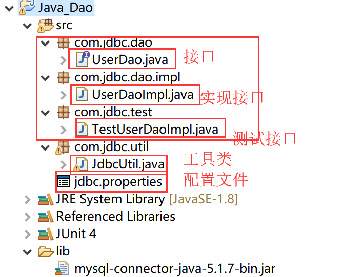

# JDBC
  *JAVA Database Connectivity,java版的数据库连接,一种数据库访问接口规范.由于数据库种类较多,并且java语言使用比较广泛,sun公司提供了一种规范,让其他数据库提供商提供数据库底层的访问规则,jdbc程序只需要使用sun公司提供的jdbc驱动即可*

  ## JDBC入门
  > **步骤**
  >
  > 1. 注册驱动
  > 2. 建立和数据库的连接
  > 3. 创建statement对象,用于和数据库打交道
  > 4. 执行简单的查询操作,得到结果集
  > 5. 遍历数据库中的每一条记录
  > 6. 释放数据库资源 resultSet,statement,connection

```java
示例:
try {
        //1.注册驱动
        DriverManager.registerDriver(new com.mysql.jdbc.Driver());
        //2.建立连接
        Connection conn = DriverManager.getConnection("jdbc:mysql://localhost/student", "root", "1234");
        //3.创建statement对象,用于和数据库打交道
        Statement st = conn.createStatement();
        //4.执行查询,得到结果集
        String sql = "select * from student1";
        ResultSet rs = st.executeQuery(sql);
        //5.遍历每一条记录
        while(rs.next()){
            int id = rs.getInt("id");
            String name = rs.getString("name");
            int age = rs.getInt("age");
            System.out.println("id="+id +"   "+ "name="+name +"   "+ "age="+age);
        }
        //6.释放数据库资源
        rs.close();
        st.close();
        conn.close();
    } catch (SQLException e) {
        // TODO Auto-generated catch block
        e.printStackTrace();
    }
}
```
> *注释*:  
>  快捷键:control+1,根据方法创建对象

### 代码结构优化
* 1.资源释放类代码的整合
```java
  //工具类,释放数据库资源
public class JdbcUtil {
	public static void Release(Connection conn,ResultSet rs,Statement st){
		CloseRs(rs);
		CloseSt(st);
		CloseConn(conn);
		
	}
	private static void CloseRs(ResultSet rs) {
		try {
			if(rs != null){
				rs.close();	
			}
		} catch (SQLException e) {
			e.printStackTrace();
		}finally{
			rs = null;
		}
	}

	private static void CloseSt(Statement st) {
		try {
			//防止出现空指针异常
			if(st != null){
				st.close();		
			}
		} catch (SQLException e) {
			e.printStackTrace();
		}finally{
			st = null;
		}
	}

	private static void CloseConn(Connection conn) {
		try {
			if(conn != null){
				conn.close();
			
			}
		} catch (SQLException e) {
			e.printStackTrace();
		}finally{
			conn = null;
		}
	}

}
```
* 2.驱动注册代码的解耦合,防止出现注册别的数据库的情况的出现
```java
  Class.forname("com.mysql.jdbc.Driver");
```
>  *注释*:  
> **jdbc4之后就不用手动去注册驱动了,底层已经写好了**

* 3.将数据库连接时用到的配置信息解耦合,提取出来作为一个单独的properties文件,以后如果连接的别的数据库需要修改配置信息,直接修改properties文件即可,不需要再改动源码,使用一个静态代码块在类初始化的时候就去读取并解析配置文件袋额信息
```java
static String driverClass = null;
static String url = null;
static String name = null;
static String password = null;

//静态代码块,用于初始化数据库连接信息
static{
    try {
        //创建属性配置对象
        Properties properties = new Properties();
//			InputStream is = new FileInputStream("jdbc.properties");
        InputStream is = JdbcUtil.class.getClassLoader().getResourceAsStream("jdbc.properties");
        //加载配置到流中
        properties.load(is);
        
        //解析配置文件
        driverClass = properties.getProperty("driverClass");
        url = properties.getProperty("url");
        name = properties.getProperty("name");
        password = properties.getProperty("password");
    } catch (Exception e) {
        e.printStackTrace();
    }
}
```

```txt
jdbc.properties内容如下:  
driverClass = com.mysql.jdbc.Driver
url = jdbc:mysql://localhost/student
name = root
password = 1234
```

### 数据库CRUD(增加,读取,更新,删除) sql语句
* insert
  INSERT TO student1 (NAME,age) VALUES('liqiang',22 )
* delete
  DELETE FROM student1 where id=1   
* query
  SELECT * FROM student1
* update
  UPDATE student SET age=23 WHERE id=1

> *注释*:  
在数据库管理软件中写的sql语句中的关键字全部都是大写,但是在java程序中写的sql语句中的关键字都是小写
### 使用单元测试,测试代码
1. 定义一个类,TestXXX,里面定义方法testXXX
2. 添加Junit的支持
> 右键工程-->add Library-->Junit-->Junit4
3. 在方法的上面加上注解@Test
```java
@Test
public TestQuery(){
    ...

}
```
4. 光标选中,然后执行单元测试.或者打开outline视图打开方法,右键执行
> *java中的sql操作:*  
> **查询:**  
> st.executeQuery("select * from student1");  
> **更新(包括增加,删除和修改):**
> st.executeUpdata("insert into student1 values(null,'aobama',50)");//返回被影响的行数

### Dao 模式
*Data Access Object,数据访问对象,将生命与实现分开*  
1. 声明一个dao接口,里面声明数据库的访问规则
2. 新建一个dao的实现类,具体实现sql语句
3. 使用测试类中的测试方法进行测试  
    

> *Statement的安全问题(一)*  
**问题描述:** 在查询语句的后面加上"or 1=1 "就会显示登陆成功,尽管登陆登录名还有登陆密码是乱写的  
**原因:** Statement执行,其实是拼接sql语句.先拼接sql语句,然后再一起执行.如果变量里面带有数据库的关键字,一并当成关键字而不认为是普通的字符串  
**解决:** 使用PreStatement对象替代Statement对象.问好对应的索引传进来的都作为参数而不是字符串
```java
public void login(String username, String password) {
		Connection conn = null;
		Statement st = null;
		ResultSet rs = null;
		try {
			//1.获取连接对象
		    conn = JdbcUtil.getConn();
		    String sql = "select * from t_user where username=? and password = ?";
			//2.创建Prestatement对象,先对sql语句作预处理
			PreparedStatement ps =conn.prepareStatement(sql);
			
			//第一个?和第二个?分别设置为username和password
			ps.setString(1, username);
			ps.setString(2, password);
			//3.执行查询语句
			rs = ps.executeQuery();
			if(rs.next()){
				System.out.println("登录成功!");
			}else{
				System.out.println("登录失败!");
			}
		} catch (Exception e) {
			e.printStackTrace();
		}finally{
			JdbcUtil.Release(conn, rs, st);
		}		
	}
```
> *注释:*     
> PreparedStatement相比较Statement,预先处理给定的sql语句,对其进行语法检查,在sql语句中使用?作为占位符代表后序传递进来的变量,后面传递进来的变量将会被看成是字符串而不是关键字
```java
示例:
String sql = "delete from t_user where id=?"
Preparedment ps = conn.prepareStatement();
ps.setInt(1,2);//第一个问号的索引就是1,依次递增
```