# Redis

## 一.入门

Redis是完全开源免费的,遵守BSD协议,是一个高性能的NOSQL的key-value型数据库,支持多种语言的API.NOSQL表示非关系型数据库,即数据与数据之间是没有任何关联的.

> 传统的关系型数据库在应付web2.0网站,特别是超大规模和高并发的SNS类型的web2.0纯动态网站已经显得力不从心,暴露出很多难以克服的问题.因此非关系型数据库发展迅速.

### 1.NoSQL的特点

1. 数据库种类繁多
2. 大数据量,高性能
3. 灵活的数据模型
4. 高可用

### 2.NoSQL数据库的四大分类

1. key-value存储数据库

   主要用于处理大量数据的高访问负载.Redis[直接操作内存]

2. 列存储数据库

   分布式文件系统

3. 文档型数据库

   web应用

4. 图形数据库

   社交网络

### 3.Redis配置

* 配置为守护进程

  **daemonize no** **修改为 daemonize yes**               

* **bind 127.0.01** **注释掉**         

* **requirepass** **设置密码**          

  > 登录 : ./redis-cli -h ip地址 -p 端口号 -a 密码

### 4.关闭redis

客户端登录后,在命令窗口输入shutdown,服务端就会关闭,客户端退出后,客户端关闭


### 5.redis 的基本命令

1. key命令

   * DEL key

     在key存在的时候删除key.删除成功,返回删除数量

   * DUMP key

     序列化给定key,并返回被序列化的值

   * EXISTS key

     检查给定key是否存在

   * EXPIRE key seconds

     设置key的过期时间以毫秒级

     **应用场景**:

     限时优惠活动,网站数据缓存,定时更新数据,手机验证码,限制网站访问频率

   * TTL key

     以秒为单位,返回给定key的剩余生存时间.返回值-1,表示该key永远不会消失.返回-2,表示key已经无效了.

   * PTL key

     以毫秒为单位返回key的剩余过期时间

   * persist key

     将key永久保存

   * key pattern

     查找所有符合给定模式的key.pattern是通配符.

     *代表所有

     ?代表一个字符

   * random key 

     从当前数据库中随机返回一个key

   * rename key newkey

     修改key的名称

   * move key db

     将key从一个数据库移动 到另一个数据库

   * type key

     返回key存储的value的数据类型

   * select index

     选择当前使用的数据库

### 6.key的命名规范

最长不要超过1024字节

最好是:user:123:password


## Redis数据类型

redis支持5中数据类型:string(字符串),hash(哈希),list(列表),set(集合),zset(sorted set:有序集合)等

1. string

   string是redis最基本的类型,一个key对应一个value.

   string类型是二进制安全的.redis 的string 可以包含任何数据,比如jpg图片或者序列化的对象

   二进制安全:传输数据时,保证二进制数据的安全,不憋篡改,破译


## String命令

### 1.赋值语法

* set key value

  设置key的值,允许覆盖

* **SETNX key value**(**很重要:解决分布式锁的问题**)

  只有在key不存在时设置key的值.如果key已经存在,则赋值失败

* MSET key value

  获取指定key的值,如果key不存在,返回nil.如果key存储的值不是字符串类型,返回一个错误

### 2.取值语法

* get key_name

  获取指定key的value

* getrange key start end

  获取value的子字符串

* getbit key offset

  获取value指定偏移量的内容

* mget key

  获取一个或多个给定key的值

* **getset key value**

  设定key的值 并 返回key的旧值

* strlen key

  获取value的长度

### 3.自增/自减

* **incr key**

  将value的值增1.如果key不存在,namekey的值会首先被赋值为0 ,在增1

* **incrby key** 增量值

* **decr key**

* **decrby key** 减值


### 4.字符串拼接

append key value


### String命令的应用场景

1. 保存单个字符串或json字符串数据
2. 可以把图片数据作为字符串来 存储
3. 计数器.很多网站利用redis的这个特性事项业务上的统计计数


## hash

Redis中的hash是一个string类型的field和value的映射表.hash特别适合用于存储对象,可以看成是具有key和value的MAP容器,非常适合用于存储对象的信息,该类型的数据仅占用很少的磁盘空间.

### hash的常用命令

1.  赋值语法

   * hash key field value

     为指定的key设定field和value

   * hmset key field value ....

     同时将多个field-value对设置到哈希表中(将一个对象的所有属性值及其所对应的值设置到哈希表中)

2. 取值语法

   * hget key field

     获得存在hash中的值,根据field得到value

   * hmget key field

     获取key所有给定字段的值

   * hgetall key

     返回hash表中所有的字段和值

   * hkeys key

     获取所有哈希表中的字段

   * hlen key

     获取哈希表中字段的数量

3. 删除语法

   * hdel key field

     删除一个或者多个hash表字段

   * hdel key field...

     将一个key对应的所有字段删除,这个key就会被redis自动删除

   * del key

     删除一个hash

4. 其他语法

   * hsetnx key field value

     只有在字段field不存在时,设置哈希表字段的值

   * hincrby key field increment

     为哈希表key中的指定字段的浮点数值加上增量increment

   * hexists key field

     查看哈希表key中,指定的字段是否存在


### 为什么不用string存储对象?

 第一种方式将用户ID作为查找key,把其他信息封装成一个对象以序列化的方式存储，这种方式的缺点是，增加了序列化/反序列化的开销，并且在需要修改其中一项信息时，需要把整个对象取回，并且修改操作需要对并发进行保护，引入CAS等复杂问题。

> key : id    value:json串

  第二种方法是这个用户信息对象有多少成员就存成多少个key-value对儿，用用户ID+对应属性的名称作为唯一标识来取得对应属性的值，虽然省去了序列化开销和并发问题，但是用户ID为重复存储，如果存在大量这样的数据，内存浪费还是非常可观的。

> user:1:name zhangsan
>
> user:1:age  16
>
> user:2:name lisi
>
> user:2:age  36


### Jedis

#### 一.简单使用

导入依赖

```xml
<!-- Redis -->
<dependency>
    <groupId>redis.clients</groupId>
    <artifactId>jedis</artifactId>
    <version>2.4.2</version>
</dependency> 
```

```java
import redis.clients.jedis.Jedis;
public class RedisDemo {
	public static void main(String[] args) {
		String host = "192.168.1.102";
		int port = 6379;
		Jedis jedis = new Jedis(host, port);
		//设置连接密码
		jedis.auth("zh");
		System.out.println(jedis.ping());
	}
}
```


#### 二.jedis连接池

```java
import redis.clients.jedis.Jedis;
import redis.clients.jedis.JedisPool;
import redis.clients.jedis.JedisPoolConfig;

/**
 * 创建redis连接池并进行配置
 * @author 张恒
 *
 */
public class RedsiPoolUtils {
	private static JedisPool pool;
	static{
		//1.设置连接池的配置信息
		JedisPoolConfig poolConfig = new JedisPoolConfig();
		poolConfig.setMaxTotal(5);//最大连接数
		poolConfig.setMaxIdle(1);//最大空闲数
		String host = "192.168.1.102";
		int port = 6379;
		//创建连接池
		pool = new JedisPool(poolConfig, host, port);
	}
	
	public static Jedis getJedis(){
		//获取一个连接
		Jedis jedis = pool.getResource();
		//设置连接密码
		jedis.auth("zh");
		return jedis;
	}
	
	public void close(Jedis jedis){
		jedis.close();
	}
}
```


###  RedisTemplate

spring data 提供了 redistemplate模板,它封装了redis连接池管理逻辑,业务代码无需关心获取,释放连接逻辑.spring redis 同时提供支持jedis,客户端操作

自定义连接池配置,并创建jedis连接工厂,将配置注入到连接工厂.随后将连接工厂 注入到模板中,生成模板bean

```xml
<?xml version="1.0" encoding="UTF-8"?>
<beans xmlns="http://www.springframework.org/schema/beans"
	xmlns:xsi="http://www.w3.org/2001/XMLSchema-instance"
	xmlns:context="http://www.springframework.org/schema/context"
	xmlns:aop="http://www.springframework.org/schema/aop"
	xmlns:tx="http://www.springframework.org/schema/tx"
	xsi:schemaLocation="http://www.springframework.org/schema/beans 
	http://www.springframework.org/schema/beans/spring-beans.xsd
	http://www.springframework.org/schema/context
	http://www.springframework.org/schema/context/spring-context.xsd
	http://www.springframework.org/schema/aop
	http://www.springframework.org/schema/aop/spring-aop.xsd
	http://www.springframework.org/schema/tx 
	http://www.springframework.org/schema/tx/spring-tx.xsd">
	
	<!--1.配置连接池的信息  -->
	<bean id="jedisPoolConfig" class="redis.clients.jedis.JedisPoolConfig">
		<!--最大连接数  -->
		<property name="maxTotal" value="50"></property>
		<property name="maxIdle" value="5"></property>
	</bean>
	
	<!--spring整合jedis  -->
	<bean id="jedisConnectionFactory" class="org.springframework.data.redis.connection.jedis.JedisConnectionFactory">
		<property name="password" value="zh"></property>
		<property name="port" value="6379"></property>
		<property name="hostName" value="192.168.1.106"></property>
		
		<!--自定义连接池配置  -->
		<property name="poolConfig" ref="jedisPoolConfig"></property>
	</bean>
	
	<!--得到RedisTemplate模板  -->
	<bean id="redisTemplate" class="org.springframework.data.redis.core.RedisTemplate">
		<property name="connectionFactory" ref="jedisConnectionFactory"></property>
	</bean>
	
	<!--service层的配置文件配置注解  -->
   <context:component-scan base-package="com.itheima.service"></context:component-scan>
	
</beans> 

```

测试:

```java
public class RedisTemplateTest {
	@Test
	public void Demo1(){
		ClassPathXmlApplicationContext ctx = new ClassPathXmlApplicationContext("spring_redis.xml","spring_service.xml");
		UserService userService = ctx.getBean(UserService.class);
		String key = "applicationName";
		String value = userService.getValueByKey(key);
		System.out.println(value);
	}
}
```

> 在上述操作中,我们设置的key是applicationName,但是在redis数据库中存放的却是一长串字母+applicationName.这是因为jdk在存入数据库中的时候会进行一个默认的序列化的操作,会导致这种情况.为了避免这种情况的发生.我们需要在配置文件中配置自己的序列化操作


## Redis集群

* 主从复制
* 哨兵模式
* 集群


#### 一. 主从复制

互联网三高架构:

* 高并发
* 高性能
* 高可用:没有宕机的时间/服务器运行总时间

1. 主从复制简介

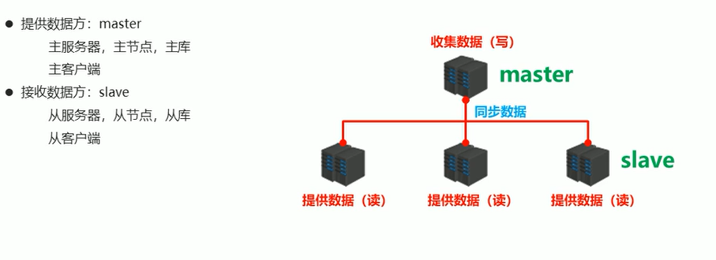

将master中的数据及时有效的复制到slave中

特征:一个master可以拥有多个slave,一个slave只对应一个master

职责:

* master:
  * 写数据
  * 执行写操作,将出现变化的数据自动同步到salve中
  * 读数据
* slave:
  * 读数据
    * 写数据(禁止)

主从复制的作用;

1. 读写分离,提高服务器的读写负载能力
2. 负载均衡:基于主从结构,配合读写分离,由slave分担master负载,并根据需求的变化,改变slave的数量,通过多个从节点分担数据读取负载,大大提高Redis服务器的并发量与数据吞吐量
3. 故障恢复:当master出现问题时,由slave提供服务,实现快速的故障恢复
4. 数据冗余:实现数据热备份
5. 高可用:基于主从复制,构建哨兵模式与集群,实现Redis的高可用方案


2. 主从复制工作流程

   * 建立连接阶段(slave-->master)
   * 数据同步阶段(master-->slave)
   * 命令传播阶段(master-->slave)

   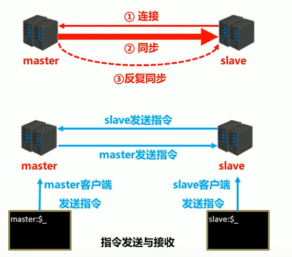

1. 建立连接阶段

   * 设置master的地址和端口,保存master信息

   * 建立 socket连接

   * 发送ping指令(定时发送)

   * 身份验证

   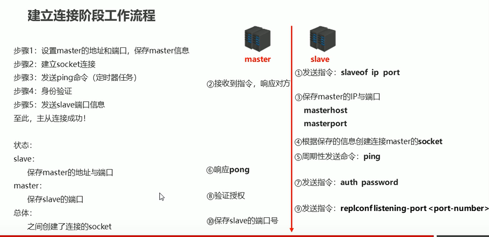

   

   * 相关命令:

     第一种:客户端发送命令:slaveof masterip masterport

     第二种:启动服务器时: redis-server -slaveof masterip masterport

     第三种:服务器配置:slaveof masterip masterport

     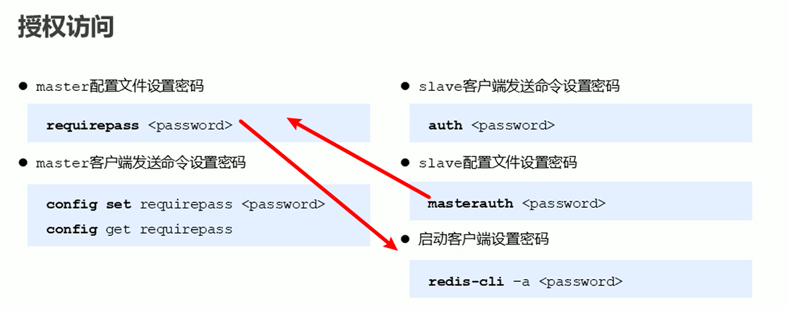

2. 数据同步阶段工作流程

   * 在slave初次连接master后,复制master中的所有数据到slave中
   * 将slave 的数据库状态更新成master当前的数据库状态

   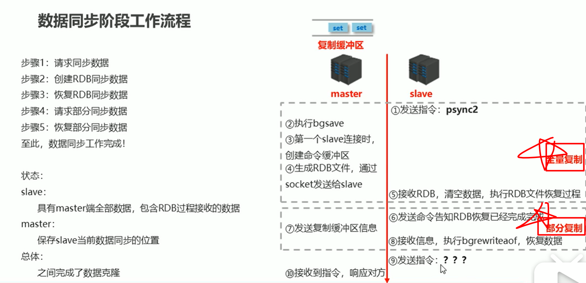

全量复制:复制从连接到master那一刻起master中的全部数据

部分复制:RDB过程中master中新增的数据

注意事项1:

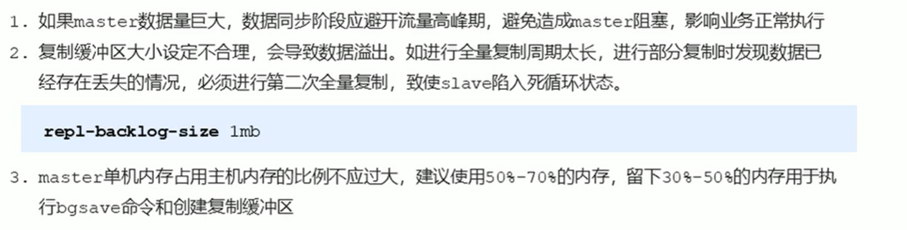


注意事项2:

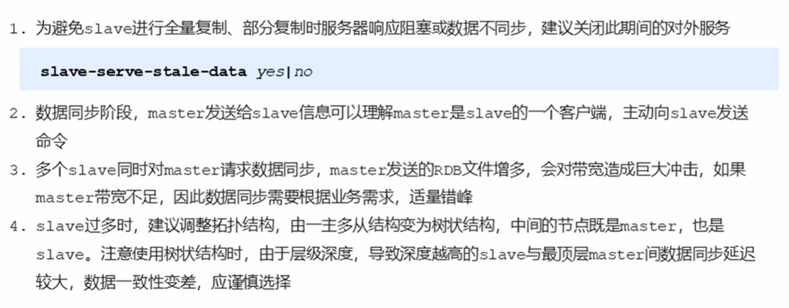


3. 命令传播阶段
   * 当master数据库的状态被修改后,导致主从服务器的数据库状态不一致,此时需要让主从数据同步到一样的状态,同步的过程称为命令传播
   * master将接受到的数据变更发送给slave,slave接受命令后执行命令


4. 相关概念

   * 服务器运行ID

     服务器运行ID是每一台服务器每次运行的身份识别码,一台服务器多次运行可以生成多个识别码.运行ID由40位字符组成,是一个随机的十六进制字符.运行ID被用于在服务器之间进行传输,识别身份.如果想要两次操作均对同一台服务器进行,必须每次携带对应的运行ID,用于对方的身份识别

   * 复制缓冲区

     用于存储服务器执行过的命令,每次传播命令,master都会将传播命令记录下俩,并存储在复制缓冲区.底层是一个队列,用于存储服务器执行过的命令,每次传播命令,master都会将传播的命令记录下来,并存储在复制缓冲区

     * 由来:每台服务器启动时,如果开启了AOF或被连接成为master节点,即创建复制缓冲区
     * 作用:用于保存master收到的所有指令(**仅仅接受影响数据变更的指令**)
     * 偏移量:描述复制缓冲区中的指令字节的位置(master记录发送给所有slave的指令字节对应的位置,slave记录接受master发送过来的指令字节对应的位置)
     * 作用:比对和同步master和slave的数据
     
     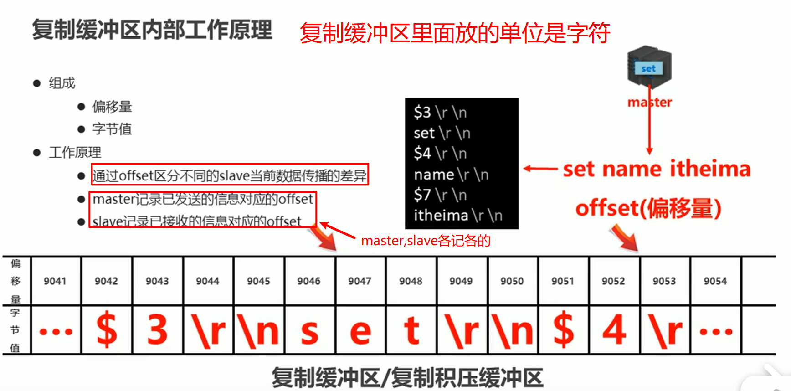


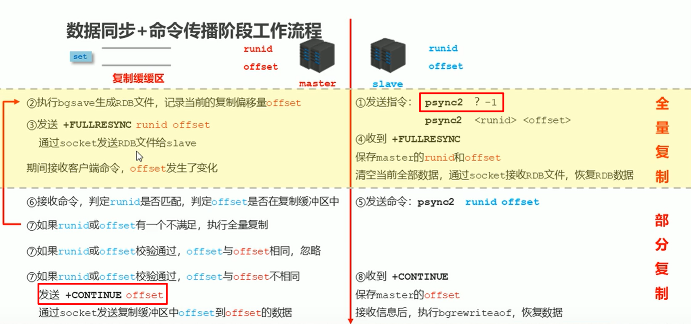


**心跳机制**

进入命令传播阶段,master与slave之间需要进行信息交换,实现双方连接保持在线

master心跳:

* 指令:PING
* 作用:判断slave是是否在线

slave心跳:

指令:REPLCONF ACK{offset}

作用:汇报slave自己的复制偏移量,获取最新的数据变更指令

作用2:判断master是否在线

注意事项:

* 当slave多数掉线,或者延迟较高时,master为保障数据稳定性,将拒绝所有信息同步操作
* slave数量少于2个.或者所有的slave的延迟高于10秒时,将强制关闭master写功能,停止数据同步
* slave数量由slave发送REPLCONF ACK命令作确认
* slave延迟由slave发送REPLCONF ACK 确认

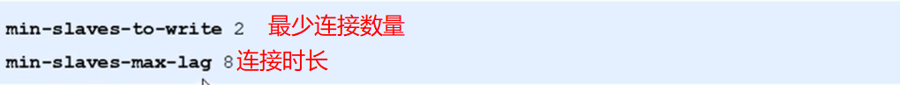


完整工作流程

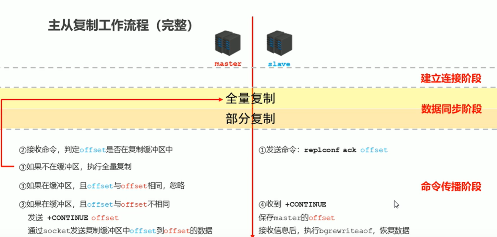


**主从复制的常见问题:**

1. 频繁的全量复制

   网络环境不佳

   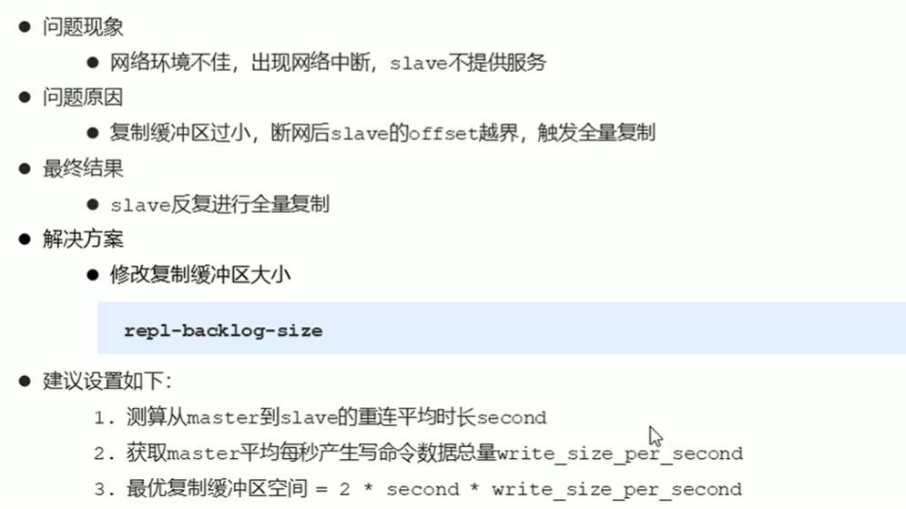

   master宕机

2. 频繁的网络中断

   设置合理的超时时间

3. 数据不同步

   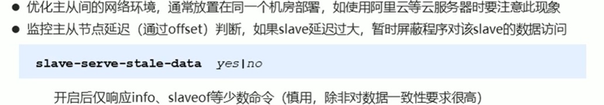


### 哨兵模式

哨兵是一个分布式系统,用于对主从结构中的每台服务器进行监控,当出现故障时通过投票机制选择新的master并将所有的slave连接到新的master中.

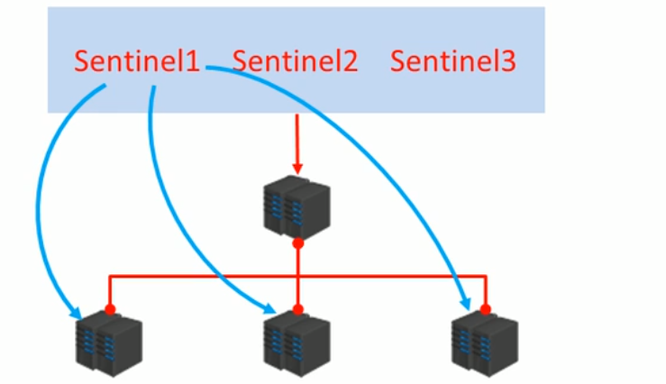


哨兵的作用:

1. 监控

   不断的检查master和slave是否正常运行

   master存活检测

2. 通知

   当被监控的服务出现问题时,向其他哨兵或者客户端发送信息

3. 自动故障转移

   断开master与slave连接,选取一个slave作为master

注意:

1. 哨兵也是一个redis服务器,只是不提供数据服务
2. 通常哨兵配置数量为单数


**搭建哨兵**

1. 配置主从模式(一拖二)

2. 配置三个哨兵(sentinel.conf)

3. 启动哨兵

   ```bash
   redis-sentinel sentinel-端口号.conf
   ```


**哨兵的工作原理:**

1. 监控阶段

   * 用于同步各个sentinel的状态
   * 获取master的状态
     * master属性
       * runid
       * role
     * 各个slave的详细信息
   * 获取所有slave的状态
     * slave属性
       * runid
       * role
       * offset
       * ...

   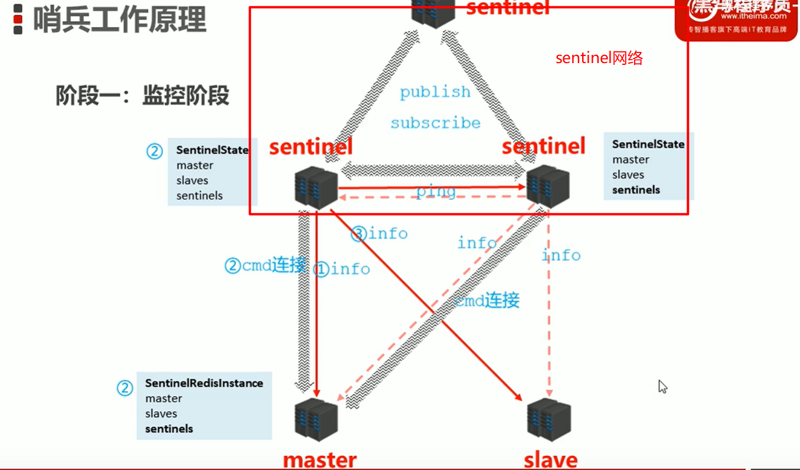


2. 通知阶段

   sentinel之间迅速同步信息

   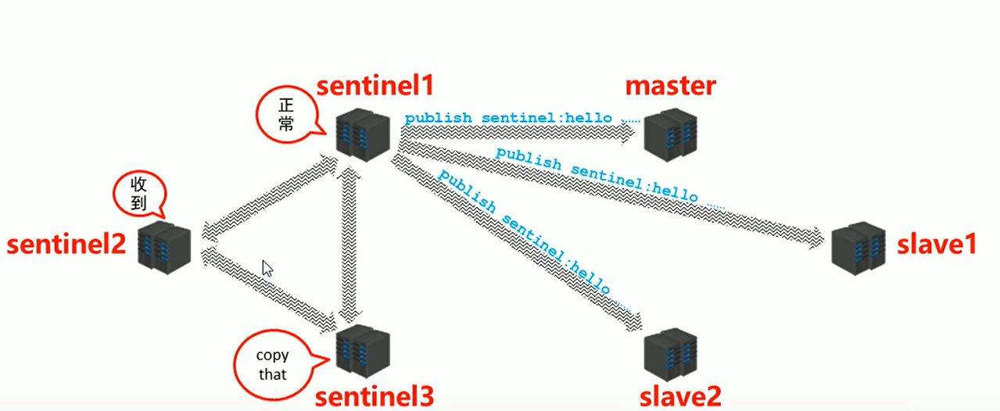


3. 故障转移阶段

   * 1

     发现问题

     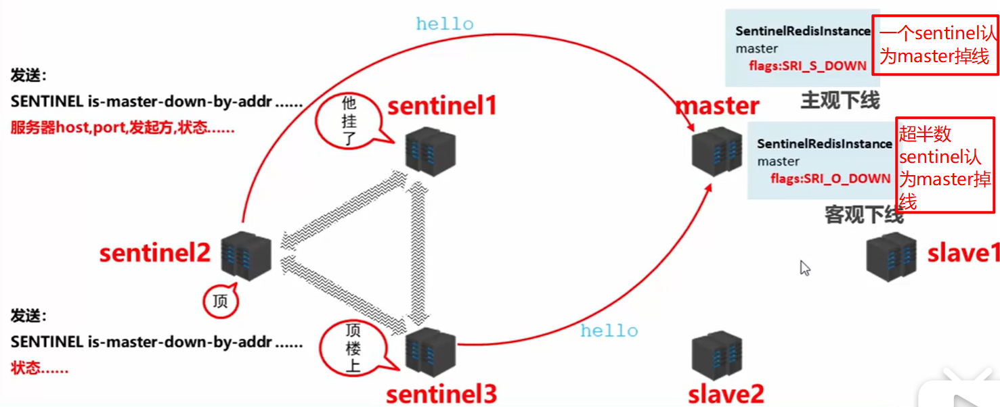

   * 2

     发现出现错误的master后,sentinel们选出一个代表来处理掉线的master,将它的master吊销

   * 3

     按照一定的原则选出新的master,并让其他的slave连接到新的master

     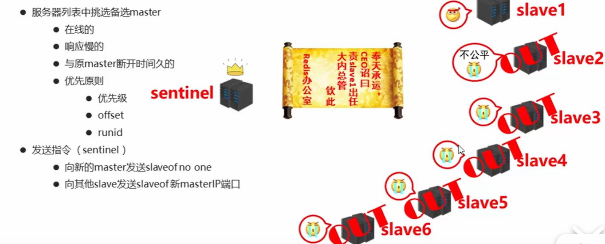


#### 集群简介

集群就是使用网络将若干台计算机连通起来,并提供统一的管理方式,使其对外呈现单机的服务效果

集群的作用:

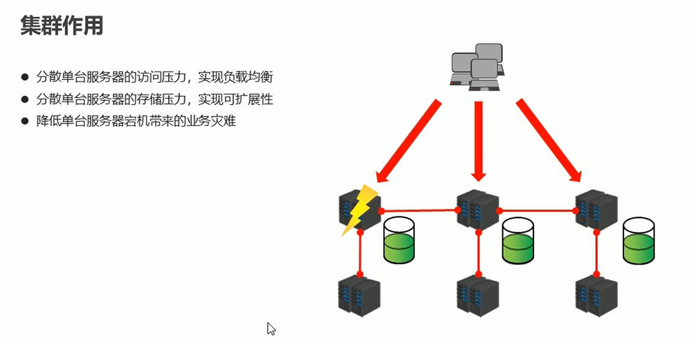


#### Redis集群结构设计

1. 数据存储设计

   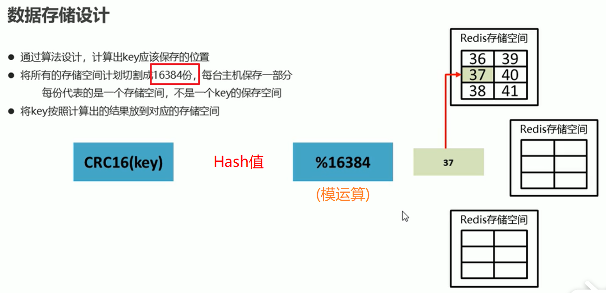


增加节点,每个节点都减少槽给新的节点

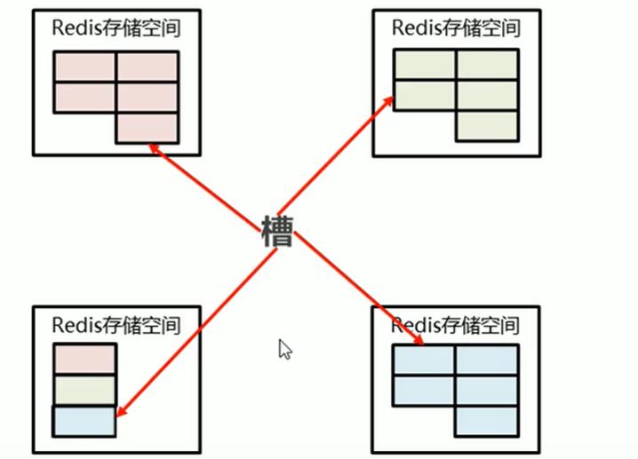


2. 内部通讯设计

   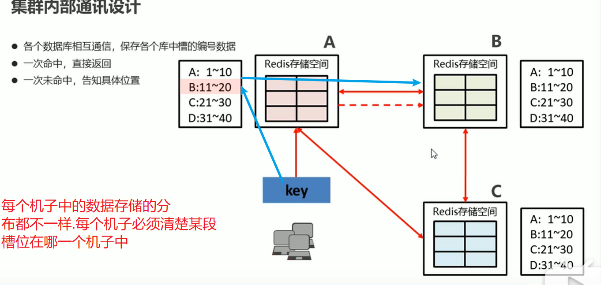


#### cluster集群搭建

需要在配置文件中加上配置,使得redis成为cluster集群的一个节点

```
cluster-enabled yes
cluster-conf-file nodes-6379.conf
cluster-node-timeout 10000
```

需要安装Ruby

1. 启动所有的redis服务器,包括master和slave

2. 创建cluster(**执行redis-trib.rb脚本,指定所有的master和slave的socket**)

   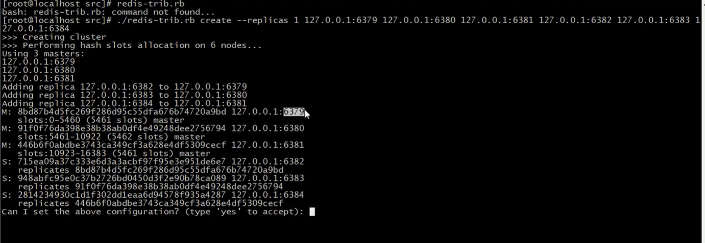

3. 创建完集群后,使用平常的命令去登录和 操作几点会报错必须加上`-c`参数


#### 企业级解决方案

1. 缓存预热

   系统启动前,提前将相关的缓存数据直接加载到缓存系统红.避免用户在请求的时候,先查询数据库,然后再将数据进行缓存的问题.用户直接加载事先被预热的缓存数据

2. 缓存雪崩

   瞬间过期数据量太大,导致对数据库服务器造成压力.如果能有效避免过期时间集中,可以有效解决雪崩现象的出现,配合其他策略一起使用,并监控服务器的运行数据,根据运行记录做出快速响应

   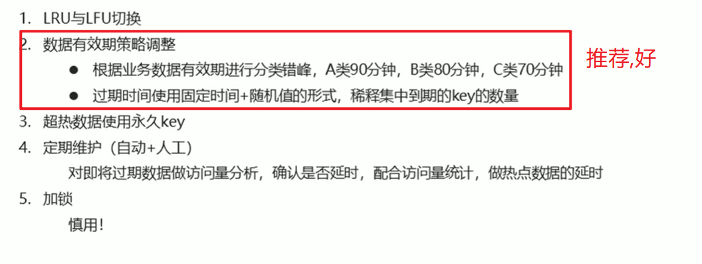

3. 缓存击穿

   单个高热数据过期的瞬间,数据访问量较大,未命中redis后,发起大量对同一数据的数据库访问,导致对数据库服务器造成压力

   

   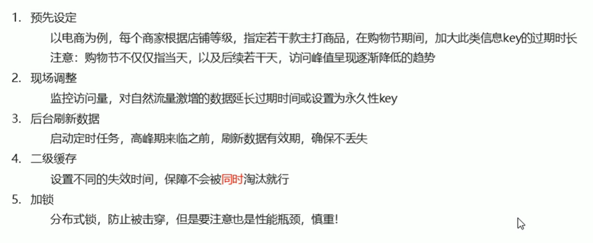

4. 缓存穿透

   访问不存在的数据,跳过了合法数据的 redis数据缓存阶段,每次访问数据库,导致对数据库造成压力.

   Redis中大面积出现未命中(黑客工攻击)

   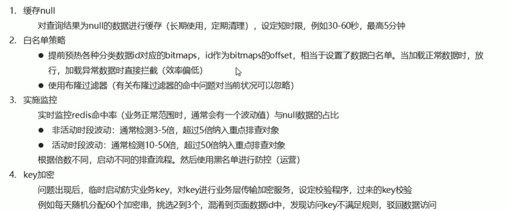

5. 性能指标监控