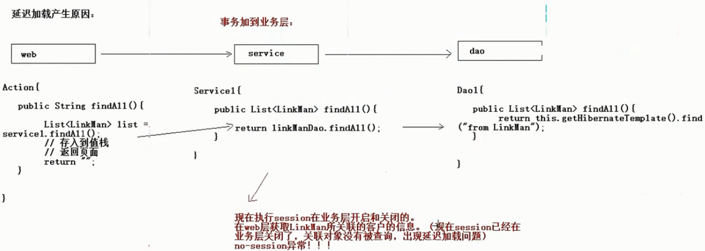

# SSH整合

## 一.三层结构回顾


## 二.环境搭建

### 1.引入jar包

* Struts2

  

* Hibernate

  

* Spring

  

### 2.引入配置文件

* Struts的配置文件

  * web.xml

    配置核心过滤器

    ```xml
      <filter>
      	<filter-name>struts</filter-name>
      	<filter-class>org.apache.struts2.dispatcher.ng.filter.StrutsPrepareAndExecuteFilter</filter-class>
      </filter>
      <filter-mapping>
      	<filter-name>struts</filter-name>
      	<url-pattern>/*</url-pattern>
      </filter-mapping>
    ```

    

  * struts.xml

* Hibernate的配置文件

  * hibernate.cfg.xml

    删除线程绑定的部分,因为spring在底层已经实现了线程绑定

    ```xml
    <?xml version="1.0" encoding="UTF-8"?>
    <!DOCTYPE hibernate-configuration PUBLIC
    	"-//Hibernate/Hibernate Configuration DTD 3.0//EN"
    	"http://www.hibernate.org/dtd/hibernate-configuration-3.0.dtd">
    <hibernate-configuration>
    	<session-factory>
    		<!-- 连接数据库的基本参数 -->
    		<property name="hibernate.connection.driver_class">com.mysql.jdbc.Driver</property>
    		<property name="hibernate.connection.url">jdbc:mysql:///ssh1</property>
    		<property name="hibernate.connection.username">root</property>
    		<property name="hibernate.connection.password">abc</property>
    		<!-- 配置Hibernate的方言 -->
    		<property name="hibernate.dialect">org.hibernate.dialect.MySQLDialect</property>
    		
    		<!-- 可选配置================ -->
    		<!-- 打印SQL -->
    		<property name="hibernate.show_sql">true</property>
    		<!-- 格式化SQL -->
    		<property name="hibernate.format_sql">true</property>
    		<!-- 自动创建表 -->
    		<property name="hibernate.hbm2ddl.auto">update</property>
    		
    		<!-- 配置C3P0连接池 -->
    		<property name="connection.provider_class">org.hibernate.connection.C3P0ConnectionProvider</property>
    		<!--在连接池中可用的数据库连接的最少数目 -->
    		<property name="c3p0.min_size">5</property>
    		<!--在连接池中所有数据库连接的最大数目  -->
    		<property name="c3p0.max_size">20</property>
    		<!--设定数据库连接的过期时间,以秒为单位,
    		如果连接池中的某个数据库连接处于空闲状态的时间超过了timeout时间,就会从连接池中清除 -->
    		<property name="c3p0.timeout">120</property>
    		 <!--每3000秒检查所有连接池中的空闲连接 以秒为单位-->
    		<property name="c3p0.idle_test_period">3000</property>
    		
    		<!-- 引入映射 -->
    		
    	</session-factory>
    </hibernate-configuration>
    ```

    

  * 映射文件

* Spring的配置文件

  * web.xml

    配置Spring核心监听器

    ```xml
    <!-- Spring的核心监听器 -->
      <listener>
      	<listener-class>org.springframework.web.context.ContextLoaderListener</listener-class>
      </listener>
      
      <!-- 加载Spring的配置文件的路径的，默认加载的/WEB-INF/applicationContext.xml -->
      <context-param>
      	<param-name>contextConfigLocation</param-name>
      	<param-value>classpath:applicationContext.xml</param-value>
      </context-param>
    ```

    

  * applicationContext.xml

  * 日志记录文件

  

### 3.spring整合Struts2

Struts-spring-plugin.jar

在这个插件中有如下的配置,其打开之后会导致自动注入功能的生效.

```xml
 <!--  Make the Spring object factory the automatic default -->
<constant name="struts.objectFactory" value="spring" />
```

因此我们再在action中提供service的set方法,即可以利用这个让service自动注入到action中

* 整合方式1

  action仍然由Struts2创建,然后将service通过spring注入到action中,这样在action中可以调用service中的方法

* 整合方式2

  action交予spring创建和管理

  > 注意:
  >
  > 1. spring是单例的而action是多例的,因此在spring的高配置文件中配置action的bean时要加上属性scope="prototype"
  > 2. 手动将service注入action


* Dao交给spring管理 

### 4.spring整合hibernate

在spring配置文件中加载hibernate的核心配置文件

```xml
<!-- 整合hibernate,加载hibernate的核心配置文件 -->
	<bean id="sessionFactory" class="org.springframework.orm.hibernate5.LocalSessionFactoryBean">
		<property name="configLocation" value="classpath:hibernate.cfg.xml"></property>
	</bean>
```

spring内置了一套Hibernate模板用于简化持久层的开发,在spring框架下如何使用Hibernate呢:

* 继承HibernateDaoSupport

  ```java
  public class CustomerDaoImpl extends HibernateDaoSupport implements CustomerDao {
  
  	public void save(Customer customer) {
  		System.out.println("customerDao中的save方法执行了....");
  		this.getHibernateTemplate().save(customer);
  	}
  }
  ```

* 在dao中注入sessionFactory,可以根据这个来创建Hibernate模板

  ```xml
  <bean id="customerDao" class="com.itheima.ssh.dao.impl.CustomerDaoImpl">
  		<property name="sessionFactory" ref="sessionFactory"></property>
  	</bean>
  ```


### 5.配置spring的事务管理

* 1.配置平台事务管理器

  ```xml
  <bean id="transactionManager" class="org.springframework.orm.hibernate5.HibernateTransactionManager">
  		<property name="sessionFactory" ref="sessionFactory"></property>
  	</bean>
  ```

* 2.开启注解事务

  ```xml
  <!-- 开启注解事务 -->
  <tx:annotation-driven transaction-manager="transactionManager"/>
  ```


### spring整合hibernate方式2:不带hibernate配置文件

将hibernate.cfg.xml中的配置全部用spring的那一套来代替.首先看看hibernate.cfg.xml中有哪些东西:

* Hibernate的相关的属性的配置

  * 方言
  * .....

* C3P0连接池-----引入jdbc.properties文件,在spring配置文件中引入配置文件

  ```xml
  	<!--2.通过context标签引入  -->
  	<context:property-placeholder location="classpath:jdbc.properties"/>
  	
  	<!--配置C3P0连接池  -->
  	<bean id = "dataSource" class="com.mchange.v2.c3p0.ComboPooledDataSource">
  		<property name="driverClass" value="${jdbc.driverClass}"></property>
  		<property name="jdbcUrl" value="${jdbc.url}"></property>
  		<property name="user" value="${jdbc.username}"></property>
  		<property name="password" value="${jdbc.password}"></property>
  	</bean>
  ```

* 映射文件

```xml
<!-- Spring整合Hibernate -->
	<!-- 引入Hibernate的配置的信息=============== -->
	<bean id="sessionFactory" class="org.springframework.orm.hibernate5.LocalSessionFactoryBean">
		<!-- 注入连接池 -->
		<property name="dataSource" ref="dataSource"/>
		<!-- 配置Hibernate的相关属性 -->
		<property name="hibernateProperties">
			<props>
				<prop key="hibernate.dialect">org.hibernate.dialect.MySQLDialect</prop>
				<prop key="hibernate.show_sql">true</prop>
				<prop key="hibernate.format_sql">true</prop>
				<prop key="hibernate.hbm2ddl.auto">update</prop>
			</props>
		</property>
		
		<!-- 设置映射文件 -->
		<property name="mappingResources">
			<list>
				<value>com/itheima/ssh/domain/Customer.hbm.xml</value>
			</list>
		</property>
	</bean>
```


## 三.spring解决延迟加载问题

### 1.延迟加载在SSH整合开发的哪些地方会出现

* 使用load方法查询对象
* 查询到某个对象时,要查询其关联对象


### 2.延迟加载产生的原因

在web层想使用其关联对象时,service层的session已经关闭了,会发出no session异常.因为事务是在service层开启和关闭的.也即session存在于service层



**解决:**OpenSessionViewFilter:配置一个过滤器即可

> 在web层开启session,关闭session

```xml
<!-- 解决延迟加载问题的过滤器 -->
  <filter>
  	<filter-name>OpenSessionInViewFilter</filter-name>
  	<filter-class>org.springframework.orm.hibernate5.support.OpenSessionInViewFilter</filter-class>
  </filter> 
  
  <filter-mapping>
  	<filter-name>OpenSessionInViewFilter</filter-name>
  	<url-pattern>*.action</url-pattern>
  </filter-mapping>
```


