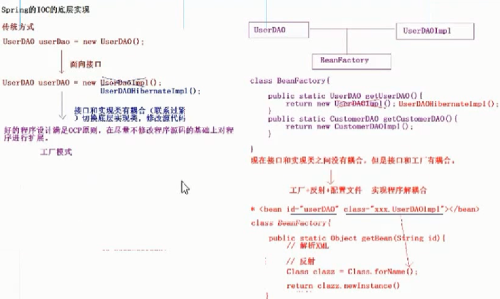
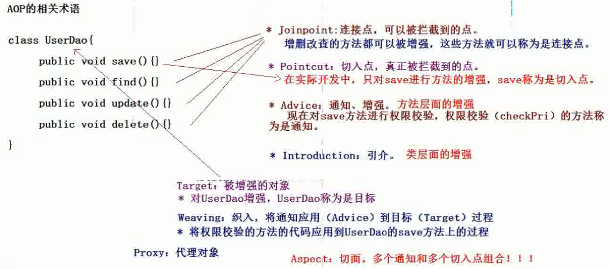
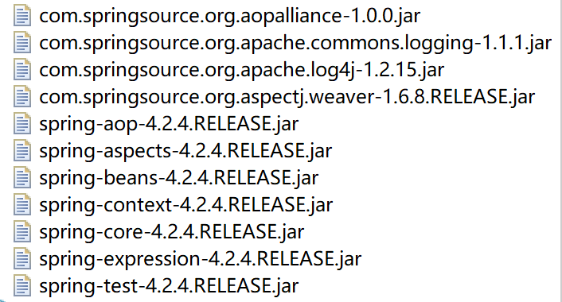
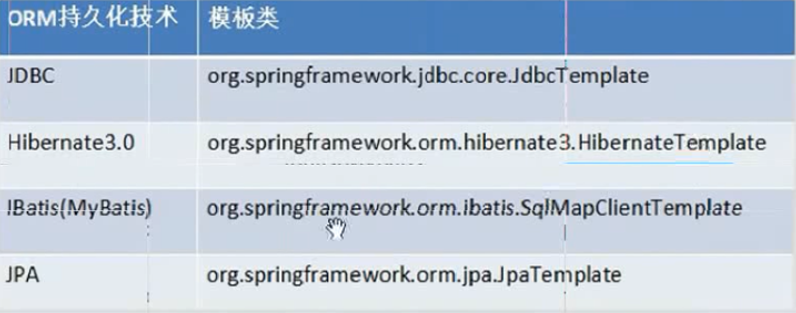
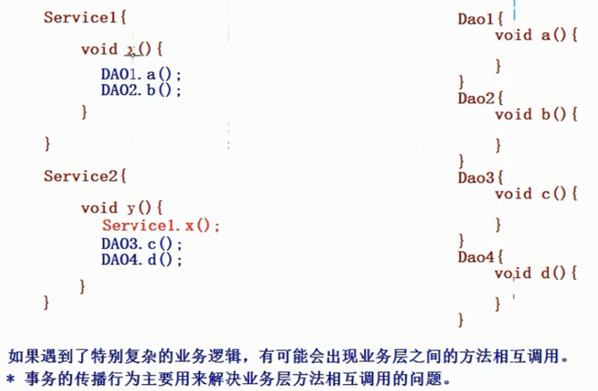
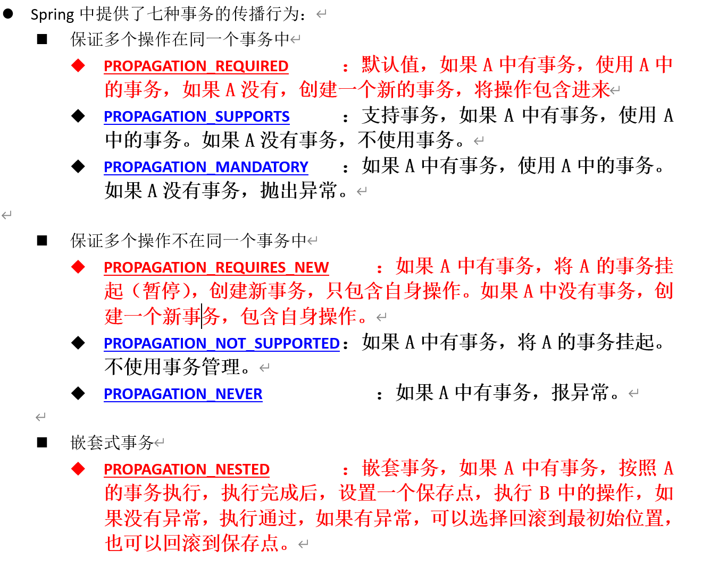
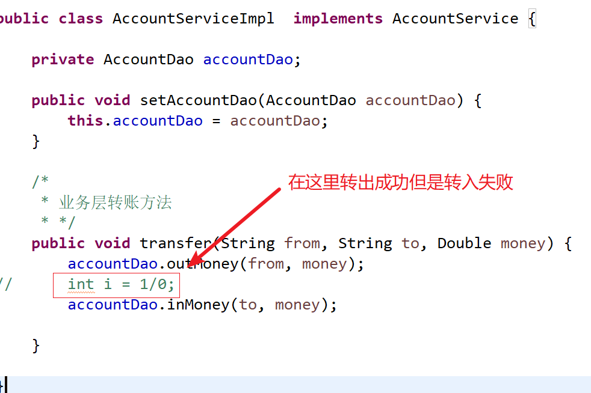

# Spring4

## 一.概述

Sping是SE/EE开发的全栈框架,有EE开发每一层的解决方案:

* WEB层:SpringMVC
* Service:Spring的Bean管理,Spring声明式事务
* DAO层:Spring的jdbc模板,Spring的ORM模块

> 为了在不修改程序源代码的基础上扩展程序


## 二.入门

### 1.IOC

*inversion of control*,控制反转,通过面向对象的编程思想解决计算机程序的耦合问题,是Spring框架的核心

* 将service,dao层的对象的创建权反转给Spring框架

* 底层实现:工厂+反射+配置文件

  

### 2.搭建环境

* 引入jar包+日志包(依赖文件夹下可以找到)


* 配置文件--->application.xml

  ```xml
  <?xml version="1.0" encoding="UTF-8"?>
  <beans xmlns="http://www.springframework.org/schema/beans"
      xmlns:xsi="http://www.w3.org/2001/XMLSchema-instance"
      xsi:schemaLocation="
          http://www.springframework.org/schema/beans http://www.springframework.org/schema/beans/spring-beans.xsd">
  	<bean id="UserDao" class="com.itheima.spring.demo1.UserDaoImpl"></bean>
  
  </beans>
  ```

  ```java
   * Spring方式的调用
  	 * */
  	@Test
  	public void demo2(){
  		ApplicationContext applicationContext = new ClassPathXmlApplicationContext("applicationContext.xml");
  		UserDao userDao = (UserDao) applicationContext.getBean("UserDao");
  		userDao.save();
  	}
  ```

  

## 三.IOC和DI的区别(*)

* IOC

  控制反转,将对象的创建全交给Spring

* DI

  依赖注入,前提必须有IOC的环境,Spring管理这个类的时候将类的依赖的属性注入(设置)进来


## 四.Spring的工厂类

* BeanFactory

  调用`getBean`的时候才会生成类的实例

* ApplicationContext

  加载配置文件的时候就会将Spring管理的类都实例化

  ApplicationContext有两个实现类;

  * ClassPathXmlApplicationContext:加载类路径下的配置文件
  * FileSystemXmlApplicationContext:加载文件系统下的配置文件

## 五.Bean的相关配置

### 1.<bean>标签的id和name属性

id使用了唯一约束.里面不能出现特殊字符

name没有使用唯一约束,理论上可以出现重复,但是在开发中不会使用.可以出现重复字符

* Spring和Struts1进行整合的时候会用到

  <bean name="/user" class=""/>

### 2.Bean的生命周期的配置

```xml
<bean id="UserDao" class="com.itheima.spring.demo1.UserDaoImpl" init-method="" destory-method=""></bean>
```

初始化方法在加载配置文件的时候就会执行,而销毁方法在工厂关闭的时候才会执行

### 3.Bean的作用范围的配置

Bean标签的scope属性

* singleton:  spring采用单例模式创建这个对象(**)
* prototype:多例模式(将Action的类交给Spring管理时设置为多例,Struts2和Spring的整合时会用到)(**)
* request:应用在web项目中,Spring创建这个类后,将这个类存入request域中
* session:应用在web项目中,Spring创建这个类后,将这个类存入session域中
* globalsession:应用在web项目中,Spring创建这个类后,将这个类存入globalsession域中

### 4.Spring的属性注入

* 构造方法的属性注入

  需要在类中提供构造方法

```xml
<bean id="Car" class="com.itheima.spring.demo1.CarImpl">
	<constructor-arg name="name" value="宝马"/>
    <constructor-arg name="price" value="800000"/>
</bean>
```

* set方法注入

  需要在类中提供set方法

```xml
<bean id="UserDao" class="com.itheima.spring.demo1.UserDaoImpl">
	<property name="name" value="涛哥"/>
    <property name="ref" value="car2"/>
</bean>
```

* 引入p名称空间的方式

```xml
<bean id="Car" class="com.itheima.spring.demo1.CarImpl" p:name="宝马" p:price="800000">
</bean>
<bean id="UserDao" class="com.itheima.spring.demo1.UserDaoImpl" p:name="涛哥" p:car2-ref="car2">
</bean>
```

* SpEL的属性注入

  Spring expression language,Spring表达式语言

  value="#{  值  }"

  可以计算表达式,也可以调用类中的属性和方法,比较灵活

  ```xml
  <bean id="CarInfo" class="com.itheima.spring.demo1.CarInfo">
  </bean>
  <bean id="Car" class="com.itheima.spring.demo1.CarImpl">
  	<property name="name" value="CarInfo.name"/>
      <property name="price" value="#{CarInfo.calculatePrice()}"/>
  </bean>
  ```

  ```java
  class CarInfo(){
      private String name;
      
      public String getName(){
          return "赵洪";
      }
      
      public Double calculatePrice(){
          return Math.random()*3000;
      }
  }
  ```

* 集合类型的属性注入

```xml
<bean id="collectionBean" class="com.itheima.spring.demo1.CollectionBean">
	<!--数组注入-->
    <property name= "arrs">
    	<list>
            <value>王东</value>
            <value>赵洪</value>
        </list>
    </property>
    
    <!--集合注入-->
    <property name= "list">
    	<list>
            <value>王东</value>
            <value>赵洪</value>
        </list>
    <property name= "set">
    	<set>
            <value>王东</value>
            <value>赵洪</value>
        </set>
    </property>
    <property name= "map">
    	<map>
            <entry key="aaa" value="111"/>
            <entry key="bbb" value="222"/>
        </map>
    </property>
</bean>
```


## 六.Spring的分模块开发

### 1.加载配置文件时一次性加载多个配置

```java
ApplicationContext applicationContext = new ClassPathXmlApplicationContext("applicationContext.xml","applicationContext2.xml");
```

### 2.在一个配置文件中引入多个配置文件

```xml
<import resource="applicationContext2.xml"/>
```


## 七.Spring的IOC的注解开发

### 1.引入jar包

多引入一个aop的包

### 2.在applicationContext.xml中引入context约束(以前引入的bean约束)

在目录`spring-framework-4.2.4.RELEASE/docs/spring-framework-reference/html/xsd-configuration.html`下

```xml
<?xml version="1.0" encoding="UTF-8"?>
<beans xmlns="http://www.springframework.org/schema/beans"
    xmlns:xsi="http://www.w3.org/2001/XMLSchema-instance"
    xmlns:context="http://www.springframework.org/schema/context" xsi:schemaLocation="
        http://www.springframework.org/schema/beans http://www.springframework.org/schema/beans/spring-beans.xsd
        http://www.springframework.org/schema/context http://www.springframework.org/schema/context/spring-context.xsd"> <!-- bean definitions here -->

</beans>
```

### 3.配置组件扫描(applicationContext.xml中)

```xml
<!--配置组件扫描的意思是在哪些包下面使用IOC注解开发的方式-->
<context:component-scan base-package="com.itheima.spring.demo2"/>
```

### 4.在类上添加注解

```java
@Component("userDao")//相当于<bean id="userDao" class="com.itheima.dao.impl.UserDaoImpl"></bean>
public class UserDaoImpl implements UserDao {

	public void save() {
		System.out.println("save方法执行了....");
	}
}
```

```java
@Test
	public void demo2(){
		ApplicationContext applicationContext = new ClassPathXmlApplicationContext("applicationContext.xml");
		UserDao userDao = (UserDao) applicationContext.getBean("userDao");
		userDao.save();
	}
```

### 5.注解方式设置属性的值

使用注解方式,可以没有set方法

* 如果没有在类中给属性添加set方法,需要将属性注入的注解添加到set方法上

  ```java
  @Value("王东")
  private String name;
  ```

* 如果在类中给属性添加了set方法,就将属性注入的注解添加到属性上

  ```java
  private String name;
  @Value("王东")
  public void setName(String name) {
      this.name = name;
  }
  ```

## 八.Spring的IOC的注解详解

修饰一个类用于将类全部交给Spring管理

### 1.  @Component组件(作用在类上)

从这个组件由衍生出来三个组件用于使得分层结构更加清晰:

* @Controller:  WEB层
* @Service:  业务层
* @Repository:  持久层

### 2. 属性注入的注解

* 普通属性

  @Value

* 对象类型的属性

  @Autowired

  ```java
  @Service("userService")
  public class UserServiceImpl implements UserService {
  	@Autowired
  	private UserDao userDao;
  	public void save() {
          //注入进来可以直接使用,不用工厂生成了
  		userDao.save();
  		System.out.println("service的save方法执行了");
  	}
  }
  ```

  ```java
  @Component("userDao")//相当于<bean id="userDao" class="com.itheima.dao.impl.UserDaoImpl"></bean>
  public class UserDaoImpl implements UserDao {
  	private String name;
  	@Value("王东")
  	public void setName(String name) {
  		this.name = name;
  	}
  	public void save() {
  		System.out.println("save方法执行了...."+name);
  	}
  }
  ```

  ```java
  public class Demo2 {
  	@Test
  	public void demo2(){
  		ApplicationContext applicationContext = new ClassPathXmlApplicationContext("applicationContext.xml");
  		UserService userService = (UserService) applicationContext.getBean("userService");
  		userService.save();
  	}
  }
  ```

  > @Autowired默认使用的按照类型注入,但是我们习惯于使用按照名称注入
  >
  > 因此,要将此标签和@Quantifier(value="名称")标签一起使用

  *  @Resource

    同样是完成对象类型的属性注入,但是是按名称注入

###  3.Bean的其他注解

* @Proconstruct----->init-method
* @predestroy------->destory-method

### 4.Bean的作用范围详解

@Scope("")

* singleton
* prototype
* request
* session
* globalsession


## 九.IOC的XML和注解

### 1.比较

* XML可以适用于任何场景.结构清晰,易于维护
* 注解开发有些地方用不了,比如这个类是别人提供的.但是开发快速

### 2.XML和注解整合开发

使用XML 管理Bean,注解完成属性注入

此时不需要配置扫描,因为扫描是扫描类上的注解;但是如果又想在类里面使用注解,开启另一个:

```xml
<context:annotation-config/>
```


## 十.AOP

### 1.概述

面向切面编程,是OOP(面向对象编程)的延伸和扩展,解决了OOP开发遇到的问题

> AOP采用横向抽取机制取代了传统的纵向继承机制.其底层使用动态代理实现,完全的用XML配置实现代理

### 2.底层实现

* JDK动态代理:  只能对实现了接口的类产生代理

* Cglib动态代理(类似于Javassist第三方代理技术):可以对没有实现接口的类产生对象.其实就是生成子类对象

  > 第三方开源代码生成类库,可以在运行时动态添加类的属性和方法

### 3.AOP开发(AspectJ的XML方式)

* AOP开发的术语

​	

#### * AOP开发入门

* 引入jar包

  额外引入4个jar包,AspectJ,Spring和AspectJ整合

* 引入AOP约束

  ```xml
  <?xml version="1.0" encoding="UTF-8"?>
  <beans xmlns="http://www.springframework.org/schema/beans"
      xmlns:xsi="http://www.w3.org/2001/XMLSchema-instance"
      xmlns:aop="http://www.springframework.org/schema/aop" xsi:schemaLocation="
          http://www.springframework.org/schema/beans http://www.springframework.org/schema/beans/spring-beans.xsd
          http://www.springframework.org/schema/aop http://www.springframework.org/schema/aop/spring-aop.xsd"> 
  </beans>
  ```

* 编写目标类并配置交给Spring管理

  ```xml
  <bean id="productDao" class="com.itheima.spring.dao.impl.ProductDaoImpl"></bean>
  ```

* 编写切面类

  ```java
  public class MyAspectXml {
  	public void checkPri(){
  		System.out.println("权限校验=========");
  	}
  }
  ```

* 配置切面类

  ```java
  <bean id="myAspect" class="com.itheima.spring.aspect.MyAspectXml"></bean>
  ```

* 配置AOP对目标类产生代理

  ```xml
  <!-- 配置切面 -->
  <aop:aspect ref="myAspect">
      <aop:before method="checkPri" pointcut-ref="pointcut1"/>
  </aop:aspect>
  ```

* 测试类

  ```java
  @RunWith(SpringJUnit4ClassRunner.class)
  @ContextConfiguration("classpath:applicationContext.xml")
  public class SpringDemo {
  	@Resource(name="productDao")
  	private ProductDao productDao;
      
  	@Test
  	public void demo1(){
  		productDao.save();
  		productDao.update();
  		productDao.find();
  		productDao.delete();
  		
  	}
  	
  }
  ```

#### * AOP中的通知类型

* 前置通知

  在目标方法执行之前进行操作

  可以获取切入点信息

  <aop:before method="checkPri" pointcut-ref="pointcut1"/>

* 后置通知

  在目标方法执行之后济宁操作

  获取方法的返回值

  <aop:after-returning method="writeLog" pointcut-ref="pointcut2" returning="result"/> 

* 环绕通知

  在目标方法执行之前或者之后进行操作

  ```java
  public Object around(ProceedingJoinPoint joinPoint) throws Throwable{
  		System.out.println("环绕前通知=============");
  		//执行目标方法
  		Object object = joinPoint.proceed();
  		System.out.println("环绕后通知=============");
  		return object;
  	}
  ```

  

* 异常抛出通知

  当切点内部代码出现异常时 出现异常时发出的通知

  <aop:after-throwing method="afterThrowing" pointcut-ref="pointcut4"/>

  ```java
  public void afterThrowing(Throwable e){
  		System.out.println("异常抛出通知=============="+e.getMessage());
  	}
  ```

  ```xml
  <!-- 异常抛出通知 -->
  <aop:after-throwing method="afterThrowing" pointcut-ref="pointcut4" throwing="e"/>
  ```

  

* 最终通知

  无论代码有没有异常,这里面的代码都会执行

* 引介通知(不掌握)

**切面配置代码**

```xml
<?xml version="1.0" encoding="UTF-8"?>
<beans xmlns="http://www.springframework.org/schema/beans"
    xmlns:xsi="http://www.w3.org/2001/XMLSchema-instance"
    xmlns:aop="http://www.springframework.org/schema/aop" xsi:schemaLocation="
        http://www.springframework.org/schema/beans http://www.springframework.org/schema/beans/spring-beans.xsd
        http://www.springframework.org/schema/aop http://www.springframework.org/schema/aop/spring-aop.xsd"> <!-- bean definitions here -->
	<!-- 配置目标对象  =====被 增强的对象 -->
	<bean id="productDao" class="com.itheima.spring.dao.impl.ProductDaoImpl"></bean>
	
	<bean id="myAspect" class="com.itheima.spring.aspect.MyAspectXml"></bean>
	
	<aop:config>
		<!-- 哪些类的哪些方法需要进行增强 -->
		<aop:pointcut expression="execution(* com.itheima.spring.dao.impl.ProductDaoImpl.save(..))" id="pointcut1"/>
		<aop:pointcut expression="execution(* com.itheima.spring.dao.impl.ProductDaoImpl.delete(..))" id="pointcut2"/>
		<aop:pointcut expression="execution(* com.itheima.spring.dao.impl.ProductDaoImpl.update(..))" id="pointcut3"/>
		<aop:pointcut expression="execution(* com.itheima.spring.dao.impl.ProductDaoImpl.find(..))" id="pointcut4"/>
		
		<!-- 配置切面 -->
		<aop:aspect ref="myAspect">
			<!-- 前置通知 -->
				<aop:before method="checkPri" pointcut-ref="pointcut1"/>
			<!-- 后置通知 -->
			<aop:after-returning method="writeLog" pointcut-ref="pointcut2" returning="result"/> 
			<!-- 环绕通知 -->
			<aop:around method="around" pointcut-ref="pointcut3"/>
			<!-- 异常抛出通知 -->
			<aop:after-throwing method="afterThrowing" pointcut-ref="pointcut4" throwing="e"/>
			<aop:after method="after" pointcut-ref="pointcut4"/>
		</aop:aspect>
	</aop:config>
</beans>
```

**切面代码**

```java
public class MyAspectXml {
	public void checkPri(){
		System.out.println("权限校验=========");
	}
	public void writeLog(Object result){
		System.out.println("写入日志========="+result);
	}
	
	public Object around(ProceedingJoinPoint joinPoint) throws Throwable{
		System.out.println("环绕前通知=============");
		//执行目标方法
		Object object = joinPoint.proceed();
		System.out.println("环绕后通知=============");
		return object;
	}
	
	public void afterThrowing(Throwable e){
		System.out.println("异常抛出通知=============="+e.getMessage());
	}
	
	public void after(){
		System.out.println("最终通知==============");
	}
	
}
```

#### * 切入点表达式的写法

语法:

[访问修饰符(可选)]   方法返回值   包名.类名.方法名(参数)

public  void com.itheima.Spring.ProductDaoImpl.save(..)

返回值类型:*代表任意返回值类型


### 4.AOP开发(AspectJ的注解方式)

#### * 入门

* 引入jar包

  

* 引入约束

  ```xml
  <?xml version="1.0" encoding="UTF-8"?>
  <beans xmlns="http://www.springframework.org/schema/beans"
  	xmlns:xsi="http://www.w3.org/2001/XMLSchema-instance"
  	xmlns:context="http://www.springframework.org/schema/context"
  	xmlns:aop="http://www.springframework.org/schema/aop"
  	xmlns:tx="http://www.springframework.org/schema/tx"
  	xsi:schemaLocation="http://www.springframework.org/schema/beans 
  	http://www.springframework.org/schema/beans/spring-beans.xsd
  	http://www.springframework.org/schema/context
  	http://www.springframework.org/schema/context/spring-context.xsd
  	http://www.springframework.org/schema/aop
  	http://www.springframework.org/schema/aop/spring-aop.xsd
  	http://www.springframework.org/schema/tx 
  	http://www.springframework.org/schema/tx/spring-tx.xsd">
  </beans> 
  
  ```

* 开启注解开发

  ```xml
  <!-- 在配置文件中开启注解的AOP的开发============ -->
  <aop:aspectj-autoproxy/>
  ```

* 将目标类和切面类交给spring管理

  ```xml
  <!--配置目标类-->
  <bean id="orderDao" class="com.itheima.spring.demo1.OrderDao"></bean>
  <!--配置切面类-->
  <bean id="myAspect" class="com.itheima.spring.demo1.MyAspectAnno"></bean>
  ```

* 给切面类加注解

  ```java
  @Aspect
  public class MyAspectAnno {
  	@Before(value="execution(* com.itheima.spring.demo1.save(..))")
  	public void before(){
  		System.out.println("前置通知===============");
  	}
  }
  ```

#### * spring的注解的AOP的通知类型

* @Before:前置通知

  ```java
  @Before(value="execution(* com.itheima.spring.demo1.save(..))")
  public void before(){
      System.out.println("前置通知===============");
  }
  ```

* @AfterReturing:后置通知

  ```java
  @AfterReturing(value="execution(* com.itheima.spring.demo1.delete(..))" ,returing="result")
  public void afterReturing(Object result){
      System.out.println("后置通知==============="+result);
  }
  ```

* @Around:环绕通知

  ```java
  @Around(value="execution(* com.itheima.spring.demo1.update(..))")
  public void afterReturing(ProceedingJoinPoint joinPoint) throw Throwable{
      System.out.println("环绕前通知===============");
      joinPoint.proceed();
      System.out.println("环绕后通知===============");
      return obj;
  }
  ```

* @AfterThrowing:异常抛出通知

  ```java
  @AfterThrowing(value="execution(* com.itheima.spring.demo1.find(..))",throwing="e")
  public void afterThrowing(Throwable e){
      System.out.println("异常抛出通知==============="+e);
      int i = 1/0;
  }
  ```

* @After:最终通知

  ```java
  @Before(value="execution(* com.itheima.spring.demo1.find(..))")
  public void after(){
      System.out.println("最终通知===============");
  }
  ```

  

#### * 切入点的注解形式的配置

```java
@PointCut(value="execution(* com.itheima.spring.demo1.save(..))")
private void pointCut1(){}

//使用
@Before(value="MyAspectAnno.pointCut1()")
public void before(){
    System.out.println("前置通知===============");
}
```


## 十一.Spring的JDBC模板

Spring是EE开发的一站式框架,spring对持久层也提供了解决方案:

**ORM模块**和**JDBC模板**



### 1.JDBC模板使用入门

#### * 引入jar包

* spring基本包
* 数据库驱动包
* JDBC模板包

#### * 创建数据库

```sql
create database spring4_day03 ;
use spring4_day03;
create table account(
	id int primary key auto_increment,
	name varchar(20),
	money double
);
```

#### * 插入一条数据

```java
public class JdbcDemo1 {
	@Test
	public void demo1(){
		//1.创建连接池(Spring内置的连接池)
		DriverManagerDataSource dataSource = new DriverManagerDataSource();
		//连接数据库
		dataSource.setDriverClassName("com.mysql.jdbc.Driver");
		dataSource.setUrl("jdbc:mysql:///spring4_day03");
		dataSource.setUsername("root");
		dataSource.setPassword("1234");
		//2.创建Jdbc模板
		JdbcTemplate jdbcTemplate = new JdbcTemplate(dataSource);
		//3.执行SQL
		jdbcTemplate.update("insert into account values(null,?,?)", "tom" ,"2000");
	}
}
```


### 2.将连接池和模板都交给spring管理

```xml
<!-- 在配置spring内置的数据库连接池============ -->
<bean id="dataSource" class="org.springframework.jdbc.datasource.DriverManagerDataSource">
    <!-- 属性注入 -->
    <property name="driverClassName" value="com.mysql.jdbc.Driver"></property>
    <property name="url" value="jbc:mysql:///spring4_day03"></property>
    <property name="username" value="root"></property>
    <property name="password" value="1234"></property>
</bean>

<!-- 配置spring的JDBC模板 -->
<bean id="jdbcTemplete" class="org.springframework.jdbc.core.JdbcTemplate">
    <property name="dataSource" ref="dataSource"></property>
</bean>
```

> 只要有set方法就可以使用属性注入


### 3.在spring中使用开源数据库连接池

#### * DHCP 的配置

```xml
<!--配置DBCP连接池================  -->
<bean id="dataSource" class="org.apache.commons.dbcp.BasicDataSource">
    <property name="driverClassName" value="com.mysql.jdbc.Driver"></property>
    <property name="url" value="jdbc:mysql:///spring4_day03"></property>
    <property name="username" value="root"></property>
    <property name="password" value="1234"></property>
</bean>
```

#### * C3P0的配置

```xml
<!--配置C3P0连接池  -->
<bean id = "dataSource" class="com.mchange.v2.c3p0.ComboPooledDataSource">
    <property name="driverClass" value="com.mysql.jdbc.Driver"></property>
    <property name="jdbcUrl" value="jdbc:mysql:///spring4_day03"></property>
    <property name="user" value="root"></property>
    <property name="password" value="1234"></property>
</bean>
```

#### * 引入外部属性文件(连接数据库)

* 通过bean标签引入(很少使用)

  ```xml
  <!--1.通过bean标签引入(很少使用) -->
  <bean class="org.springframework.beans.factory.config.PropertyPlaceholderConfigurer">
      <property name="location" value="classpath:jdbc.properties"></property>
  </bean>
  ```

* 通过context标签引入

  ```xml
  <!--2.通过context标签引入  -->
  <context:property-placeholder location="classpath:jdbc.properties"/>
  ```

  ```xml
  <!--配置C3P0连接池  -->
  <bean id = "dataSource" class="com.mchange.v2.c3p0.ComboPooledDataSource">
      <property name="driverClass" value="${jdbc.driverClass}"></property>
      <property name="jdbcUrl" value="${jdbc.url}"></property>
      <property name="user" value="${jdbc.username}"></property>
      <property name="password" value="${jdbc.password}"></property>
  </bean>
  ```

### 4.spring完成CRUD操作

查询-手动封装

```java
@Test
// 查询多条记录
public void demo7(){
    List<Account> list = jdbcTemplate.query("select * from account", new MyRowMapper());
    for (Account account : list) {
        System.out.println(account);
    }
}

class MyRowMapper implements RowMapper<Account>{

    public Account mapRow(ResultSet rs, int rowNum) throws SQLException {
        Account account = new Account();
        account.setId(rs.getInt("id"));
        account.setName(rs.getString("name"));
        account.setMoney(rs.getDouble("money"));
        return account;
    }
}
```


## 十二.spring的事务管理

### 1. API

* PlatformTransactionManager:平台事务管理器

  * DataSourceTransactionManager:底层使用JDBC管理事务
  * HIbernateTransactionManager:底层使用Hibernate管理事务

* TransactionDefinition: 事务定义信息

  事务定义:用于定义事务的相关信息,隔离级别,超时信息/传播行为/是否只读

* TransactionStatus:事务的状态

  用于记录在事务管理过程中,事务的状态的对象

### 2.事务管理API之间的关系

Spring进行事务管理的时候,首先平台`事务管理器`根据`事务定义信息`进行事务管理,在事务管理过程中,产生各种状态,将这些状态的信息记录到`事务状态`的对象中

### 3.Spring事务的传播行为

事务的传播行为用来解决业务层方法相互调用的问题





### 4.搭建转账事务的环境

继承JdbcDaoSupport类后只需要向Dao中注入dataSource,就会自动帮你生成JdbcTemplate模板,而不需要在application中配置.如下:

```xml
	<bean id="accoutService" class="com.itheima.jdbc.tx.AccountServiceImpl">
		<!--提供set方式进行属性注入  -->
		<property name="accountDao" ref="accountDao"></property>
	</bean>
	
	<bean id="accountDao" class="com.itheima.jdbc.tx.AccountDaoImpl">
		<!-- <property name="jdbcTemplate" ref="jdbcTemplate"></property> -->
		<property name="dataSource" ref="dataSource"></property>
	</bean>
	
		<!--2.通过context标签引入  -->
	<context:property-placeholder location="classpath:jdbc.properties"/>
	
	<!--配置C3P0连接池  -->
	<bean id = "dataSource" class="com.mchange.v2.c3p0.ComboPooledDataSource">
		<property name="driverClass" value="${jdbc.driverClass}"></property>
		<property name="jdbcUrl" value="${jdbc.url}"></property>
		<property name="user" value="${jdbc.username}"></property>
		<property name="password" value="${jdbc.password}"></property>
	</bean>
	
	<!-- 配置spring的JDBC模板 -->
	<!-- <bean id="jdbcTemplate" class="org.springframework.jdbc.core.JdbcTemplate">
		<property name="dataSource" ref="dataSource"></property>
	</bean> --> 
```

```java
public class AccountDaoImpl extends JdbcDaoSupport implements AccountDao {
	
	/*	继承了JdbcDaoSupport类后只需要在配置文件中向dao中注入一个DataSource即可,
	 * spring在底层可以根据这个注入的DataSource自动生成JdbcTemplate
	*/
	public void outMoney(String from, Double money) {
		this.getJdbcTemplate().update("update account set money = money - ? where name = ?",money,from);

	}
	public void inMoney(String to, Double money) {
		this.getJdbcTemplate().update("update account set money = money + ? where name = ?",money,to);

	}
}
```

> 转账业务依赖于事务的规则,一旦在业务层的转账业务在执行过程中发生了错误,导致转出成功但是转入失败,那么这次转账是失败的,需要回滚状态.
>
> 

### 5.Spring的事务管理分类

#### * 第一类: 编程式事务

1. 配置平台事务管理器

   ```xml
   <!--配置平台事务管理器  -->
   <bean id = "transactionManager" class="org.springframework.jdbc.datasource.DataSourceTransactionManager">
       <!-- 注入连接对象 -->
       <property name="dataSource" ref="dataSource"></property>
   </bean>
   ```

2. 配置事务管理的模板类

   ```xml
   <!-- 配置事务管理的模板类 -->
   <bean id="transactionTemplate" class="org.springframework.transaction.support.TransactionTemplate">
       <property name="transactionManager" ref="transactionManager"></property>
   </bean>
   ```

3. 在业务层注入事务管理的模板

   在`AccountServiceImpl`中定义`TransactionTemplate`并提供set方法,在配置文件中使用`<property name="transactionTemplate" ref="transactionTemplate"></property>`注入

4. 在业务层中编写事务管理的代码

   ```java 
       /*
        * 业务层转账方法
       * */
   public void transfer(final String from, final String to, final Double money) {
   
       transactionTemplate.execute(new TransactionCallbackWithoutResult() {
           @Override
           protected void doInTransactionWithoutResult(TransactionStatus transactionStatus) {
               //将需要交由事务管理的代码丢进来即可
               accountDao.outMoney(from, money);
               //				int i = 1/0;
               accountDao.inMoney(to, money);
           }
       });
   }
   ```

#### * 第二类:聲明式事務管理(AOp)

* xml形式

  ```xml
  <!--配置平台事务管理器  -->
  <bean id = "transactionManager" class="org.springframework.jdbc.datasource.DataSourceTransactionManager">
      <!-- 注入连接对象 -->
      <property name="dataSource" ref="dataSource"></property>
  </bean>
  <!--配置事务的增强-->
  <tx:advice id="txAdvice">
      <tx:attributes>
          <tx:method name="*" propagation="REQUIRED"/>
      </tx:attributes>
  </tx:advice>
  
  <aop:config>
      <aop:pointcut expression="execution(* com.itheima.jdbc.tx2.AccountDaoImpl.*(..))" id="pointCut1"/>
      <aop:advisor advice-ref="txAdvice" pointcut-ref="pointCut1"/>
  </aop:config>
  ```

  

* 注解形式

  * 配置事务管理器

    ```xml
    <!--配置平台事务管理器  -->
    <bean id = "transactionManager" class="org.springframework.jdbc.datasource.DataSourceTransactionManager">
        <!-- 注入连接对象 -->
        <property name="dataSource" ref="dataSource"></property>
    </bean>
    ```

  * 开启注解事务

    ```xml
    <!-- 开启注解事务================================ -->
    <tx:annotation-driven transaction-manager="transactionManager"/>
    ```

  * 在业务层类上使用注解

    ```java
    @Transactional(isolation=Isolation.DEFAULT,propagation=Propagation.REQUIRED)
    public class AccountServiceImpl implements AccountService {
    	// 注入DAO:
    	private AccountDao accountDao;
    	
    	public void setAccountDao(AccountDao accountDao) {
    		this.accountDao = accountDao;
    	}
    	
    	@Override
    	/**
    	 * from：转出账号
    	 * to：转入账号
    	 * money：转账金额
    	 */
    	public void transfer( String from,  String to,  Double money) {
    			accountDao.outMoney(from, money);
    			int d = 1/0;
    			accountDao.inMoney(to, money);
    	}
    }
    ```

    


