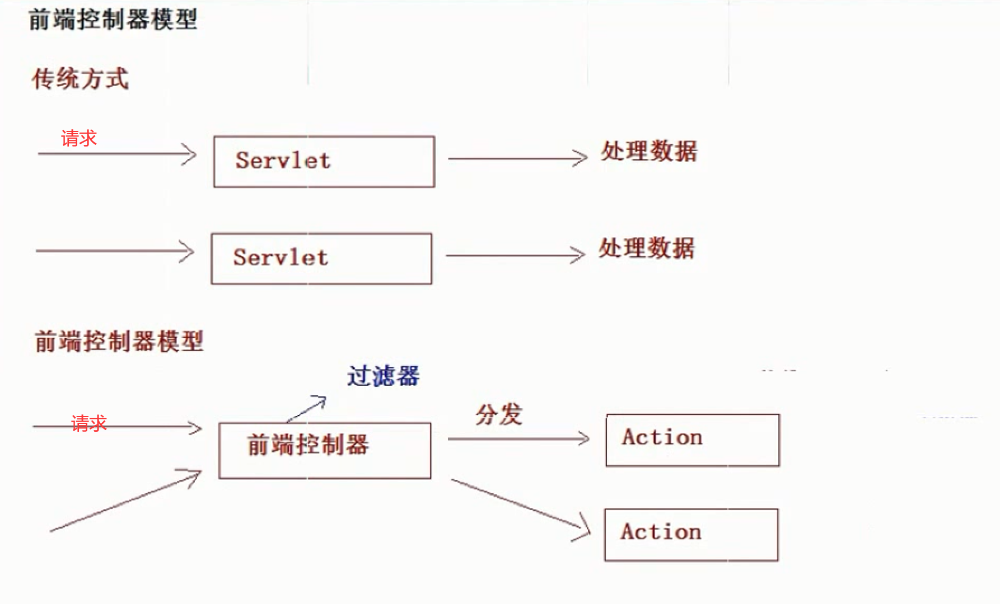
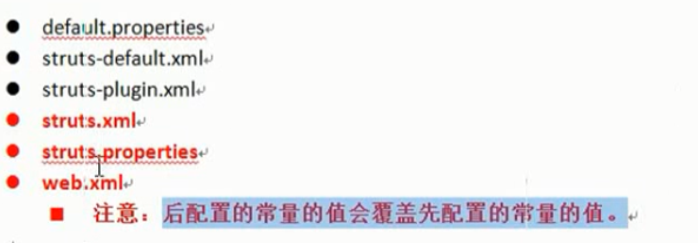
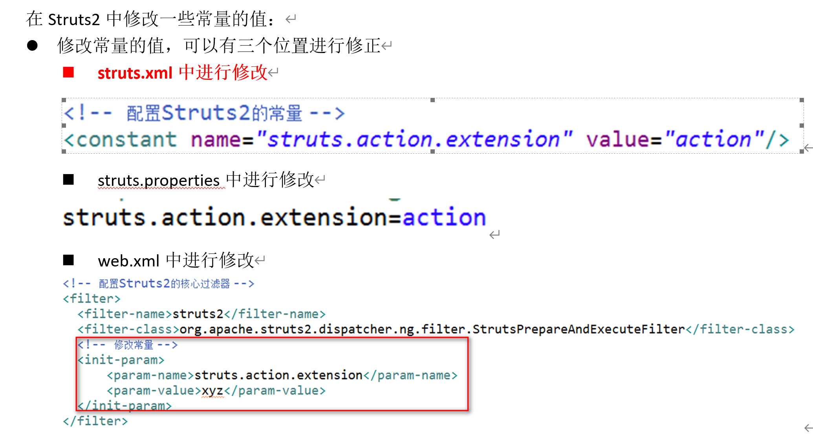
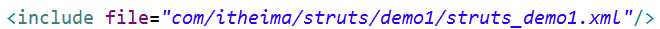
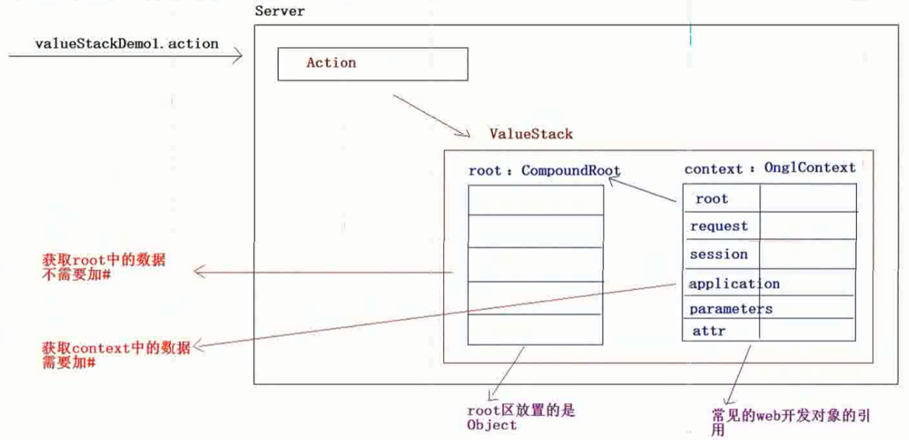

# Strust2

## 一.概述

### 什么是Strusts2

Strusts2是一个基于MVC设计模式的WEB层框架,内核时webwork,整个体系结构相对于Strust1来说已经发生了巨大的改变.其本质上来说相当于一个Servlet.用于接收和响应用户请求

### 常见的web层框架

1. Strust2
2. webwork
3. SpringMVC

web层应用框架都是基于前端控制器模型来设计的



## 二.Strust2入门

default.properties     struts-default.xml   都在核心包下

1. 引入jar包

   去Strusts-blank项目下找jar包

2. 创建测试页面

   ```html
   <body>
       <h1>这是Strust2的入门</h1>
       <h3><a href="${pageContext.request.contextPath }/hello.action">Strust2入门案例</a></h3>
     </body>
   ```

3. 编写action

   ```java
   public class HelloAction {
   	
   	/*
   	 * 方法标签是固定的,即访问权限,返回值类型以及方法名是固定不变的
   	 * */
   	public String execute(){
   		System.out.println("hello action");
   		return null;
   	}
   ```

4. 配置struts.xml

   ```java
   <?xml version="1.0" encoding="UTF-8" ?>
   <!DOCTYPE struts PUBLIC
   	"-//Apache Software Foundation//DTD Struts Configuration 2.3//EN"
   	"http://struts.apache.org/dtds/struts-2.3.dtd">
   
   <struts>
   	<!-- Strusts2通过包管理action -->
   	<!-- 
   		name随便取
   		extends是继承的
   	 -->
   	<package name="demo1" extends="struts-default" namespace="/">
   		<!-- 
   			name是href=/hello.action中的hello,class指的是所要执行的Action的全路径
   		 -->
   		<action name="hello" class="com.itheima.strust.demo1.HelloAction">
   		
   		</action>
   	</package>
   
   </struts>
   
   ```

5. 配置Struts核心过滤器

   在web.xml文件下

   ```xml
     <filter>
     	<filter-name>struts</filter-name>
     	<filter-class>org.apache.struts2.dispatcher.ng.filter.StrutsPrepareAndExecuteFilter</filter-class>
     </filter>
     
     <filter-mapping>
     	<filter-name>struts</filter-name>
     	<url-pattern>/*</url-pattern>
     </filter-mapping>
   ```

6. 更改Action的返回值,配置页面跳转

   ```xml
   <?xml version="1.0" encoding="UTF-8" ?>
   <!DOCTYPE struts PUBLIC
   	"-//Apache Software Foundation//DTD Struts Configuration 2.3//EN"
   	"http://struts.apache.org/dtds/struts-2.3.dtd">
   
   <struts>
   	<!-- Strusts2通过包管理action -->
   	<!-- 
   		name随便取
   		extends是继承的
   	 -->
   	<package name="demo1" extends="struts-default" namespace="/">
   		<!-- 
   			name是href=/hello.action中的hello,class指的是所要执行的Action的全路径
   		 -->
   		<action name="hello" class="com.itheima.strust.demo1.HelloAction">
   			<!-- 配置页面跳转 -->
   			<result name="success" >/demo1/success.jsp</result>
   		</action>
   	</package>
   
   </struts>
   
   ```

   ### Struts2的执行流程

   当用户访问某一个Action的时候,先经过核心过滤器,在核心过滤器中执行一组拦截器(这组拦截器实现部分功能,执行目标Action,根据Action的返回值,进行页面跳转)

   

### 配置文件加载顺序




## 三.Struts的常见配置

#### package标签的配置

1. name

   包的名称,只要在一个项目中不重名即可

2. extends

   继承那个包,通常值为struts-default

3. namespace

   名称空间,与action标签中的name共同决定action的访问路径

   * 带名称的名称空间

     /aaa

   * 根名称空间

     /

   * 默认名称空间

     namespace=""

     

     #### action标签的配置

     1. name

        与namespace共同决定访问路径

     2. class

        action类的全路径

     3. method

        执行action类中的那个方法

     4. converter

        用于设置类型转换器

     

     

     #### Struts常量的配置

     

     

     #### include标签

     分模块开发的时候引入其他组员的配置文件或者集成的时候

     

     

     

     #### Action的编写规则

     1. Action类就是一个POJO类(普通类)

        方法写成:

        ```java
        public String execute(){
            return null;
        }
        ```

        不继承任何类,在Struts.xml中配置即可

     2. 写一个类实现Action接口,重写里面的execute方法

        和第一种 方法很相似,不同点在于Action接口中提供了5个常量(5重逻辑视图)

        * SUCCESS	:成功
        * ERROR         :失败
        * LOGIN           :登录出错页面跳转
        * INPUT           :表单校验的时候出错
        * NONE            :不跳转

     3. 继承ActionSupport接口(推荐使用)

        ActionSupport中提供了数据校验,国际化等一系列方法

        

     ### 访问Action的方式

   1. 通过method

      ```xml  
      <package name="demo2" extends="struts-default" namespace="/">
      		<!-- 
      			name是href=/hello.action中的hello,class指的是所要执行的Action的全路径
      		 -->
      		<action name="userFind" class="com.itheima.strust.demo1.HelloAction" method="find"></action>
      		<action name="userUpdate" class="com.itheima.strust.demo1.HelloAction" method="update"></action>
      		<action name="userDelete" class="com.itheima.strust.demo1.HelloAction" method="delete"></action>
      		<action name="UserSave" class="com.itheima.strust.demo1.HelloAction" method="save"></action>
      </package>
      ```

   2. 使用通配符的方式

      ```html
      <a href="${pageContext.request.contextPath }/product_find.action"
      ```

      ```xml
      <action name="product_*" class="com.itheima.strust.dem03.ProductionAction" method="{1}">
      ```

      

   

   3. 动态方法访问

      * action的配置

        ```xml
        <action name="Customer" class="com.itheima.strust.demo1.CustomerAction" method="find"></action>
        ```

      * 在配置文件中开启动态方法访问

        ```xml
        <constant name="struts.enable.DynamicMethodInvocation = false" value="true"/>
        ```

      * 访问路径

        ```xml
        <a href="${pageContext.request.contextPath }/use!find.action">查找用户</a><br>
            <a href="${pageContext.request.contextPath }/user!update.action">修改用户</a><br>
            <a href="${pageContext.request.contextPath }/user!delete.action">删除用户</a><br>
            <a href="${pageContext.request.contextPath }/user!save.action">保存用户</a><br>
        ```

        

   ## 客户列表demo

   1. 搭建开发环境

      * 引入Jar包
        * Hibernate
        * Struts2
      * 引入配置文件
        * Struts2
          * Struts.xml
          * web.xml
        * HIbernate
          * 核心配置文件
          * 映射文件
          * 日志文件

      

## 四.Struts2的servlet 的API访问

### 1.完全解耦合的方式

这种方式只能获得数据的集合而不能操作对象本省

```java
/*
 * 访问servlet的方式:方式一:完全解耦合的方式
 * */
public class requestDemo1 extends ActionSupport{
	@Override
	public String execute() throws Exception {
		//获取ActionSupport中的对象
		ActionContext context = ActionContext.getContext();
		//利用ActionContext对象获取表单提交参数
		Map<String, Object> map = context.getParameters();
		System.out.println(map);
		//向域中存数据
		context.put("reqName", "reqValue");//相当于request.setAttribute
		context.getSession().put("sessName", "sessionvalue");//相当于Session.setAttribute
		context.getApplication().put("appName", "applicationValue");//相当于application.setAttribute
		return SUCCESS;
	}
}
```


### 2.使用servlet的API的原生方式

要获取request对象

```java
public class requestDemo2 extends ActionSupport{
	@Override
	public String execute() throws Exception {
		//接受数据
		//直接获取request对象,通过ServletActionContext
		HttpServletRequest request = ServletActionContext.getRequest();
		Map<String,String[]> map = request.getParameterMap();
		
		return SUCCESS;
	}
}
```


### 3.接口注入的方式

```java
public class requestDemo3 extends ActionSupport implements ServletRequestAware,ServletContextAware{
	private HttpServletRequest request;
	private ServletContext context;

	@Override
	public String execute() throws Exception {
		Map<String,String[]> map = request.getParameterMap();
		
		//向域中保存数据
		request.setAttribute("reqname", "reqValue");
		request.getSession().setAttribute("sessname", "sessionValue");
		context.setAttribute("conname", "conValue");
		return SUCCESS;
	}

	public void setServletRequest(HttpServletRequest request) {
		this.request = request;
		
	}

	public void setServletContext(ServletContext context) {
		
		this.context = context;
	}
}
```

> 注释:Servlet是单例的,多个应用访问servlet时只会创建一个servlet实例存在线程安全问题..而Action是多例的,每来一个请求就会创建一个Action,不存在线程安全带来的问题


## 五.Struts2结果页面的配置

1. 全局结果页面

   ```xml
   <global-result name="success">/demo1/demo1.jsp</global-result>
   ```

2. 局部结果页面

   局部的会覆盖全局的

3. result标签的属性

   type:页面跳转的类型

   * dispatcher:默认值,请求转发(*Action转发到jsp*)
   * redirect:重定向(*Action重定向到jsp*)...重定向地址栏会发生改变
   * chain:转发(*Action到Action*)
   * redirection:重定向(*Action到Action*)
   * stream:Struts提供的文件下载的功能

   

## 六.Struts2的数据封装

我们需要将表单提交来的数据封装成一个对象

### 1.属性驱动:提供属性set方法的方式(不常用)

```java
public class UserAction1 extends ActionSupport {
	// 提供了对应的属性
	private String username;
	private String password;
	private Integer age;
	private Date birthday;
	private Double salary;
	// 提供属性对应的set方法
	public void setUsername(String username) {
		this.username = username;
	}

	public void setPassword(String password) {
		this.password = password;
	}

	public void setAge(Integer age) {
		this.age = age;
	}

	public void setBirthday(Date birthday) {
		this.birthday = birthday;
	}

	public void setSalary(Double salary) {
		this.salary = salary;
	}
	
	
	@Override
	public String execute() throws Exception {
		// 接收数据:
		System.out.println(username);
		System.out.println(password);
		System.out.println(age);
		System.out.println(birthday);
		System.out.println(salary);
		// 封装数据:
		User user = new User();
		user.setUsername(username);
		user.setPassword(password);
		user.setAge(age);
		user.setBirthday(birthday);
		user.setSalary(salary);
		return NONE;
	}
}
```


### 2.属性驱动:在页面提供OGNL表达式方式

表单的name属性:

```html
<form action="${ pageContext.request.contextPath }/userAction2.action" method="post">
	用户名:<input type="text" name="user.username"/><br/>
	密码:<input type="password" name="user.password"><br/>
	年龄:<input type="text" name="user.age"/><br/>
	生日:<input type="text" name="user.birthday"/><br/>
	工资:<input type="text" name="user.salary"/><br/>
	<input type="submit" value="提交">
</form>
```

Action:

```java
public class UserAction2 extends ActionSupport {
	// 提供一个User对象:
	private User user;
	// 提供user的set和get方法：一定要提供get方法。
	// 因为拦截器完成数据封装，需要创建User对象。通过get方法可以获得同一个对象，将数据封装到同一个对象中。
	public User getUser() {
		return user;
	}
	public void setUser(User user) {
		this.user = user;
	}
	@Override
	public String execute() throws Exception {
		System.out.println(user);
		return NONE;
	}
}
```


### 3.模型驱动:采用模型驱动的方式(最常用)

```java
/**
 * 数据封装的方式三：模型驱动-采用模型驱动的方式
 * @author jt
 *
 */
public class UserAction3 extends ActionSupport implements ModelDriven<User>{
	// 模型驱动使用的对象：前提必须手动提供对象的实例
	private User user = new User(); // 手动实例化User.
	@Override
	// 模型驱动需要使用的方法:
	public User getModel() {
		return user;
	}
	@Override
	public String execute() throws Exception {
		System.out.println(user);
		return NONE;
	}
}
```

> 注释:第二种方式可以同时向多个对象中封装数据,而第三种一次只能想一个对象中封装数据


### input逻辑视图的配置

Action接口中提供了5个逻辑视图的名称:

* SUCCESS

* ERROR

* LOGIN

* INPUT

  input在很多的拦截器中都会使用,很多情况下出错都会转到INPUT逻辑视图

  

* NONE


## 七.Struts2复杂数据类型的封装

需求:向数据库中批量插入数据,例如像数据库中同时插入很多歌商品的信息,我们需要将每个商品的信息单独封装成对象,然后再把这一个个封装好的对象放到集合中去

**其实使用的是上面介绍的在页面上使用表达式的方式**

### 1.封装数据到list集合中

```html
<h1>Struts2的复杂类型的数据封装</h1>
<h3>封装到List集合中：批量插入商品</h3>
<form action="${ pageContext.request.contextPath }/productAction1.action" method="post">
	商品名称:<input type="text" name="products[0].name"><br/>
	商品价格:<input type="text" name="products[0].price"><br/>
	商品名称:<input type="text" name="products[1].name"><br/>
	商品价格:<input type="text" name="products[1].price"><br/>
	商品名称:<input type="text" name="products[2].name"><br/>
	商品价格:<input type="text" name="products[2].price"><br/>
	<input type="submit" value="提交">
</form>
```

```java
/**
 * 复杂类型的数据封装：封装到List集合
 * @author jt
 *
 */
public class ProductAction1 extends ActionSupport {
	private List<Product> products;
	// 提供集合的set方法:
	public void setProducts(List<Product> products) {
		this.products = products;
	}
	public List<Product> getProducts() {
		return products;
	}
	@Override
	public String execute() throws Exception {
		for (Product product : products) {
			System.out.println(product);
		}
		return NONE;
	}
	
}

```


### 2.封装数据到map集合中

```html
<h3>封装到Map集合中：批量插入商品</h3>
<form action="${ pageContext.request.contextPath }/productAction2.action" method="post">
	商品名称:<input type="text" name="map['one'].name"><br/>
	商品价格:<input type="text" name="map['one'].price"><br/>
	商品名称:<input type="text" name="map['two'].name"><br/>
	商品价格:<input type="text" name="map['two'].price"><br/>
	商品名称:<input type="text" name="map['three'].name"><br/>
	商品价格:<input type="text" name="map['three'].price"><br/>
	<input type="submit" value="提交">
</form>
```

```java
/**
 * 数据封装的方式三：模型驱动-采用模型驱动的方式
 * @author jt
 *
 */
public class UserAction3 extends ActionSupport implements ModelDriven<User>{
	// 模型驱动使用的对象：前提必须手动提供对象的实例
	private User user = new User(); // 手动实例化User.
	@Override
	// 模型驱动需要使用的方法:
	public User getModel() {
		return user;
	}
	@Override
	public String execute() throws Exception {
		System.out.println(user);
		return NONE;
	}
}
```


## 八.OGNL表达式

对象导航语言,是一种强大的表达式语言,通过他简单一致的表达式语法,可以存取对象的任意属性,调用对象的方法,遍历整个对象的结构图,实现字段类型转换等功能

* EL:从域对象中获取数据,从EL的11个对象中获取
* OGNL:可以调用对象的方法,获取Struts2的值栈数据

### 1.OGNL使用的要素

* 表达式
* 根对象
* Context对象

### 2.在java环境中使用Ognl表达式

```java
Ognl.getValue(expression,context,root);
//1.直接执行expression获得值
expression = "'helloworld'.length()"
//2.从context中获得值
 OgnlContext context = new OgnlContext();
context.put("name","张三");
Ognl.getValue("#name",context,root);
//3.从root中获得值
OgnlContext context = new OgnlContext();
User user = new User("aaa","123");
context.setRoot(user);
Object root= context.getRoot();
Object username = Ognl.getValue("username",context,root);
```

### 3.在Struts2环境中使用Ognl表达式

(**在web页面上**)

1. 引入标签

   ```jsp
   <%@ taglib prefix="s" uri="/struts-tags"%>
   <s:property value="'struts'.length"/>
   <!--遍历--第一种方式-->
   <s:itertor var="c" value="list">
   	<s:property value="#c.username"></s:property>
   </s:itertor>
   <!--第二种方式-->
   <s:itertor  value="list">
   	<s:property value="username"></s:property>
   </s:itertor>
   ```

### 4.OGNL中的特殊字符

* #

  1. 获取context中的内容

  2. 使用#构建map集合

     ```jsp
     <s:iterator value=#{'aa':'11','bb':'22','cc':'33'}"">
         <s:property value="key"></s:property>
         <s:property value="value "></s:property>
     </s:iterator>
     ```

     

* $

  1. 在属性文件中将表达式强制识别为OGNL表达式
  2. 在xml文件中将表达式强制识别为OGNL表达式

* %

  将表达式强制解析为OGNL表达式

  ```jsp
  <s:textfiled name="name" value="%{#request.name}"
  ```

  

## 九.ValueStack

### 1.概述

ValueStack--值栈,是Strut的一个接口.当客户端发起一个请求,Struts框架会创建一个action实例同时创建一个OgnlValueStack的实例,OgnlValueStack(*实现了ValueStack接口*)贯穿整个Action的生命周期,Struts2中使用OGNL将请求Action的参数封装为对象存储到值栈中,并通过OGNL表达式读取值栈中的对象属性 

> ValueStack相当于一个数据中转站(Struts2框架中的数据就都保存到了ValueStack中)

### 2.ValueStack的内部结构

ValueStack找那个有两个主要的区域:

* root区域:底层是一个ArrayList.里面一般放置对象.获取root对象不需要加#

* context区域:底层是一个map.里面放置的开发的常用的对象数据的引用.获取context里面的数据需要加#

  * request
  * session
  * application
  * parameters
  * attr

  > 值栈操作,通常指的是操作ValueStack中的root区域

  

### 3.值栈与ActionContext的关系

* servletContext:servlet的上下文
* ActionContext:Action的上下文
  * 当请求到来时,执行过滤器的doFilter方法,在这个方法中创建ActionContext,在创建ActionContext的时候创建 ValueStack对象,将ValueStack对象传递给ActionContext对象.所以通过ActionContext对象获取值对象
  * ActionContext对象之所以能够访问Servlet的API,是因为其中有ValueStack的引用,而ValueStack中有域对象

### 4.获取ValueStack的两种方式

* 通过Action

  ```java
  ValueStack ValueStack1 = ActionCOntext.getContext.getValueStack();
  ```

* 通过request对象获得

  ```java
  ValueStack ValueStack2 = (ValueStack)ServletActionContext.getRequest().getAttribute(ServletActionContext.STRUTS_VALUESTACK_KEY)
  ```

### 5.操作值栈-向值栈中存入数据

第一种:在Action中提供属性的get方法的方式

* 默认的情况下降Action对象压入值栈中,action对象的属性也会被压入到值栈中

  ```html
  <s:property  value="user.username">
  <s:property  value="user.username">
  ```

  ```java
  //在action中定义user对象并提供get方法,Strust会自动将action连同其属性一起压入到值栈中
  private User user;
  
  public user getUser(){
      return user;
  }
  ```

  

第二种:只用ValueStack中本身的方法

```java
ValueStack ValueStack = ActionCOntext.getContext.getValueStack();
User user = new User("赵洪",""38);
ValueStack.push(user);
ValueStack.set("name","dengdeng");
```

### 6.EL 表达式获取值栈中的数据

EL表达式本来只能获取域对象中的数据,但是Strusts2框架在底层对request.getAttribute()方法进行了增强.会增强后,该方法到值栈中去找数据局

## 十.Struts2拦截器

### 1.什么是拦截器

拦截客户端对Action的访问.更细粒度化的拦截,可以拦截action中某个具体的方法.

> Filter:过滤器,过滤从客户端向服务器发出的请求

### 2.Struts2的执行流程

客户端向服务器发送一个Action的请求,执行核心过滤器的`doFilter()`方法.在这个方法中,调用`executeAction()`方法,在这个方法内部调用`dispatcher.serviceAction()`;在这个方法内部创建一个Action的Proxy,最终执行的是Action代理中的execute;在这个execute方法中调用了ActionInvocation的invoke方法.在这个方法的内部递归的执行了一组拦截器;如果没有下一个拦截器,就会执行目标Action根据Action的返回值做出页面跳转


### 3.自定义一个拦截器

#### * 实现Interceptor接口或者继承AbstractInterceptor类或者继承MethodFilterInterceptor类

```java
public class InterceptorDemo1 extends AbstractInterceptor {
	@Override
	public String intercept(ActionInvocation invocation) throws Exception {
		System.out.println("拦截器1执行了...");
		String obj = invocation.invoke();
		System.out.println("拦截器1执完成了...");
		return obj;
	}
}
```


#### * 对拦截器进行配置

​	1. 在Struts.xml文件的package标签内部对拦截器进行配置.并且如果要拦截某个action那么在action标签的内部也要配置

```xml
<?xml version="1.0" encoding="UTF-8" ?>
<!DOCTYPE struts PUBLIC
	"-//Apache Software Foundation//DTD Struts Configuration 2.3//EN"
	"http://struts.apache.org/dtds/struts-2.3.dtd">

<struts>
	<constant name="struts.action.extension" value="action"></constant>
	<package name="demo1" extends="struts-default" namespace="/">
	<!-- 定义一个拦截器 -->
	<interceptors>
		<interceptor name="InterceptorDemo1" class="com.itheima.web.action.InterceptorDemo1"/>
	</interceptors>
	
		<action name="ActionDemo1" class="com.itheima.web.action.ActionDemo1">
			<!-- 拦截这个action -->
			<interceptor-ref name="defaultStack"/>
			<interceptor-ref name="InterceptorDemo1"/>
			<result>/demo1/demo1.jsp</result>
		</action>
	</package>
</struts>
```

2. 定义一个拦截器栈

```xml
<?xml version="1.0" encoding="UTF-8" ?>
<!DOCTYPE struts PUBLIC
	"-//Apache Software Foundation//DTD Struts Configuration 2.3//EN"
	"http://struts.apache.org/dtds/struts-2.3.dtd">
<struts>
	<constant name="struts.action.extension" value="action"></constant>
	<package name="demo1" extends="struts-default" namespace="/">
	<!-- 定义一个拦截器 -->
	<interceptors>
		<interceptor name="InterceptorDemo1" class="com.itheima.web.action.InterceptorDemo1"/>
        <!--定义一个拦截器栈-->
		<interceptor-stack name="mystack">
			<interceptor-ref name="defaultStack"/>
			<interceptor-ref name="InterceptorDemo1"/>
		</interceptor-stack>
        
	</interceptors>
        
		<action name="ActionDemo1" class="com.itheima.web.action.ActionDemo1">
			<!-- 引入拦截器栈 -->
			<interceptor-ref name="mystack"></interceptor-ref>
			<result>/demo1/demo1.jsp</result>
		</action>
	</package>
</struts>
```


## 十一.Struts2标签库

使用时需要先引入标签

```jsp
<%@ taglib uri="/struts-tags" prefix="s"%>
```


### 1.通用标签库

* 判断标签

  ```xml
  <s:if></s:if>
  <s:elif></s:elif>
  <s:else></s:else>
  ```

* 遍历标签

  ```jsp
  <!--普通遍历-->
  <s:iterator var="i" begin="1" end="10" step="1">
  	<s:property value="#i"/>
  </s:iterator>
  <!--遍历list集合-->
  <s:iterator var="i" value="{'aa','bb','cc'}">
  	<s:property value="#i"/>
  </s:iterator>
  <!--遍历map集合-->
  <s:iterator var="entry" value="#{'aa':'11','bb':'22','cc':'33'}">
  	<s:property value="#entry.key"/>
      <s:property value="#entry.value"/>
  </s:iterator>
  ```

* 其他

  ```xml
  <s:debug/>
  <s:date/>----在页面上进行日期格式化
  ```

  

### 2.UI标签库(方便数据回显)

数据在提交多个字段的数据时,若某个字段非法,别的字段不受影响,返回登录页面时,表单中其他字段的值任然存在

* ui标签的表单

  ```jsp
  <s:form action="" method="post">
  	<s:textfield name="name" label="用户名"/>
      <s:password name="password" label="密码"/>
      <s:radio list="{'男','女}" name="sex" lable="性别"></s:radio>
      <s:select list="{'北京','上海','深圳'}" name="city" label="籍贯" headerkey="" headerValue="-请选择-"></s:select>
      <s:checkboxlist list="#{'basketball':'篮球','football':足球}"></s:checkbox>
      <s:textarea name="info" clos="6" rows="3" label="介绍"></s:textarea>
      <s:submit value="提交"/>
  </s:form>
  
  ```

  

  


