# Hibernate

## day01--入门

1. 入门
   * 环境搭建
   * Hibernate的API
   * Hibernate的CRUD
2. 第二天
   * Hibernate的以及缓存
   * 其他的API
3. 第三天
   * Hibernate的一对多配置
   * Hibernate的多对多配置
4. 第四天
   * Hibernate的查询方式
   * 抓取策略

## CRM概述

### 什么CRM 

> 客户关系管理

**CRM有哪些模块**

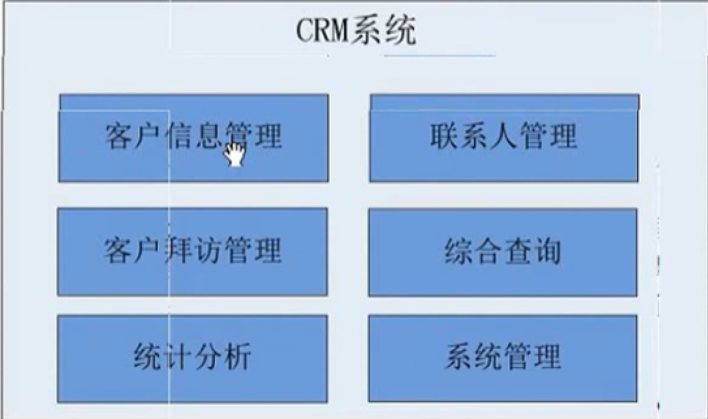


## 框架概述

> 框架:指的是软件的半成品,已经完成了部分功能

### JAVA EE的四层架构

> 客户端层,web层,业务逻辑层,持久层

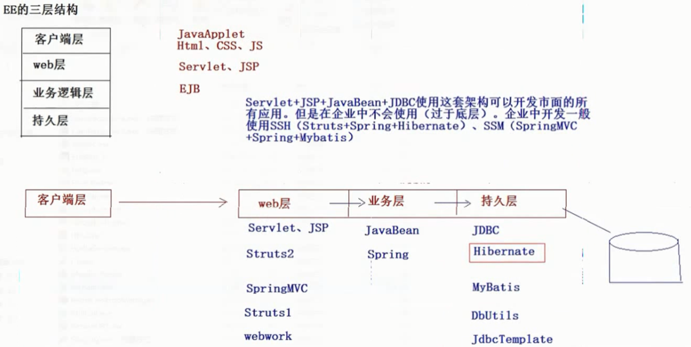


## Hibernate概述

*持久层的ORM框架*

ORM:  object  relational  mapping,将java中的类和数据库中的表项对应,对对象的操作就相当于对表的操作,不用再关心底层的sql语句等实现.

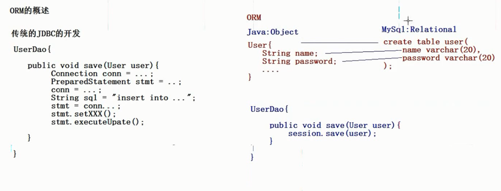

### 配置

使用xml进行配置	

### Hibernate

* HIbernate对JDBC访问数据库的代码做了轻量级的封装,大大简化了数据访问层繁琐的重复性代码,并且减少了内存消耗,加快了运行速度
* HiBernate是一个基于JDBC的主流化持久框架,是一个优秀的ORM实现,很大程度上简化了DAO层的编码工作
* Hibernate的性能非常好,映射的灵活性很出色.它支持很多关系型数据库,从一对一到多对多的各种复杂关系
* 可扩展性强,由于源代码的开源以及API的开方,当本省功能不够用时,可以自行编码进行扩展


### 安装

1. 解压

   * documentation,开发文档
   * lib,开发包
     * required, 开发必须的依赖包
     * optional,开发可选包
   * project,提供的简单demo项目

2. 使用

   创建一个项目,引入jar包

   * 数据库驱动包
   * required包
   * 日志记录包
   
3. 创建实体类customer

4. 创建映射文件(和实体类同一个包下)

   > 映射文件的文件名可以随便取.但是尽量统一.如`类名.hbm.xml`
   >
   > 在libery库文件下找到hibernate-core核心文件,打开它,找到第一个包下的mapping的dtd文件将依赖粘贴到Customer.xml文件中
   >
   > 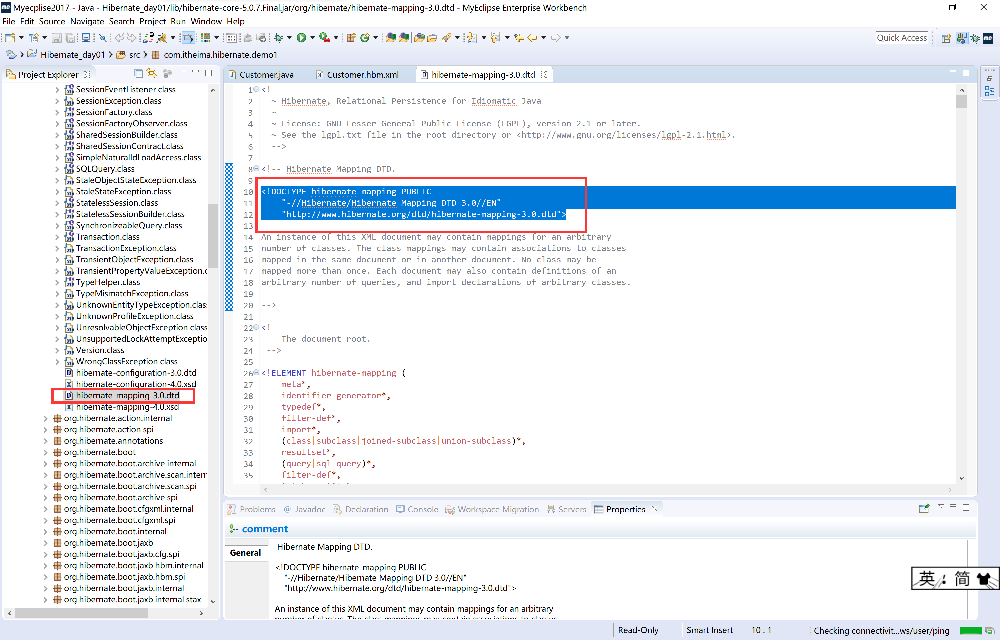
   >
   > ```xml   
   > <?xml version="1.0" encoding="UTF-8"?>
   > <!DOCTYPE hibernate-mapping PUBLIC 
   >     "-//Hibernate/Hibernate Mapping DTD 3.0//EN"
   >     "http://www.hibernate.org/dtd/hibernate-mapping-3.0.dtd">
   > 
   > <hibernate-mapping>
   > 	<!-- 建立实体类和表的对应关系 实体类的全路径-->
   > 	<class name="com.itheima.hibernate.demo1.Customer" table="cst_customer">
   > 		<!--  建立类中属性和表中主键的对应关系-->
   > 		<id name="cust_id" column="cust_id">
   > 		<!-- 生成方法:本地 -->
   > 		<generator class="native"/>
   > 		</id>
   > 		<!-- 建立实体类中的其他属性和表中字段的对应关系 -->
   > 		<property name="cust_name" column="cust_name"/>
   > 		<property name="cust_source" column="cust_source"/>
   > 		<property name="cust_industry" column="cust_industry"/>
   > 		<property name="cust_level" column="cust_level"/>
   > 		<property name="cust_phone" column="cust_phone"/>
   > 		<property name="cust_mobile" column="cust_mobile"/>
   > 	</class>
   > </hibernate-mapping>
   > 
   > ```
   >
   > 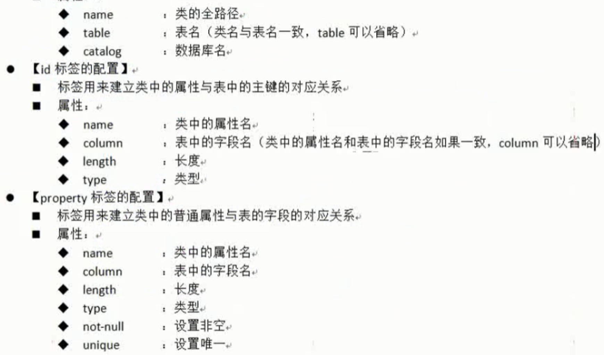

5. 创建hibernate核心配置文件(src目录下)

   hibernate核心配置文件名称:hibernate.cfg.xml.打开hibernate的解压路径,找到project/etc中的属性文件,里面有如何配置的模板

   ```xml  
   <?xml version="1.0" encoding="UTF-8"?>
   <!DOCTYPE hibernate-configuration PUBLIC
   	"-//Hibernate/Hibernate Configuration DTD 3.0//EN"
   	"http://www.hibernate.org/dtd/hibernate-configuration-3.0.dtd">
   
   <hibernate-configuration>
   	<session-factory>
   		<!-- 连接数据库的基本参数 -->
   		<property name="hibernate.connection.driver_class">com.mysql.jdbc.Driver</property>
   		<property name="hibernate.connection.url">jdbc:mysql:///hibernate_day01</property>
   		<property name="hibernate.connection.username">root</property>
   		<property name="hibernate.connection.password">1234</property>
   		<!-- 配置hibernate的方言 与数据库种类相对应 -->
   		<property name="hibernate.dialect">org.hibernate.dialect.MySQLDialect</property>
   		<!-- 映射文件的路径 -->
   		<mapping resource="com/itheima/hibernate/demo1/Customer.hbm.xml"/>
   	</session-factory>
   </hibernate-configuration>
   ```

   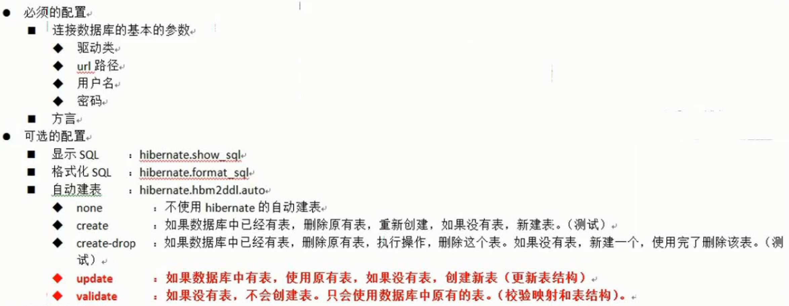

6. 编写测试

   demo 	

   ```java  
   @Test
   	public void demo1(){
   		//1.加载Hibernate的核心配置文件
   		Configuration configuration = new Configuration().configure();
   		//2.创建一个SessionFactory对象:类似于JDBC中的连接池
   		SessionFactory sessionFactory =  configuration.buildSessionFactory();
   		//3.通过SessionFactory对象获取Session对象:类似于JDBC中的Connection
   		Session session = sessionFactory.openSession();
   		//4.手动开启事务
   		org.hibernate.Transaction transaction = session.beginTransaction();
   		//5.编写代码
   		Customer customer = new Customer();
   		customer.setCust_name("wangdong");
   		session.save(customer);
   		
   		//6.事务提交
   		transaction.commit();
   		//7.释放资源
   		session.close();
   	}
   ```

   核心API:

   * Configuration对象

     > 用于加载`核心配置文件`和`映射文件`,然后创建一个SessionFactory对象.除了在xml文件中加载映射文件还可以手动再程序中用代码加载映射文件
     >
     > ```java  
     > //在程序中手动配置
     > configuration.addResource("com/itheima/hibernate/demo1/Customer.hbm.xml");
     > ```
     >
     > ```xml  
     > <!--在xml中加载-->
     > <mapping resource="com/itheima/hibernate/demo1/Customer.hbm.xml"/>
     > ```
     >
     > 
     >
     > 

   * SessionFactory

     > SessionFactory在内部维护了Hibernate的连接池和二级缓存.是线程安全的.一个项目只需要一个sessionFactory即可,可以将这个部分抽取出来作为一个工具类
     >
     > ```java  
     > /*
     >  * Hibernate的工具类,加载配置文件
     >  * */
     > public class HibernateUtils {
     > 	public static final Configuration cfg;
     > 	public static final SessionFactory sf;
     > 	
     > 	static{
     > 		cfg = new Configuration().configure();
     > 		sf = cfg.buildSessionFactory();
     > 	}
     > 	
     > 	public static Session openSession(){
     > 		return sf.openSession();
     > 	}
     > 	
     > ```

   * Session对象

     > session对象不是线程安全的,而且和jsp应用中的HTTPSession不一样,后者是指用户session,前者用于和数据库连接.**正因为session不是线程安全的,因此不能定义成全局变量,必须要定义在方法的内部,成为局部变量**
     >
     > session中的API:
     >
     > * 保存方法
     >
     >   Serializable save(Object obj),会返回对象在数据库中的id
     >
     > * 查询方法
     >
     >   1. T get(class c,Serializable id)
     >
     >      * `采用的是立即加载,执行到get方法时会立刻发送SQL语句去查询`
     >      * `查询后会返回一个真实的对象`
     >      * `查询一个找不到的对象时会返回null`
     >
     >      
     >
     >   2. T load(class c,Serializable id)
     >
     >      * `采用的是延迟加载,执行到load方法时不会立刻发送SQL语句查询,当真正使用这个对象的时候才会发送SQL语句`
     >      * `查询后返回的是一个代理对象`
     >      * `查询一个找不到的记录时会抛出异常`
     >
     > * 修改方法
     >
     >   先查询再更新,如果直接更新的话,不能更新单独的一个字段
     >
     >   ```java  
     >   Customer customer = session.get(Customer.class,1l);
     >   customer.setCust_name("王小贱");
     >   session.update(customer);
     >   ```
     >
     >   
     >
     >   
     >
     > * 删除方法
     >
     >   ```java  
     >   //先查询再删除(推荐)
     >   Customer customer = session.get(Customer.class,1l);
     >   session.delete(customer);
     >   ```
     >
     >   
     >
     > * 查询所有
     >
     >   ```java  
     >   //传入HQL
     >   Query query = session.createQuery("from Customer");
     >   List<Customer> list = query.list();
     >   for(Customer customer:list){
     >       System.out.println(customer);
     >   }
     >   ```

     * transaction 对象

       Hibernate中管理事务的对象

       1. commit()
       2. rollback()

7. xml配置时提示的问题

   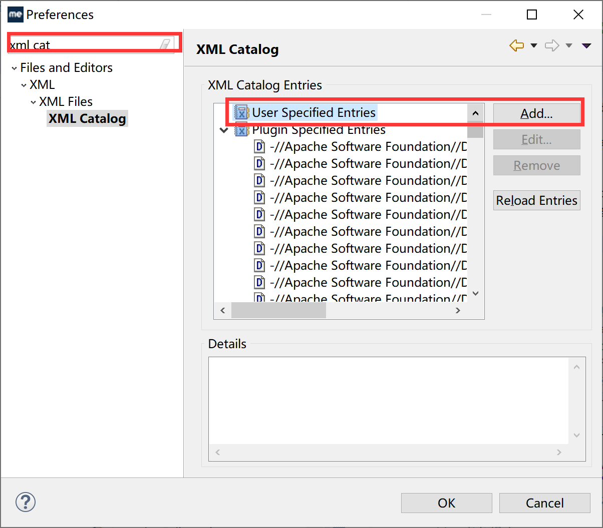


## day02---持久化类的编写规则

### 什么是持久化类

和数据库中的表建立对应关系的java类

### 持久化类的编写规则

1. 对持久化类提供一个无参的构造方法

   > 底层需要使用.class文件生成实例

2. 属性私有,set和get方法

3. 对持久化类提供一个唯一标识OID与数据库的主键相对应

4. 持久化类的属性尽量使用包装类类型而不是基本数据类型

   > 基本数据类型的默认值是0,容易造成层歧义.而包装类的默认值是null

5. 持久化类尽量不要final修饰

   > 底层需要继承持久化类生成代理对象,如果用final修饰,持久化类不能被继承.延迟加载也就失效了.这样,load方法和get方法无异

### 主键生成策略

```xml  
<!-- 主键生成方法:本地 -->
<generator class="native"/>
```

#### 主键的分类

1. 自然 主键

   主键是表中的一个字段或者说对象的固有的自然属性

2. 代理主键(**推荐使用**)

   主键本身不是表中必须的一个字段,不是对象的固有的自然属性

#### 生成策略

1. increment

   自动增长,适用于short,int,long.在单线程程序中使用

2. identity

   使用的数据库底层的增长.,适用于short,int,long,自动增长(mysql)

3. sequence

   采用的序列的方式(Oracle),,适用于short,int,long

4. uuid

   适用于字符串类型的主键.Hibernate中随机生成的字符串

5. native

   本地策略,在identity和sequence之间切换.取决你底层使用的是哪种数据库

6. assigned

   在保存之前需要,用户自己设置id才能保存

7. foreign

   一对一的关联映射时会使用


## 持久化类的三种状态

1. 瞬时态(transition)

   没有唯一的OID标识,没有被session所管理

2. 持久态(persistent)

   有唯一的OID,被session管理.持久化对象具有更新数据库的能力,即使不写save也没有问题,会自动更新

   ```java  
   Customer customer = session.get(Customer.class,1l);
   customer.setCust_name("wangdada");
   //customer.update(customer);这句不写也没有问题
   ```

   

3. 脱管态(detached)

   有唯一的OID,不被session管理

```java  
Session session = HibernateUtils.openSession();
Transaction transaction = session.beginTransaction();

Customer customer = new Customer();//瞬时态对象
customer.setCust_name("wangxi");
session.save(customer);//持久化对象

transaction.commit();
session.close();

System.out.println(customer.toString());//session关闭,脱管态对象
```


*三种状态的相互转换:*

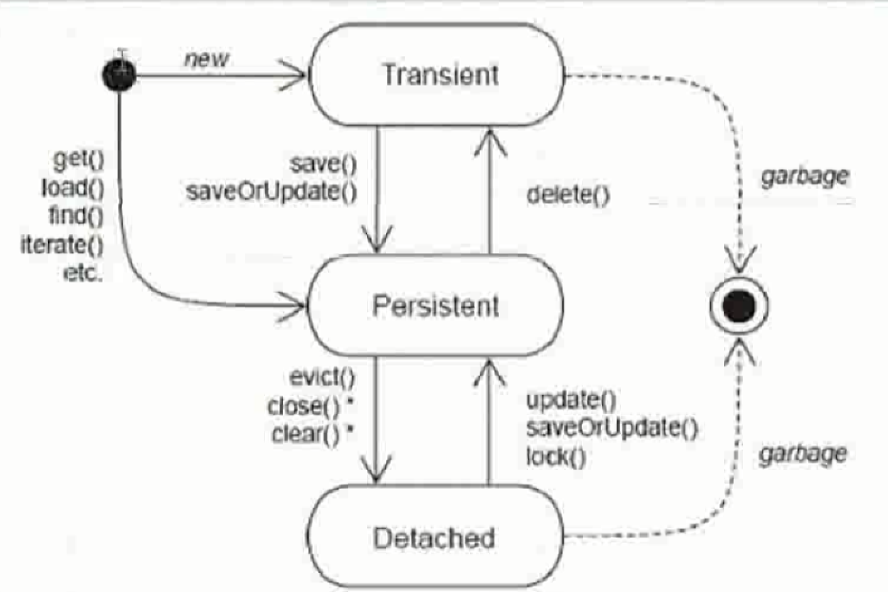


## Hibernate一级缓存

### 概述

也被称为session级别的缓存,因此一级缓存的声明周期和session一致

Hibernate的二级缓存也被称为sessionFactory级别的缓存,需要配置的缓存

### 现象

因为一级缓存的存在,如果对一条记录先后执行两次查询,那么第一次查询的时候会发送SQL语句,而第二次查询的时候不会发送SQL语句

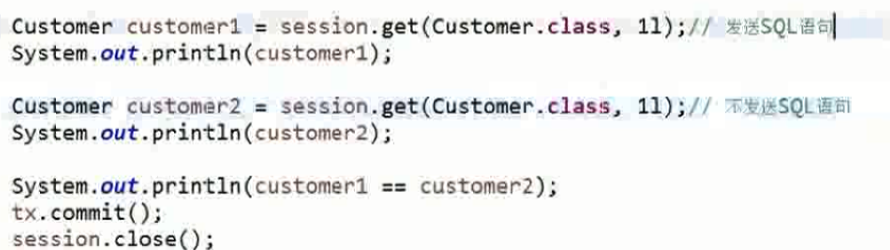

### 一级缓存的结构

1. 快照区

   是一级缓存数据的备份,在事务提交的时候会比较一级缓存和 快照区内的数据是否一致,如果一致不执行 操作,如果不一致,执行操作

   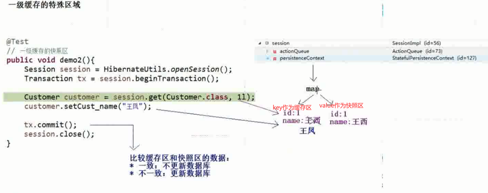


## 事务

事务的四种特性:

1. 原子性
2. 一致性
3. 隔离性
4. 持久性

### 不考虑隔离性引发的安全问题

* 度问题
  * 脏读:一个事务读到另一个事务未提交的数据
  * 不可重复读:一个事务读到另一个事务已经提交的update的数据,导致在前一个事务多次查询的结果不一致
  * 虚读:一个事务读取到了另一个事务已经提交的insert的护具,导致在前一个事务多次查询的结果不一致
* 写问题
  * 引发两类丢失更新

### 读问题的解决

* 设置事务的隔离级别

  * Read uncommitted :以上的读问题都不能解决
  * read committed :可以解决脏读的问题,但是不能够解决不可重复读和虚读的问题
  * repeatable read :解决脏读和不可重复读,但是虚读有可能会发生
  * serializable :解决所有的问题,但是效率最低

* 在Hibernate中设置事务隔离级别

  在配置文件中设置

  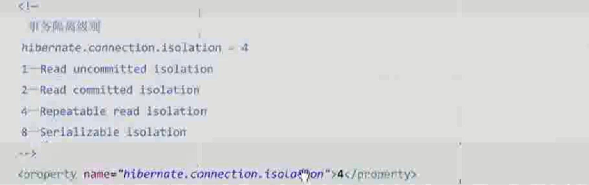

### 线程绑定session

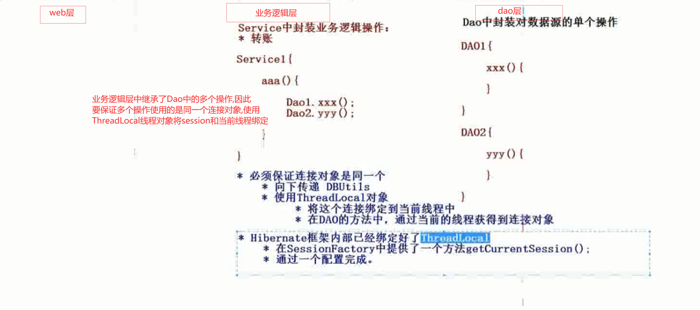

> 注释:
>
> 1. 使用线程绑定session需要在hibernate.cfg.xml文件中进行配置
>
> ```xml  
> <!-- 配置当前线程绑定session -->
> 		<property name="hibernate.current_session_context_class">thread</property>
> ```
>
> 2.  不能手动关闭session,即session.close()不能再使用,因为,线程关闭后会自动关闭session,不需要手动关闭了


### Hibernate中的其他API

1. Query

   ```java  
   //查询所有
   String hql = "from Customer";
   Query query = session.createQuery(hql);
   List<Customer> list = query.list();
   for(Customer customer:list){
       System.out.println(customer);
   }
   //条件查询
   String hql = "from Customer where cust_name like ?";
   Query query = session.createQuery(hql);
   query.setParamter(0,"王%");
   List<Customer> list = query.list();
   for(Customer customer:list){
       System.out.println(customer);
   }
   //设置分页--查询第三页的数据
   query.setFirstResult(3);
   query.setMaxResult(3);
   ```

   

2. Criteria

   ```java  
   //查询所有
   Criteria criteria = session.createCriteria(Customer.class);
   List<Customer> list = criteria.list();
   
   //条件查询
   criteria.add(Restrictions.like("cust_name","王%"));
   List<Customer> list = criteria.list();
   ```

   ## 

   ## day03--表操作

   > 表与表之间的关系:一对一,一对多[在多的一张表内建立外键指向另一张表的主键],多对多[建立一个中间表,放入两个主键]

   

   ### Hibernate一对多的关系配置

   1.  实体类的建立规则

      * 在一的一方放置多的一方对象的集合
   * 在多的一方放一的一方的对象
   
      ```java  
   //一个客户对应多个联系人
      //这边放置联系人的集合
      private Set<LinkMan> linkmans = new HashSet<LinkMan>();
      
      //通过ORM的方式建立联系人表和客户表的关系.一个联系人只能对应一个客户
      //在联系 人表这边放置客户表的对象
      private Customer customer;
      ```
   
      

   2. 配置文件中的配置

      * 多的一方的配置

      ```xml  
   <?xml version="1.0" encoding="UTF-8"?>
      <!DOCTYPE hibernate-mapping PUBLIC 
          "-//Hibernate/Hibernate Mapping DTD 3.0//EN"
          "http://www.hibernate.org/dtd/hibernate-mapping-3.0.dtd">
      <hibernate-mapping>
      	<class name="com.itheima.hibernate.domain.LinkMan" table="cst_linkman">
      		<id name="lkm_id" column="lkm_id">
      			<generator class="native"></generator>
      		</id>
      		
      		<property name="lkm_name" column="lkm_name"></property>
      		<property name="lkm_gender" column="lkm_gender"></property>
      		<property name="lkm_phone" column="lkm_phone"></property>
      		<property name="lkm_mobile" column="lkm_mobile"></property>
      		<property name="lkm_email" column="lkm_email"></property>
      		<property name="lkm_qq" column="lkm_qq"></property>
      		<property name="lkm_position" column="lkm_position"></property>
      		<property name="lkm_memo" column="lkm_memo"></property>
      		
      		<!-- 配置多对一关系 
      			*name:一的一方的属性
      			*class:一的一方的类的全路径
      			*column:多的一方的外键
      		-->
      		<many-to-one name="customer" class="com.itheima.hibernate.demo1.Customer" column="lkm_cust_id"></many-to-one>
      	</class>
      </hibernate-mapping>
      ```
   
      * 一的一方的配置

        ```xml  
     <?xml version="1.0" encoding="UTF-8"?>
        <!DOCTYPE hibernate-mapping PUBLIC 
            "-//Hibernate/Hibernate Mapping DTD 3.0//EN"
            "http://www.hibernate.org/dtd/hibernate-mapping-3.0.dtd">
            
        <hibernate-mapping>
        	<class name="com.itheima.hibernate.demo1.Customer" table="cst_customer">
        		<id name="cst_id" column="cst_id">
        			<generator class="native"></generator>
        		</id>
        		<property name="cust_name" column="cust_name"/>
        		<property name="cust_source" column="cust_source"/>
        		<property name="cust_industry" column="cust_industry"/>
        		<property name="cust_level" column="cust_level"/>
        		<property name="cust_phone" column="cust_phone"/>
        		<property name="cust_mobile" column="cust_mobile"/>
        		
        		<!-- 配置一对多
        			*name:多的一方的属性
        			*column:外键
        			*class:多的一方实体类的全路径
        		 -->
        		<set name="linkmans">
        			<key column="lkm_cust_id"></key>
        			<one-to-many class="com.itheima.hibernate.domain.LinkMan"/>
        		</set>
        	</class>
        </hibernate-mapping>
        
   ```
        
   
   3.  测试类
   
       ```java  
       @Test
       	public void demo1(){
       		Session session = HibernateUtils.getCurrentSession();
       		Transaction tx = session.beginTransaction();
       		
       		//创建两个用户
       		Customer customer1 = new Customer();
       		customer1.setCust_name("wangxi");
       		Customer customer2 = new Customer();
       		customer1.setCust_name("xiaoming");
       		
       		//创建三个联系人
       		LinkMan linkMan1 = new LinkMan();
       		linkMan1.setLkm_name("fengjie");
       		LinkMan linkMan2 = new LinkMan();
       		linkMan1.setLkm_name("zhaohong");
       		LinkMan linkMan3 = new LinkMan();
       		linkMan1.setLkm_name("liming");
       		
       		//设置用户和联系人之间的关系
       		linkMan1.setCustomer(customer1);
       		linkMan2.setCustomer(customer1);
       		linkMan3.setCustomer(customer2);
       		
       		customer1.getLinkmans().add(linkMan1);
       		customer1.getLinkmans().add(linkMan2);
       		customer2.getLinkmans().add(linkMan3);
       		
       		//保存数据
       		session.save(linkMan1);
       		session.save(linkMan2);
       		session.save(linkMan3);
       		session.save(customer1);
       		session.save(customer2);
       		
       		tx.commit();
       	}
       ```
   
       >注释:一对多的关系只保存一边是不行的,会报瞬时对象异常---->保存的那边变成了持久态,但是与之相关联的对象仍然是瞬时态,这样是允许的
   
       
   
   4.  级联操作
   
       为了完成上面只保存一边数据的操作,需要进行配置,使程序能够完成级联操作
   
       * 什么是级联
   
         操作一个对象时,是否会操作与之相关的对象
   
       * 级联是有方向的
   
         * 操作一的一方是否操作多的一方
         * 操作多的一方是否操作一的一方
   
       * 级联操作
   
         * 级联保存或更新
         * 级联删除
   
       如果要保存customer,而你希望与之关联的LinkMan对象能都级联保存,那么就在customer.hbm.xml文件中配置标签set,使之加上一个属性:cascade="save-update".简而言之就是需要修改操作主体的xml配置文件
   
       ```xml  
       <!--操作主体是customer-->
       <set name="linkmans" cascade="save-update">
           <key column="lkm_cust_id"></key>
           <one-to-many class="com.itheima.hibernate.domain.LinkMan"/>
       </set>
       
       <!--操作主体是LinkMan-->
       <many-to-one name="customer" class="com.itheima.hibernate.demo1.Customer" column="lkm_cust_id"></many-to-one>
       ```
   
       * 对象导航
   
         ```java  
         /*
         一旦保存了linkMan1,cunstomer也会被级联保存,接着,LinkMan2和LinkMan3也会被级联保存
         这样做的前提是两个实体类的配置文件中都配置了cascade属性
         但是保存了customer只会级联保存LinkMan2和LinkMan3
         保存了LinkMan2,不会级联保存别的对象
         LinkMan1--->customer--->LinkMan2--->LinkMan3
         */
         
         Customer customer = new Customer();
         customer.setCust_name("wangxi");
         
         LinkMan linkMan1 = new LinkMan();
         linkMan1.setLkm_name("fengjie");
         LinkMan linkMan2 = new LinkMan();
         linkMan1.setLkm_name("zhaohong");
         LinkMan linkMan3 = new LinkMan();
         linkMan1.setLkm_name("liming");
         
         LinkMan1.setCustomer(customer);
         customer.getLinkmans().add(linkMan2);
         customer.getLinkmans().add(linkMan3);
         
         session.save(linkMan1);
         ```
   
       * 级联删除
   
         默认情况下,如果没有设置cascade,那么在删除两个有关系的表的时候,会先把另一张表的外键置为空然后再把这张表中要删除的属性删除.这个不是级联删除
   
         > 注释:级联删除一定要先查询再删除
   
         * 同样的,在删除之前需要在被删除实体类的配置文件中配置cascade="save-update,delete"即可
   
       * cascade和inverse的区别
   
         是否级联保存进数据库是由cascade控制的,而级联保存进入数据库后的外键是否为空是由inverse控制的
   
         
   
   


### Hibernate多对多关系的配置

需要额外建一张表,然后多的两张表分别与这张表形成一对多的关系

``` xml    
<!--role.hbm.xml-->
<!--set标签
name:role类属性的名称
cloumn:name对应的表的名称
-->
<set name="users" column="sys_user_role">
    <!--key标签
    	当前实体类对应额外表的外键的名称
    -->
	<key column="role_id"/>
    <many-to-many class="com.itheima.hibernate.domain.User" column="user_id">
</set>
```

> 注释:一对多的时候一的一方放弃外键的维护权;多对多的时候必须要有一方放弃外键的维护权.通常来说是让被动方放弃,比如说学生选课,学生与课程之间的关系是多对多的,同时课程是`被选的`,因此在课程实体类的配置文件中的set标签中加上属性inverse="true"

### Hibernate的其他一些操作

1. 给用户添加角色

   ```java  
   User user = session.get(User.class,1l);
   Role role = session.get(Role.class,3l);
   
   user.getRoles().add(role);
   ```

2. 给用户改选角色

   ```java   
   User user = session.get(User.class,1l);
   Role role1 = session.get(Role.class,2l);
   Role role2 = session.get(Role.class,3l);
   
   User.getRoles().remove(role2);
   user.getRoles().add(role1);
   ```

   


## day04--HQL_QBC查询

### Hibernate的查询方式

1. OID检索	

   使用get方法和load方法根据`主键`进行查询

2. 对象导航检索

   Hibernate根据已经查询到的对象,获得与其关联的对象的一种查询方式.比如Customer和LinkMan的一对多的关系

   ```java  
   LinkMan linkMan = 	session.get(LinkMan.class,1l);
   Customer customer = linkMan.getCustomer();
   ```

   

3. HQL检索(***)

   Hibernate query language,面向对象的查询语言.使用session.createQuery()方法

   * 简单查询

     ```java 
     Query query = session.createQuery("from Customer");
     List<Customer> list = query.list();
     
     Query query = session.createQuery("select * from Customer");//这种写法是错误的
     ```

     

   * 排序查询 

     ```java 
     Query query = session.createQuery("from Customer order by cust_id");//默认情况下是升序
     Query query = session.createQuery("from Customer order by cust_id desc");//降序.升序是asc
     ```

     

   * 别名查询

     ```java  
     Query query = session.createQuery("from Customer c");
     ```

     

   * 条件查询

     * 按照条件的位置进行绑定

     ```java  
     Query query = session.createQuery("from Customer where cust_id =?");
     query.setString(0,1);
     ```

     * 按名称绑定

     ```java  
     Query query = session.createQuery("from Customer where cust_source = :aaa and cust_name like :bbb");
     query.setParamter("aaa","朋友推荐");
     query.setParameter("bbb","李%");
     ```

     

   * 投影查询

     查询对象的某个或某些属性

     ```java  
     Query query = session.createQuery("select c.cust_name,c.cust_source from Customer c");
     
     //提供无参构造函数以及由你想查询的属性构成的有参构造函数
     Query query = session.createQuery("select new Customer(cust_name,cust_source) from Customer");
     ```

     

   * 分组统计查询

     ```java 
     List<Object> list = session.createQuery("select cust_source,count(*) from Customer group by cust_source");
     ```

     

   * 分页查询

     ```java  
     Query query = session.createQuery("from Customer");
     query.setFirstResult(0);//从第一条记录开始
     query.setMaxResults(10);//一页10条记录
     List<LinkMan> list = query.list();
     ```

     

4. QBC检索(***)

   query by criteria,条件查询.是一种更加面向对象的查询方式

   * 简单查询

   ```java  
   Criteria criteria = session.createCriteria(Customer.class);
   List<Customer> list = criteria.list();
   ```

   * 排序查询

   ```java  
   Criteria criteria = session.createCriteria(Customer.class);
   criteria.addOrder(Order.desc("cust_id"));
   List<Customer> list = criteria.list();
   ```

   * 分页查询

   ```java   
   Criteria criteria = session.createCriteria(LinkMan.class);	
   criteria.setFirstResult(0);
   criteria.setMaxResults(10);
   List<LinkMan> list = criteria.list();
   ```

   * 条件查询

   ```java  
   //查询用户来自于小广告的用户
   /*
   =  eq
   >  gt
   >= ge
   <  lt
   <= le
   <> ne  不等于
   like
   in
   and
   or
   */
   Criteria criteria = session.createCriteria(Customer.class);
   criteria.add(Restrictions.eq("cust_source","小广告"));
   criteria.add(Restrictions.like("cust_name","李%"));
   ```

   * 分组统计查询等

   ```java  
   Criteria criteria = session.createCriteria(Customer.class);
   criteria.setProjection(Projections.rowCount());
   Long num = (Long)criteria.uniqueResult();	
   ```

   * 离线条件查询--DetachedCriteria

     更适合用于做一些综合查询,条件多的查询

     离线--->可以脱离session使用

     好处sql语句的条件在service层之外的时候就已经设置好了,无需在dao层复杂的拼接SQL语句

     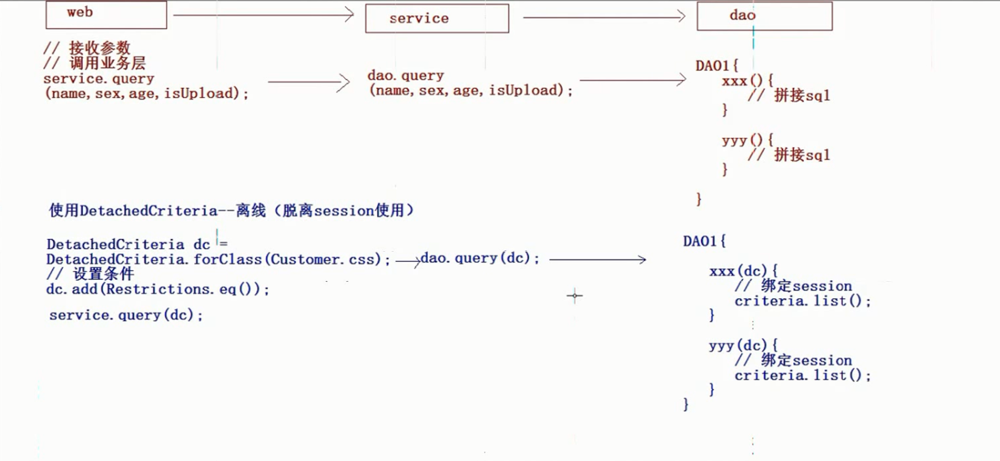

     ```java  
     /*
     可以先在servlet中创建detachedCriteria加上各种条件,然后将这个detachedCriteria对象作为参数传递到service层,然后再传递到dao层,dao层是专门和数据库打交道的,而与数据库打交道必须要使用session,因此在dao层将detachedCriteria对象通过detached.getExecuteableCriteria(session)的方式和session绑定,然后对数据库进行操作.这对于条件很多的查询来说是很方便的
     */
     //注意,这里是离线的criteria,因为没有使用session创建
     DetachedCriteria detachedCriteria = DetachedCriteria.forClass(Customer.class);
     detachedCriteria.add(Restrictions.like("cust_name","李%"));
     //这里创建session
     Session session = HibernateUtils.getCurrentSession();
     Transaction transaction = session.beginTransaction();
     
     //在这里将离线的criteria重新与session绑定
     Criteria criteria = detachedCriteria.getExecuteableCriteria(session);
     List<Customer> list = criteria.list();
     
     ```

   * SQL的多表查询

     1. 交叉连接-->笛卡尔积,两个表的乘积

        ```sql  
        select * from A,B;
        ```

     2. 内连接-->inner join(inner可以省略),查询的是表的交集

        * 隐式内连接

          ```sql   
          select * from A,B where A.id=B.id;
          ```

        * 显示内连接

          ```sql  
          select * from A inner join B where A.id=Bi.d;
          ```

     3. 外连接-->outer join(outer可以省略)

        * 左外连接(查询左边表的全部信息和以及两个表的交集)

          ```sql 
          select * from A left outer join B where A.id=Bi.d;
          ```

        * 右外连接(查询右边表的全部信息以及两个表的交集)

          ```sql  
          select * from A right outer join B where A.id=B.id;
          ```

   * HQL的多表查询

     * 交叉连接(基本不用)

     * 内连接

       ```java  
       //返回的是一个对象集合,这个集合中有两个对象,没有封装到一个对象中
           List<Object[]> list = session.createQuery("from Customer c inner join c.linkMans");
       ```

       * 隐式内连接

       * 显示内连接

       * 迫切内连接

         在普通内连接的join后面加上`**fetch**`

         ```java  
         //发送的SQL语句和普通的连接查询是一致的,fetch的作用是通知Hibernate将联系人的数据添加到Customer的联系人集合中封装成一个对象,而不是两个对象.
         List<Customer> list = session.createQuery("select distinct * from Customer c inner join fetch c.linkMans");
         ```

         

     * 外连接

       * 左外连接
       * 右外连接
       * 迫切外连接

5. SQL检索

   ```sql  
   SQLQuery sqlQuery = session.createSQLQuery("select * from cst_customer");
   List<Object[]> list = sqlQuery.list();
   
   //也可以将查询出来的数据封装成一个实体
   sqlQuery.addEntity(Customer.class);
   List<Customer> list = sqlQuery.list();
   ```


### Hibernate的抓取策略

> 对查询关联对象的一种优化

#### 延迟加载(懒加载)

执行到这段代码的时候不会立刻发送SQL语句,而是真正要使用这个对象的属性的时候才会发送SQL语句急性查询

* 类级别的延迟加载

  指的是使用load方法查询某个对象的时候是否采用延迟加载.session.load(Customer.class,1l);

  **只对类中的普通属性有效,对关联对象无效**

  使得lazy失效有三种方法:

  * 可以在class标签上配置属性lazy="true"来实现
  * 将持久化类用final修饰
  * 使用Hibernate中的initialize方法.session.initialize(customer);

* 关联级别的延迟加载---->在set标签或者是many-to-one标签上配置lazy来实现

* 指的是查询某个对象的关联的对象的时候时候采用延迟加载

  ```java  
  i//在这里查询customer对象的时候没有采用延迟加载
   //通过客户对象获得联系人的时候,联系人对象是否采用了延迟加载,称为是关联级别的延迟
  Customer customer = session.get(Customer.class,1l);
  customer.getLinkMans();
  ```

#### 抓取策略的概述

通过一个对象抓取到关联对象需要发送SQL语句,SQL语句如何发送,发送成什么样的格式通过策略进行配置

通过<set>或者<many-to-one>上的lazy和fetch属性进行配置,优化SQL语句

* <set>上的fetch和lazy取值

  * fetch:抓取策略,控制SQL语句格式

    1. select

       默认值,发送普通的select语句查询关联对象

    2. join

       发送一条迫切左外连接查询关联对象

    3. subselect

       发送一条子查询语句查询关联对象

  * lazy:延迟加载,控制查询关联对象的时候是否采用延迟

    1. true

       默认值,采用延迟加载

    2. false

       不采用延迟加载

    3. extra

       及其懒惰

  * 默认情况(fetch='select" lazy="true")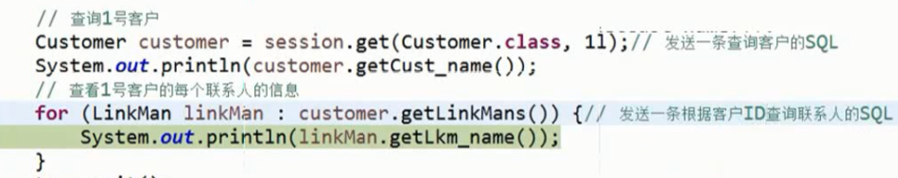

  * (fetch='select" lazy="extra"),想要联系人的个数就差联系人的个数,select count 而不会吧联系人都查出来

    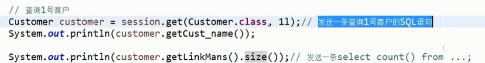

  * (fetch='select" lazy="flase")

    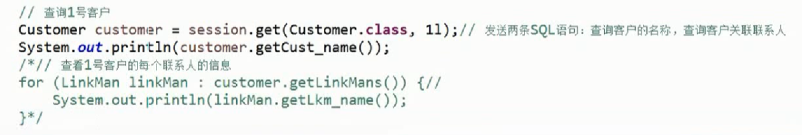

  * fetch设置为join时,lazy失效

    会一次性将两个表的数据都查出来

    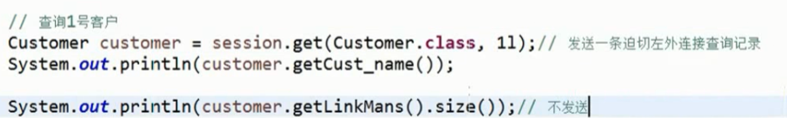

  * fetch = subselect,lazy=true

    

* <many-to-one>上的fetch和lazy取值

  * fetch 

    1. select 
    2. join

  * lazy

    1. proxy

       默认值,proxy是true还是false,取决于另一端class上的lazy的取值

    2. flase

    3. no-proxy

#### 批量抓取

获取客户的时候批量抓取联系人

在class上配置熟悉 batch-size="4",每个4个联系人抓取一次,如果共有8个联系人,那么需要发送两次SQL语句


