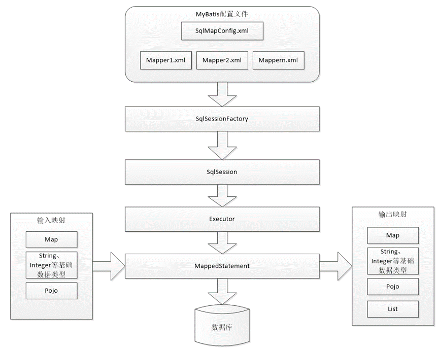
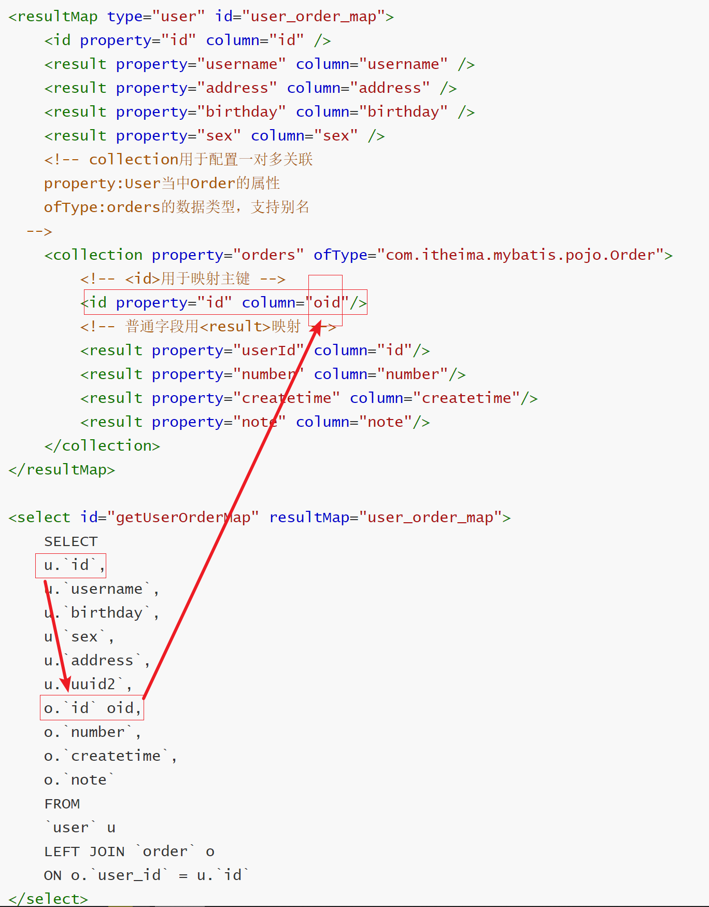

# Mybatis

Hibernate一样的持久层框架,广泛应用于电商领域

 MyBatis是面向SQL的持久层框架,他封装了jdbc访问数据库的过程.我们开发只需要专注于sql语句本身的拼装,其他复杂的过程交给mybatis完成

mybatis是目前国内主流的两大持久层框架之一+介绍mybatis的架构

userMapper.java相当于UserDao,UserMapper.xml相当于UserDaoImpl

sqlMapConfig.xml中配置包扫描(动态Dao代理),根据文件名将UserMapper.java和UserMapper.xml绑定

## 一.环境搭建

1. 导入jar包

2. 新建配置文件/映射文件

   配置文件

   ```xml
   <?xml version="1.0" encoding="UTF-8" ?>
   <!DOCTYPE configuration
   PUBLIC "-//mybatis.org//DTD Config 3.0//EN"
   "http://mybatis.org/dtd/mybatis-3-config.dtd">
   <configuration>
   	<!-- 和spring整合后 environments配置将废除 -->
   	<environments default="development">
   		<environment id="development">
   			<!-- 使用jdbc事务管理 -->
   			<transactionManager type="JDBC" />
   			<!-- 数据库连接池 -->
   			<dataSource type="POOLED">
   				<property name="driver" value="com.mysql.jdbc.Driver" />
   				<property name="url"
   					value="jdbc:mysql://localhost:3306/mybatis?characterEncoding=utf-8" />
   				<property name="username" value="root" />
   				<property name="password" value="1234" />
   			</dataSource>
   		</environment>
   	</environments>
   	
   	<!-- 加载映射文件 -->
   	<mappers>
   		<mapper resource="mybatis/user.xml"/>
   	</mappers>
   </configuration>
   
   ```

   映射文件

   ```xml
   <?xml version="1.0" encoding="UTF-8" ?>
   <!DOCTYPE mapper
   PUBLIC "-//mybatis.org//DTD Mapper 3.0//EN"
   "http://mybatis.org/dtd/mybatis-3-mapper.dtd">
   <!-- 用于隔离不同实体的SQL语句 -->
   <mapper namespace="user">
   	<!--
   		id:sql语句的唯一标识
   		parameterType:入参类型
   		resultType:语句执行结果返回值类型
   	  -->
   	<select id="findUserById" parameterType="int" resultType="com.itheima.mybatis.pojo.User">
   		SELECT 
   		  `id`,
   		  `username`,
   		  `birthday`,
   		  `sex`,
   		  `address` 
   		FROM
   		  `user` 
   		WHERE id=#{id2}
   	</select>
   </mapper>
   
   ```
   
3. 创建实例访问数据库

   ```java
   public class MybatisTest {
   	@Test
   	public void testGetUserById() throws IOException{
   		//1.创建sqlSessionFactory
   		SqlSessionFactoryBuilder ssfb = new SqlSessionFactoryBuilder();
   		//加载核心配置文件
   		InputStream inputStream = Resources.getResourceAsStream("SqlMapConfig.xml");
   		SqlSessionFactory ssf = ssfb.build(inputStream);
   		//创建session
   		SqlSession session = ssf.openSession();
   		//执行语句,sqlid以及SQL语句需要的参数
   		User user = session.selectOne("user.findUserById", 1);
           session.commit();
   		System.out.println(user);
   		session.close();
   	}
   }
   ```

   > #{ }:占位符,相当于jdbc的?
   >
   > ${ }:字符串拼接指令,如果入参为普通数据类型,{ }内只能写value


其他的sql配置:

```xml
<!--插入记录-->
<insert></insert>
<!--插入记录后返回主键在<insert标签内嵌套使用-->
<selectKey keyProperty="id" resultType="int" order="after">
	SELECT LAST_INSERT_ID()
</selectKey>
<!--或者直接在inert标签内部写属性-->
useGeneratedKeys="true" keyProperty="id"
```


## 二.mybatis的架构



## 三.动态代理Dao开发

动态代理开发规则:

1. namespace必需是Dao接口的全路径
2. 接口的方法名必须与sql id 一致
3. 接口的入参与parameterType类型一致
4. 接口的返回值必须与resultType一致

不需要手动去实现Dao,mybatis会自动生成该接口的代理实现类,直接使用代理调用方法即可

```java
@Test
public void testGetUserById() {
    // 加载配置得到SqlSession
    SqlSession sqlSession = SqlSessionFactoryUtils.getSqlSessionFactory().openSession();
    // 获取代理对象
    UserMapper userMapper = sqlSession.getMapper(UserMapper.class);
    // 查询数据
    User user = userMapper.getUserById(30);
    System.out.println(user);
    // 关闭资源
    sqlSession.close();
}
```

> 这里不像以前是调用的DaoImpl里面的方法,这里是通过映射来,根据getUserByid去找到xml映射文件中的SQL语句,直接去执行了SQL语句.


> 传统Dao有接口有实现类,动态代理有接口没有实现类


## 四.其他属性的配置

1. <properties>

   ```xml
   <!-- 加载规则，首先加载标签内部属性，再加载外部文件，名称相同时，会替换相同名称的内容 -->
   <properties resource="jdbc.properties">
       <property name="jdbc.username" value="root1"/>
       <property name="jdbc.password" value="root"/>
   </properties>
   
   <environments default="development">
   		<environment id="development">
   			<!-- 使用jdbc事务管理 -->
   			<transactionManager type="JDBC" />
   			<!-- 数据库连接池 -->
   			<dataSource type="POOLED">
   				<property name="driver" value="${jdbc.driver}" />
   				<property name="url"
   					value="${jdbc.url}" />
   				<property name="username" value="${jdbc.username}" />
   				<property name="password" value="${jdbc.password}" />
   			</dataSource>
   		</environment>
   	</environments>
   ```

2. typeAliases

   ```xml
   <typeAliases>
   		<!-- 单个别名定义 -->
   		 <typeAlias type="com.itheima.mybatis.pojo.User" alias="user"/> 
   		<!-- 别名包扫描器(推荐使用此方式)，整个包下的类都被定义别名，别名为类名，不区分大小写-->
   		<package name="com.itheima.mybatis.pojo" />
   	</typeAliases>
   
   ```

3. mapper映射器

   ```xml
   <mappers>
       <!-- 第一种方式，加载 resource-->
       <mapper resource="mapper/user.xml"/>
       <!-- <mapper resource="mapper/UserMapper.xml"/> -->
   
       <!-- 第二种方式，class扫描器要求：
       1、映射文件与接口同一目录下
       2、映射文件名必需与接口文件名称一致
      -->
       <!-- <mapper class="com.itheima.mybatis.mapper.UserMapper"/> -->
   
       <!-- 第三种方式，包扫描器要求(推荐使用此方式)：
       1、映射文件与接口同一目录下
       2、映射文件名必需与接口文件名称一致
     -->
       <package name="com.itheima.mybatis.mapper"/>
   </mappers>
   
   ```

   

## 五.传递包装的pojo

为了适应复杂场景,通常实体类里面还包含别的实体类作为其属性.那么在使用其属性类的属性的时候,只需要作简单的修改就可以完成

```xml
<!-- resultType：如果返回结果为集合，只需设置为每一个的数据类型 这里设置了别名-->
<select id="getUserByQueryVo" parameterType="queryvo"
        resultType="com.itheima.mybatis.pojo.User">
    SELECT
    <include refid="user_sql" />
    FROM `user`
    <!-- WHERE username LIKE #{name} -->
    WHERE username LIKE '%${user.username}%'
</select>
```

```java
public class QueryVo {

	private User user;
	
	private List<Integer> ids;
	
	public List<Integer> getIds() {
		return ids;
	}

	public void setIds(List<Integer> ids) {
		this.ids = ids;
	}

	public User getUser() {
		return user;
	}

	public void setUser(User user) {
		this.user = user;
	}
}
```

> 在动态代理dao开发中,如果实体类的属性字段和数据库中的字段不一致,会导致查出来是空,在这种情况下,无论是该代码或者数据库都不是好的解决手段,我们可以通过在映射文件中的sql上给字段加上别名

```xml
<select id="getOrderList" resultType="order">
		SELECT
		  `id`,
		  `user_id` userId,
		  `number`,
		  `createtime`,
		  `note`
		FROM `order`
	</select>
```


## 六.resultMap

数据库字段和属性字段的映射关系,这个和Hibernate的配置很相似

要想使用resultMap,必须先定义一个resultMap.如果实体字段和数据库字段一样,property可以不配置,但是不建议这样做

```xml
<!-- resultMap入门，定义 -->
<resultMap type="order" id="order_list_map">
    <!-- <id>用于映射主键 -->
    <id property="id" column="id"/>
    <!-- 普通字段用<result>映射 -->
    <result property="userId" column="user_id"/>
    <result property="number" column="number"/>
    <result property="createtime" column="createtime"/>
    <result property="note" column="note"/>
</resultMap>

<!-- 使用resultMap -->
<select id="getOrderListMap" resultMap="order_list_map">
    SELECT
    `id`,
    `user_id`,
    `number`,
    `createtime`,
    `note`
    FROM `order`
</select>
```


## 七.动态sql

使用sql标签动态拼接sql语句

1. if标签

   ```xml
   <!-- resultType：如果返回结果为集合，只需设置为每一个的数据类型 -->
   <select id="getUserByPojo" parameterType="user"
   resultType="com.itheima.mybatis.pojo.User">
       SELECT
       `id`,
       `username`,
       `birthday`,
       `sex`,
       `address`
       FROM `user`
       <!-- WHERE username LIKE #{name} -->
       WHERE 1 = 1 
   	<if test="username != null and username != ''"> 
           and username LIKE '%${username}%' 
       </if> 
       <if test="sex != null and sex != ''"> 
           and sex = #{sex} 
       </if>   
   </select>
   ```

2. where标签

   where可以自动处理多余关键字

   ```xml
   <!-- resultType：如果返回结果为集合，只需设置为每一个的数据类型 -->
   <select id="getUserByPojo" parameterType="user"
           resultType="com.itheima.mybatis.pojo.User">
       SELECT
       `id`,
       `username`,
       `birthday`,
       `sex`,
       `address`
       FROM `user`
       <!-- <where>自动补上where关键字，同时处理多余and,用了where标签就不能再手动加上where关键字 -->
       <where>
           <if test="username != null and username != ''">
               and username LIKE '%${username}%'
           </if>
           <if test="sex != null and sex != ''">
               and sex = #{sex}
           </if>
       </where>
   </select>
   ```

3. sql片段重复使用

   比如查询,尽管每个查询语句的where语句各不相同,但是每个语句的查询的东西是一样的,这些都是重复的,这个时候可以定义一个sql语句块,用sql语句块来代替这些重复的sql语句

   ```xml
   <!-- sql片段的抽取，定义 -->
   <sql id="user_sql">
       `id`,
       `username`,
       `birthday`,
       `sex`,
       `address`
   </sql>
   <!-- resultType：如果返回结果为集合，只需设置为每一个的数据类型 -->
   <select id="getUserByUserName" parameterType="string"
           resultType="com.itheima.mybatis.pojo.User">
       SELECT
       <include refid="user_sql" />
       FROM `user`
       <!-- WHERE username LIKE #{name} -->
       WHERE username LIKE '%${value}%'
   </select>
   ```

4. foreach

   ```xml
   <select id="getUserByIds" parameterType="queryvo" resultType="user">
   		SELECT
   		<include refid="user_sql" />
   		FROM `user`
   		<where>
   			<!-- foreach循环标签 
   				collection:要遍历的集合 ,ids是定义在queryVo实体类中的属性
   				open:循环开始之前输出的内容 
   				item:设置循环变量 
   				separator:分隔符 
   				close:循环结束之后输出的内容 -->
   			<!-- 目的：id IN(1,25,29,30,35) -->
   			<foreach collection="ids" open="id IN(" item="uId" separator=","
   				close=")">
   				#{uId}
   			</foreach>
   		</where>
   	</select>
   ```


## 八.关联查询

### 1.一对一关联查询

javaType

关联查询是把两张表作笛卡尔积.首先在订单实体类中定义user作为其属性(这样才能使用到user中的属性),然后定义resultMap做订单表字段的映射,然后在resultMap标签中使用association标签将要查询出来的user的属性和数据库中的字段作一对一映射.随后在sql语句中引入该resultMap.因为是动态Dao开发,所以会直接执行这里面的sql语句

```xml
<resultMap type="order" id="order_user_map">
    <!-- <id>用于映射主键 -->
    <id property="id" column="id"/>
    <!-- 普通字段用<result>映射 -->
    <result property="userId" column="user_id"/>
    <result property="number" column="number"/>
    <result property="createtime" column="createtime"/>
    <result property="note" column="note"/>

    <!-- association用于配置一对一关系
    property:order里面的User属性
    javaType:user的数据类型，支持别名
   -->
    <association property="user" javaType="com.itheima.mybatis.pojo.User">
        <id property="id" column="user_id"/>

        <result property="username" column="username"/>
        <result property="address" column="address"/>
        <result property="birthday" column="birthday"/>
        <result property="sex" column="sex"/>
    </association>
</resultMap>
	
	<!-- 一对一关联查询：resultMap使用 -->
	<select id="getOrderUserMap" resultMap="order_user_map">
		SELECT 
		  o.`id`,
		  o.`user_id`,
		  o.`number`,
		  o.`createtime`,
		  o.`note`,
		  u.username,
		  u.address,
		  u.birthday,
		  u.sex
		FROM
		  `order` o 
		  LEFT JOIN `user` u 
		    ON u.id = o.user_id 
	</select>
```

### 2.一对多关联查询

ofType

```xml
<resultMap type="user" id="user_order_map">
    <id property="id" column="id" />
    <result property="username" column="username" />
    <result property="address" column="address" />
    <result property="birthday" column="birthday" />
    <result property="sex" column="sex" />
    <!-- collection用于配置一对多关联
    property:User当中Order的属性
    ofType:orders的数据类型，支持别名
  -->
    <collection property="orders" ofType="com.itheima.mybatis.pojo.Order">
        <!-- <id>用于映射主键 -->
        <id property="id" column="oid"/>
        <!-- 普通字段用<result>映射 -->
        <result property="userId" column="id"/>
        <result property="number" column="number"/>
        <result property="createtime" column="createtime"/>
        <result property="note" column="note"/>
    </collection>
</resultMap>

<select id="getUserOrderMap" resultMap="user_order_map">
    SELECT
    u.`id`,
    u.`username`,
    u.`birthday`,
    u.`sex`,
    u.`address`,
    u.`uuid2`,
    o.`id` oid,
    o.`number`,
    o.`createtime`,
    o.`note`
    FROM
    `user` u
    LEFT JOIN `order` o
    ON o.`user_id` = u.`id`
</select>
```

> 如果在做关联查询时,两张表中存在相同的字段,这个时候要使用别名,需要注意的是如果用了别名后,对应的column也要改为别名,否则是查不出数据的
>
> 


## 九.spring和mybatis整合

AOP.监听某个应用的性能或者日志,事务管理

IOC,spring作为一个容器,dao,service或者action,连接池都交由其管理

### 1.整合思路

sqlSessionFactory对象应该方法spring容器中作为单例存在

传统Dao开发方式中,应该从spring容器中 获得SQLSession对象

Mapper代理形式中,应该从spring容器中直接获得mapper代理对象

数据库的连接以及数据连接池的管理


### 2.整合步骤

* 创建一个java工程
* 导入jar包
* mybatis的配置文件sqlMapConfig.xml
  * 数据库连接以及连接池
  * SQLSessionFactory对象,配置到spring容器中
  * 编写Spring的配置文件
* 复制jdbc.properties配置文件
* 复制log4j.properties配置文件


### 3.动态Dao代理的整合

* 第一种方式--配置MapperBeanFactory

  ```xml
  <!-- 动态代理配置方式:第一种 -->
  	<bean id="baseMapper" class="org.mybatis.spring.mapper.MapperFactoryBean" abstract="true" lazy-init="true">
        <property name="sqlSessionFactory" ref="sqlSessionFactory" />
      </bean> -->
   	<!-- 配置一个接口 -->
       <bean parent="baseMapper">
        <property name="mapperInterface" value="com.itheima.mybatis.mapper.UserMapper" />
      </bean> 
  ```

* 第二种方式--配置包扫描[推荐]

  ```xml
   <!-- 动态代理，第二种方式：包扫描（推荐）： -->
      <bean class="org.mybatis.spring.mapper.MapperScannerConfigurer">
      	<!-- basePackage多个包用","分隔 -->
      	<!-- <property name="basePackage" value="com.itheima.mybatis.mapper" /> -->
      	<property name="basePackage" value="com.itheima.ssm.mapper" />
      </bean>
  ```


## mybatis逆向工程

通过数据库的字段来生成dao的代码


