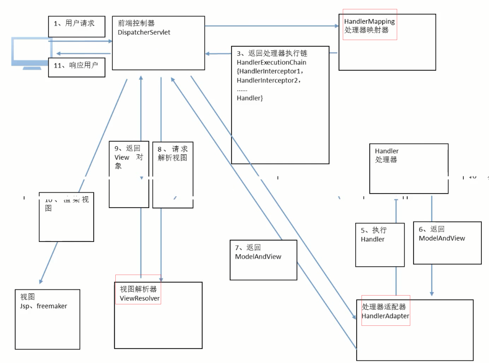
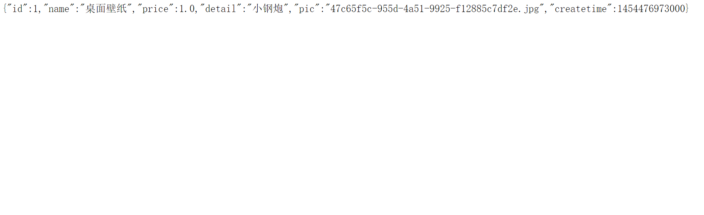
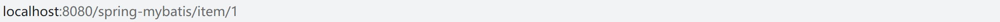

# SpringMVC

SpringMVC是类似于Struts2的MVC框架,属于SpringFrameWork的后序产品.基于servlet,可以与spring 无缝整合


## 一.SpringMVC和Struts2的对比

|   对比项目   |           SpringMVC           |                     Struts2                      |
| :----------: | :---------------------------: | :----------------------------------------------: |
|   国内市场   |             新,多             |                       旧的                       |
|   框架入口   |          基于servlet          |                    基于filter                    |
| 框架设计思想 | 控制器基于方法级别的拦截,单例 |       控制器基于类级别拦截,多例(消耗资源)        |
|   参数传递   |           入参传递            | 参数通过类的成员变量传递.线程不安全,引起并发问题 |


## 二.开发入门

1. 创建项目

2. 引入jar包

3. 编写TestController类

   ```java
   @Controller
   public class HelloController {
   	@RequestMapping("hello")
   	public ModelAndView hello(){
   		System.out.println("hello SpringMVC.....");
   		
   		//创建模型视图对象
   		ModelAndView mav = new ModelAndView();
   		//携带数据给jsp页面
   		mav.addObject("msg", "从控制器成功跳转到了jsp...");
   		//设置返回的页面
   		mav.setViewName("/WEB-INF/jsp/hello.jsp");
   		//返回
   		return mav;
   	}
   }
   ```

4. 配置servlet并加载springMVC配置文件

   ```xml
    <!--核心控制器的配置  -->
     <servlet>
     	<servlet-name>springmvc</servlet-name>
     	<servlet-class>org.springframework.web.servlet.DispatcherServlet</servlet-class>
     	
     	<!-- 加载springmvc核心配置文件 -->
     	<init-param>
     		<param-name>contextConfigLocation</param-name>
     		<param-value>classpath:springmvc.xml</param-value>
     	</init-param>
     </servlet>
     
     <servlet-mapping>
     	<servlet-name>springmvc</servlet-name>
     	<url-pattern>*.action</url-pattern>
     </servlet-mapping>
   ```

5. 编写springmvc.xml

   ```xml
   <?xml version="1.0" encoding="UTF-8"?>
   <beans xmlns="http://www.springframework.org/schema/beans"
   	xmlns:xsi="http://www.w3.org/2001/XMLSchema-instance" xmlns:p="http://www.springframework.org/schema/p"
   	xmlns:context="http://www.springframework.org/schema/context"
   	xmlns:mvc="http://www.springframework.org/schema/mvc"
   	xsi:schemaLocation="http://www.springframework.org/schema/beans http://www.springframework.org/schema/beans/spring-beans-4.0.xsd
           http://www.springframework.org/schema/mvc http://www.springframework.org/schema/mvc/spring-mvc-4.0.xsd
           http://www.springframework.org/schema/context http://www.springframework.org/schema/context/spring-context-4.0.xsd">
   
   	<!-- 配置controller扫描包 -->
   	<context:component-scan base-package="com.itheima.springmvc.controller" />
   </beans>
   
   ```

6. 执行流程

   

## 三.SpringMVC架构

SpringMVC三大组件

* 处理器映射器--找到那个控制器是干活的
* 处理器适配器---将控制器类实例化
* 视图解析器--将处理结果返回给具体的某个视图

```xml
<!-- 配置处理器映射器 -->
	<!-- <bean class="org.springframework.web.servlet.mvc.method.annotation.RequestMappingHandlerMapping"/> -->
	<!-- 配置处理器适配器,和映射器配套使用-->
	<!-- <bean class="org.springframework.web.servlet.mvc.method.annotation.RequestMappingHandlerAdapter"/> -->
	
	<!-- 配置注解驱动，相当于同时使用最新处理器映射跟处理器适配器,对json数据响应提供支持 -->
	<mvc:annotation-driven />
	
	<!-- 配置视图解析器 -->
	<bean class="org.springframework.web.servlet.view.InternalResourceViewResolver">
		<property name="prefix" value="/WEB-INF/jsp/"/>
		<property name="suffix" value=".jsp"/>
	</bean>
```




# SSM整合

## 一.思路

Dao层:

1. sqlMapConfig.xml,空文件即可,需要文件头

   ```xml
   <?xml version="1.0" encoding="UTF-8" ?>
   <!DOCTYPE configuration
   PUBLIC "-//mybatis.org//DTD Config 3.0//EN"
   "http://mybatis.org/dtd/mybatis-3-config.dtd">
   <configuration>
   
   </configuration>
   ```

   

2. applicationContext-dao.xml

   * 数据库连接池:加载数据库配置文件,创建数据库连接池
   * sqlSessionFactory对象
   * 配置Mapper文件扫描器

   ```xml
   <?xml version="1.0" encoding="UTF-8"?>
   <beans xmlns="http://www.springframework.org/schema/beans"
   	xmlns:context="http://www.springframework.org/schema/context" xmlns:p="http://www.springframework.org/schema/p"
   	xmlns:aop="http://www.springframework.org/schema/aop" xmlns:tx="http://www.springframework.org/schema/tx"
   	xmlns:xsi="http://www.w3.org/2001/XMLSchema-instance"
   	xsi:schemaLocation="http://www.springframework.org/schema/beans http://www.springframework.org/schema/beans/spring-beans-4.0.xsd
   	http://www.springframework.org/schema/context http://www.springframework.org/schema/context/spring-context-4.0.xsd
   	http://www.springframework.org/schema/aop http://www.springframework.org/schema/aop/spring-aop-4.0.xsd http://www.springframework.org/schema/tx http://www.springframework.org/schema/tx/spring-tx-4.0.xsd
   	http://www.springframework.org/schema/util http://www.springframework.org/schema/util/spring-util-4.0.xsd">
   
      <!-- 加载数据库连接配置文件 -->
      <context:property-placeholder location="classpath:jdbc.properties" />
   
   	<!-- 数据库连接池 -->
   	<bean id="dataSource" class="org.apache.commons.dbcp.BasicDataSource"
   		destroy-method="close">
   		<property name="driverClassName" value="${jdbc.driver}" />
   		<property name="url" value="${jdbc.url}" />
   		<property name="username" value="${jdbc.username}" />
   		<property name="password" value="${jdbc.password}" />
   		<!-- 连接池的最大数据库连接数 -->
   		<property name="maxActive" value="10" />
   		<!-- 最大空闲数 -->
   		<property name="maxIdle" value="5" />
   	</bean>
   	
   	<!-- SqlSessionFactory配置 -->
   	<bean id="sqlSessionFactory" class="org.mybatis.spring.SqlSessionFactoryBean">
   		<property name="dataSource" ref="dataSource" />
   		<!-- 加载mybatis核心配置文件 -->
   		<property name="configLocation" value="classpath:SqlMapConfig.xml" />
   		<!-- 别名包扫描,别名为实体类的名字不区分大小写-->
   		<property name="typeAliasesPackage" value="com.itheima.springmvc.pojo" />
   	</bean>
   	
       <!-- 动态代理，第二种方式：包扫描（推荐）： -->
       <bean class="org.mybatis.spring.mapper.MapperScannerConfigurer">
       	<!-- basePackage多个包用","分隔 -->
       	 <property name="basePackage" value="com.itheima.springmvc.mapper" /> 
       	
       </bean>
   </beans>
   ```
   

   
3. service层

   * applicationContext-service.xml包扫描,扫描@service注解的类

     ```xml
     <?xml version="1.0" encoding="UTF-8"?>
     <beans xmlns="http://www.springframework.org/schema/beans"
     	xmlns:context="http://www.springframework.org/schema/context" xmlns:p="http://www.springframework.org/schema/p"
     	xmlns:aop="http://www.springframework.org/schema/aop" xmlns:tx="http://www.springframework.org/schema/tx"
     	xmlns:xsi="http://www.w3.org/2001/XMLSchema-instance"
     	xsi:schemaLocation="http://www.springframework.org/schema/beans http://www.springframework.org/schema/beans/spring-beans-4.0.xsd
     	http://www.springframework.org/schema/context http://www.springframework.org/schema/context/spring-context-4.0.xsd
     	http://www.springframework.org/schema/aop http://www.springframework.org/schema/aop/spring-aop-4.0.xsd http://www.springframework.org/schema/tx http://www.springframework.org/schema/tx/spring-tx-4.0.xsd
     	http://www.springframework.org/schema/util http://www.springframework.org/schema/util/spring-util-4.0.xsd">
     
        <!--service层的配置文件--配置注解,注解开发  -->
        <context:component-scan base-package="com.itheima.springmvc.service"></context:component-scan>
     </beans>
     ```

     

   * applicationContext-trans.xml配置事务

     ```xml
     <?xml version="1.0" encoding="UTF-8"?>
     <beans xmlns="http://www.springframework.org/schema/beans"
     	xmlns:context="http://www.springframework.org/schema/context" xmlns:p="http://www.springframework.org/schema/p"
     	xmlns:aop="http://www.springframework.org/schema/aop" xmlns:tx="http://www.springframework.org/schema/tx"
     	xmlns:xsi="http://www.w3.org/2001/XMLSchema-instance"
     	xsi:schemaLocation="http://www.springframework.org/schema/beans http://www.springframework.org/schema/beans/spring-beans-4.0.xsd
     	http://www.springframework.org/schema/context http://www.springframework.org/schema/context/spring-context-4.0.xsd
     	http://www.springframework.org/schema/aop http://www.springframework.org/schema/aop/spring-aop-4.0.xsd http://www.springframework.org/schema/tx http://www.springframework.org/schema/tx/spring-tx-4.0.xsd
     	http://www.springframework.org/schema/util http://www.springframework.org/schema/util/spring-util-4.0.xsd">
     
     	<!-- 事务管理器 -->
     	<bean id="transactionManager"
     		class="org.springframework.jdbc.datasource.DataSourceTransactionManager">
     		<!-- 数据源 -->
     		<property name="dataSource" ref="dataSource" />
     	</bean>
     
     	<!-- 通知 -->
     	<tx:advice id="txAdvice" transaction-manager="transactionManager">
     		<tx:attributes>
     			<!-- 传播行为 -->
     			<tx:method name="save*" propagation="REQUIRED" />
     			<tx:method name="insert*" propagation="REQUIRED" />
     			<tx:method name="delete*" propagation="REQUIRED" />
     			<tx:method name="update*" propagation="REQUIRED" />
     			<tx:method name="find*" propagation="SUPPORTS" read-only="true" />
     			<tx:method name="get*" propagation="SUPPORTS" read-only="true" />
     			<tx:method name="query*" propagation="SUPPORTS" read-only="true" />
     		</tx:attributes>
     	</tx:advice>
     
     	<!-- 切面 -->
     	<aop:config>
     		<aop:advisor advice-ref="txAdvice"
     			pointcut="execution(* com.itheima.springmvc.service.*.*(..))" />
     	</aop:config>
     </beans>
     ```

     

4. controller层

   SpringMvc.xml

   * 包扫描器,扫描@Controller注解的类
   * 配置注解驱动
   * 视图解析器

   ```xml
   <?xml version="1.0" encoding="UTF-8"?>
   <beans xmlns="http://www.springframework.org/schema/beans"
   	xmlns:xsi="http://www.w3.org/2001/XMLSchema-instance" xmlns:p="http://www.springframework.org/schema/p"
   	xmlns:context="http://www.springframework.org/schema/context"
   	xmlns:mvc="http://www.springframework.org/schema/mvc"
   	xsi:schemaLocation="http://www.springframework.org/schema/beans http://www.springframework.org/schema/beans/spring-beans-4.0.xsd
           http://www.springframework.org/schema/mvc http://www.springframework.org/schema/mvc/spring-mvc-4.0.xsd
           http://www.springframework.org/schema/context http://www.springframework.org/schema/context/spring-context-4.0.xsd">
   
   	<!-- 配置controller扫描包 -->
   	<context:component-scan base-package="com.itheima.springmvc.controller" />
   	
   	<!--配置注解驱动对json数据的响应提供支持  -->
   	<mvc:annotation-driven/>
   	<!-- 配置视图解析器 -->
   	<bean class="org.springframework.web.servlet.view.InternalResourceViewResolver">
   		<property name="prefix" value="/WEB-INF/jsp/"/>
   		<property name="suffix" value=".jsp"/>
   	</bean>
   </beans>
   ```

   

5. web.xml

   * 配置spring容器监听器
   * 配置前端控制器

   ```xml
   <?xml version="1.0" encoding="UTF-8"?>
   <web-app xmlns:xsi="http://www.w3.org/2001/XMLSchema-instance"
   	xmlns="http://java.sun.com/xml/ns/javaee"
   	xsi:schemaLocation="http://java.sun.com/xml/ns/javaee http://java.sun.com/xml/ns/javaee/web-app_2_5.xsd"
   	id="WebApp_ID" version="2.5">
   	<display-name>springmvc-web</display-name>
   	<welcome-file-list>
   		<welcome-file>index.jsp</welcome-file>
   	</welcome-file-list>
   
   	<!-- 配置spring -->
   	<context-param>
   		<param-name>contextConfigLocation</param-name>
   		<param-value>classpath:spring/applicationContext*.xml</param-value>
   	</context-param>
   
   	<!-- 使用监听器加载Spring配置文件 -->
   	<listener>
   		<listener-class>org.springframework.web.context.ContextLoaderListener</listener-class>
   	</listener>
   	
   	<!-- 前端控制器 -->
   	<servlet>
   		<servlet-name>springmvc-web</servlet-name>
   		<servlet-class>org.springframework.web.servlet.DispatcherServlet</servlet-class>
   		<init-param>
   			<param-name>contextConfigLocation</param-name>
   			<param-value>classpath:spring/springmvc.xml</param-value>
   		</init-param>
   	</servlet>
   
   	<servlet-mapping>
   		<servlet-name>springmvc-web</servlet-name>
   		<url-pattern>*.action</url-pattern>
   	</servlet-mapping>
     
   </web-app>
   ```


# 参数绑定

在ssm整合开发中,页面向控制器传参的问题

1. 为此需要拿到Request,通过request来获取页面向controller传过来的参数

```java
@RequestMapping("itemEdit")
public ModelAndView itemEdit(HttpServletRequest request){
    String idStr = request.getParameter("id");
    Item item = itemService.getItemById(new Integer(idStr));
    ModelAndView mav = new ModelAndView();
    mav.addObject("item", item);
    mav.setViewName("itemEdit");
    return mav;

}
```

> springMVC默认在控制器中默认可以获得HttpServletRequest,HttpServletResponse,HttpSession

2. 简单参数绑定

   ```java
   @RequestMapping("itemEdit")
   public String itemEdit(Model model , Integer id){
       Item item = itemService.getItemById(id);
       model.addAttribute("item", item);
       return "itemEdit";
   }
   ```

3. pojo参数绑定

   ```java
   @RequestMapping("updateItem")
   	public String updateItem(Item item,Model model){
   		itemService.updateItem(item);
   		Item itemUpdated = itemService.getItemById(item.getId());
   		model.addAttribute("item", itemUpdated);
   		model.addAttribute("msg", "修改成功");
   		
   		//返回编辑视图
   		return "itemEdit";
   	}
   ```

   

> 乱码问题
>
> 1. post请求:在web.xml中写一个过滤器处理
>
>    ```xml
>    <!-- 解决post乱码问题 -->
>    	<filter>
>    		<filter-name>encoding</filter-name>
>    		<filter-class>org.springframework.web.filter.CharacterEncodingFilter</filter-class>
>    		<!-- 设置编码参是UTF8 -->
>    		<init-param>
>    			<param-name>encoding</param-name>
>    			<param-value>UTF-8</param-value>
>    		</init-param>
>    	</filter>
>    	<filter-mapping>
>    		<filter-name>encoding</filter-name>
>    		<url-pattern>/*</url-pattern>
>    	</filter-mapping>
>    
>    ```
>
>    2. GET请求
>
>       在server.xml文件中配置编码格式
>
>       ```xml
>        <Connector URIEncoding="utf-8" port="8009" protocol="AJP/1.3" redirectPort="8443" />
>       ```
>
>    3. response
>
>       获取writer之前设置
>
>       ```java
>       response.setContentType("text/html;charset=utf-8");
>       response.setCharacterEncoding("utf-8");
>       ```
>
>       


# springMVC高级参数的绑定

## 1.数组类型的参数绑定

常用于批量操作的业务场景

只需要在包装的pojo中定义数组或者集合即可，底层会自动根据名称自动绑定

```java 
public class QueryVo {

	private Item item;
	
	private List<Item> items;
	
	private Integer[] ids;

	public Integer[] getIds() {
		return ids;
	}

	public void setIds(Integer[] ids) {
		this.ids = ids;
	}

	public Item getItem() {
		return item;
	}

	public void setItem(Item item) {
		this.item = item;
	}

	public List<Item> getItems() {
		return items;
	}

	public void setItems(List<Item> items) {
		this.items = items;
	}	
}
```

### 2.自定义参数的绑定

默认情况下如果springMVC无法自动完成日期类型的转换而报出404错误

这个时候我们需要自定义一个转化器，实现Converter

```java
/**
 * 日期转换器
 * S:需要转换的类型
 * T:转换成什么类型 
 * @author 张恒
 *
 */
public class DateConverter implements Converter<String, Date>{
	public Date convert(String source) {
		Date result =null;
		try {
			SimpleDateFormat sdf = new SimpleDateFormat("yyyy-MM-dd HH:mm:ss");
			result = sdf.parse(source);
		} catch (ParseException e) {
			// TODO Auto-generated catch block
			e.printStackTrace();
		}
		return null;
	}
}
```

配置以使用该日期转换器

```xml
<!--配置注解驱动对json数据的响应提供支持  -->
	<mvc:annotation-driven conversion-service="myConverter"/>
	<!-- 配置视图解析器 -->
	<bean class="org.springframework.web.servlet.view.InternalResourceViewResolver">
		<property name="prefix" value="/WEB-INF/jsp/"/>
		<property name="suffix" value=".jsp"/>
	</bean>
	<bean id="myConverter" class="org.springframework.format.support.FormattingConversionServiceFactoryBean">
		<property name="converters">
			<set>
				<bean class="com.itheima.springmvc.utils.DateConverter"></bean>
			</set>
		</property>
	</bean>
```

# @RequestMapping注解的其他应用场景

1. @RequestMapping(value={"itemList","itemList2"})

   一次性配置多个请求

2. 把这个注解加在控制器头部

   为了防止控制器之间方法重名,将不同控制器的方法分目录管理

   @RequestMapping("item")

   ```html
   http://localhost:8080/spring-mybatis/itml/itemList.action
   ```

3. 限定请求方法

   @RequestMapping(value="itemList",method=RequestMethod.POST)


# 控制器方法的返回值类型

1. ModelAndView类型---其中包含了要返回的视图名称以及要返回给页面的数据

2. String类型---返回视图名称

   使用model设置返回值

   字符串为视图名称

   在方法的参数列表获取页面传来的数据

3. void

   request和response来响应用户请求

   ```java
   @RequestMapping("queryVoid")
   	public void queryVoid(HttpServletRequest request, HttpServletResponse response) throws Exception {
   
   		// request响应用户请求
   		// request.setAttribute("msg", "这个是request响应的消息");
   		// request.getRequestDispatcher("/WEB-INF/jsp/msg.jsp").forward(request,
   		// response);
   
   		// 假设这里是跟据id查询商品信息，搜索不到商品
   		if (true) {
   			throw new MyException("你查找的商品不存在，请确认信息！");
   		}
   
   		int i = 1 / 0;
   
   		// response响应用户请求
   		// response.sendRedirect("itemList.action");
   
   		// 设置响应的字符编码
   		// response.setContentType("text/html;charset=utf-8");
   		response.setCharacterEncoding("utf-8");
   
   		PrintWriter printWriter = response.getWriter();
   
   		printWriter.println("这个是response打印的消息");
   	}
   ```

   

# 控制器方法异常的处理

1. 全局异常处理器,实现HandlerExceptionResolver接口

```java
/**
 * 全局异常处理器
 * @author 张恒
 *
 */
public class CustomerExceptionResolver implements HandlerExceptionResolver {
	public ModelAndView resolveException(HttpServletRequest arg0, HttpServletResponse arg1, Object arg2,
			Exception arg3) {
		ModelAndView mav = new ModelAndView();
		mav.addObject("msg", "系统出现异常,请联系管理员!");
		mav.setViewName("msg");
		return null;
	}
}
```

在springmvc.xml中配置

发生异常时会自动实例化这个类来处理异常(返回页面)

```xml
<bean class="com.itheima.springmvc.exception.CustomerExceptionResolver"></bean>
```


2. 自定义一个异常类,更加具体的处理异常

   在可能发生异常的代码出,抛出自定义异常以及异常信息

   throw new MyException("你查找的商品不存在,请确认商品消息");

   ```java
   /**
    * 全局异常处理器
    * @author 张恒
    *
    */
   public class CustomerExceptionResolver implements HandlerExceptionResolver {
   	public ModelAndView resolveException(HttpServletRequest arg0, HttpServletResponse arg1, Object arg2,
   			Exception ex) {
   		String result = "系统出现异常,请联系管理员!";
   		if(ex instanceof Myexception){
   			result = ((Myexception)ex).getMsg();
   		}
   		ModelAndView mav = new ModelAndView();
   		
   		mav.addObject("msg", result);
   		mav.setViewName("msg");
   		return mav;
   	}
   }
   
   
   /**
    * 自定义异常类
    * @author 张恒
    *
    */
   public class Myexception extends Exception {
   	private String msg;
   
   	public String getMsg() {
   		return msg;
   	}
   
   	public void setMsg(String msg) {
   		this.msg = msg;
   	}
   }
   ```


# 图片上传

1.  首先在磁盘上配置图片文件夹

在server.xml配置文件中

```xml
<Context docBase="D:\blackwaller" path="/pic" reloadable="true"/>
```

2. 导入支持jar包

3. 配置多媒体解析器

   ```xml
   <!-- 配置多媒体处理器 -->
   <!-- 注意：这里id必须填写：multipartResolver -->
   <bean id="multipartResolver" class="org.springframework.web.multipart.commons.CommonsMultipartResolver">
       <!-- 最大上传文件大小 -->
       <property name="maxUploadSize" value="8388608" />
   </bean>
   ```

4. 编码

   ```java
   @RequestMapping("updateItem")
   	public String updateItem(Item item,MultipartFile pictureFile,Model model) throws Exception{
   		//图片新名字
   		String newName = UUID.randomUUID().toString();
   		//图片原来的名字
   		String oldName = pictureFile.getOriginalFilename();
   		//获取图片后缀
   		String sux = oldName.substring(oldName.lastIndexOf("."));
   		File file = new File("D:\\webwork\\"+newName+sux);
   		//存入磁盘
   		pictureFile.transferTo(file);
   		//保存图片到数据库
   		item.setPic(newName+sux);
   		
   		itemService.updateItem(item);
   //		Item itemUpdated = itemService.getItemById(item.getId());
   		model.addAttribute("item", item);
   		model.addAttribute("msg", "修改成功");
   		
   		//返回编辑视图
   		return "itemEdit";
   	}
   ```

   


# json交互

加一个注解

```java
@RequestMapping("getItem")
@ResponseBody
public Item getItem(){
    Item item = itemService.getItemById(1);
    return item;
}
```



# RestFul

restful是uri的一种风格,可以隐藏网站的内部技术细节

在@RequestMapping上动手脚.

```java
@RequestMapping("item/{id}")
	public String itemQuery(@PathVariable Integer id, Model model){
		Item item = itemService.getItemById(id);
		model.addAttribute("item", item);
		return "itemEdit";
	}
```



