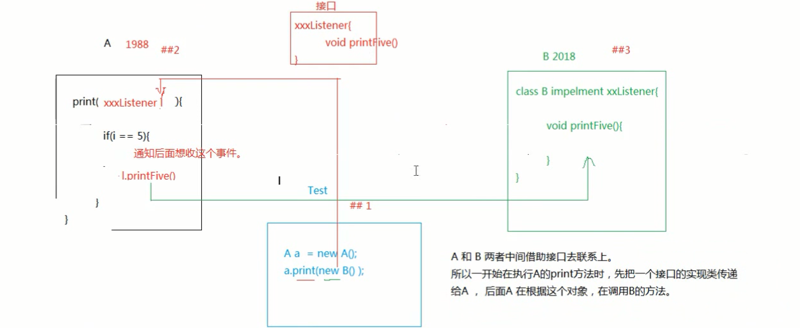

# Listener
>监听某一个事件的发生或者某个状态的改变.  
>实现机制:接口回调

## 接口回调  
---->多态

为了实现通用,不能在事先写好的框架代码中传入后来的类对象作为参数,因此在设计框架代码的一开始就设计了一种接口,在框架代码的方法传入的是定义好的接口实例.后来的开发者想要调用方法,只需要传入实现该接口的类的实例即可.这即是多态


## web监听器
>总共有8种监听器,划分成三种类型
1. 定义一个类,实现监听器接口
```java
public class MyServletContextListener implements ServletContextListener {

	//ServletContext初始化的时候调用
	public void contextDestroyed(ServletContextEvent arg0) {
		// TODO Auto-generated method stub
		System.out.println("ServletContext初始化了");
	}

	//ServletContext销毁的时候调用
	public void contextInitialized(ServletContextEvent arg0) {
		// TODO Auto-generated method stub
		System.out.println("ServletContext销毁了");
	}

}
```
2. 注册 || 配置监听器(在web.xml中)
```xml
<listener>
  	<listener-class>com.itheima.listener.MyServletContextListener</listener-class>
  </listener>
```
* 监听三个作用域创建和销毁
  pageContext
  * request   --HTTPServletRequest  **---ServletRequestListener[任务调度]**
    1. 创建:访问HTML,访问jsp,访问servlet(访问服务器上的资源)
    2. 销毁:服务器已经对这次请求作出响应结束
  * session   --httpSession         **--httpSessionListener[统计在线人数]**
    1. session的创建getSession方法的调用
    2. 超时/非正常关闭
        html:不会创建session
        jsp:会创建session
        servlet:只有调用getSession才会创建Session对象
 *  application   --ServletContext  ---ServletContextListener
    1. 创建:启动服务器
    2. 销毁:关闭服务器或者从服务器移除项目饿到时候
>主要监听后面三个作用域
* 监听三个作用域属性的状态变更
* 监听httpSession里面存值的状态变更


## 监听器的作用
1. ServletContextListener
   利用它在创建ServletContextListener的时候,
   * 完成自己想要的初始化工作
   * 执行自定义的任务调度
2. httpSessionListener
   统计在线人数 

### 监听三个 作用域属性状态变更的监听器
request -- ServletRequestAttributeListener
session -- HttpSessionAttributeListener
servletContext -- ServletContextAttributeListener

>可以监听在作用域中值  添加 | 替换 | 移除   的动作
分别是 setAttribute  setAttribute  removeAttribute


### 监听httpSession里面存值的状态变更
>这一类监听器不用注册.因此如果要使用该类监听器,必须要有类实现这些接口并重写接口里面的方法
* HttpSessionBindingListener
>对象和session绑定和解除绑定的动作
* **HttpSessionActivationListener[钝化,活化处理]**
>用于监听现在session中的值是钝化还是活化(序列化和反序列化)
实体类需要实现的两个接口:HttpSessionActivationListener  和  Serializable

* 钝化和活化的作用是什么
>session中的值可能会很多,并且有很长一段时间不用内存中的某个值,那么可以考虑先把session中的值先存储到硬盘上,等到需要使用的时候再拿到内存中,减轻内存的压力

* 如果让内存中session中的值在一段时间之后就钝化而不需要等到正常关闭服务器再进行钝化工作?
>做配置即可
1. 在Tomcat里面的conf/context.xml中
>对运行在该服务器上的所有项目生效
2. 在conf/Catalina/localhost/context.xml
>对localhost生效
3. 在自己的web项目中的META-INF/context.xml
>只对当前工程生效
```xml
<!--  maxIdleSwap="1"  一分钟不用就会被钝化-->
<!-- directory:钝化后的那个文件存放的位置 -->
<Context>
    <Manager className="org.apache.catalina.session.PersistentManager" maxIdleSwap="1">
        <Store className="org.apache.catalina.session.FileStore" directory="it315"/>
    </Manager>
</Context>

```