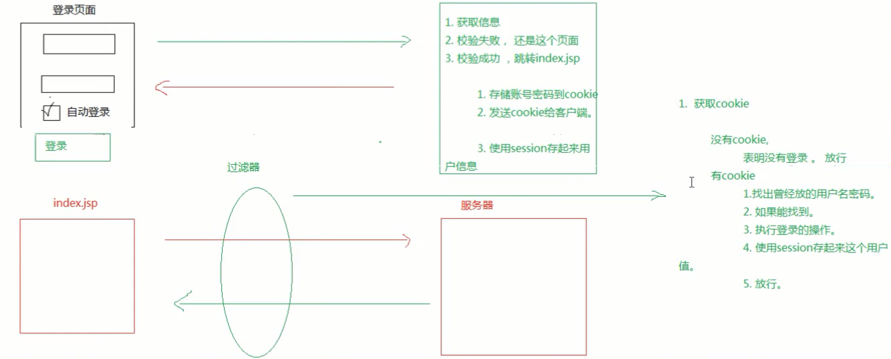

# 自动登录案例
需求


### 实现
1. 实现数据库
2. 搭建页面

### 核心实现点

* 使用cookie在第一次登陆成功时将用户名和密码以cookie的形式返回给客户端,如果直接访问index.jsp就会携带上用户名和密码,从而servlet完成自动登录,无须手动输入密码

  ```html   
  <c:if test="${not empty userBean }">
      欢迎您,${userBean.username }
  </c:if>
  <c:if test="${empty userBean }">
      欢迎您,游客.<a href="login.jsp">请登录</a>
  </c:if>
  ```

* java中在servlet中返回cookie

  ```java  
  
      try {
          String username = request.getParameter("username");
          String password = request.getParameter("password");
          String autologin = request.getParameter("auto_login");
  
          UserBean user = new UserBean();
          user.setUsername(username);
          user.setPassword(password);
  
          UserDao dao = new UserDaoImpl();
          UserBean userBean = dao.login(user);
  
          if(userBean != null){
              if("on".equals(autologin)){
                  Cookie cookie = new Cookie("auto_login",username+"#"+password);
                  cookie.setMaxAge(60*60*24*7);
                  //得到应用名称,即工程项目名称
                  cookie.setPath(request.getContextPath());
                  //返回cookie
                  response.addCookie(cookie);
              }
  
              request.getSession().setAttribute("userBean", userBean);
              response.sendRedirect("index.jsp");
          }else{
              request.getRequestDispatcher("login.jsp").forward(request, response);
          }
  
      } catch (SQLException e) {
          // TODO Auto-generated catch block
          e.printStackTrace();
      }
  ```

* 过滤器

  > 由浏览器在关闭以后,会话将消失,因此为了实现浏览器关闭后还能够实现自动登录的功能,因此要使用到过滤器,仅仅靠session是不够的

  ```java  
  try {
  			HttpServletRequest request = (HttpServletRequest) req;
  			UserBean userBean = (UserBean) request.getSession().getAttribute("userBean");
  			//如果session中有UserBean,表名这个回话还没有过期
  			if(userBean != null){
  				chain.doFilter(request, response);
  			}else{
  				//session失效,表名用户关闭了浏览器,这时候要看cookie了
  				//1.从请求中取出cookie
  				Cookie[] cookies = request.getCookies(); 
  				//2.cookie中包含多个键值对,按照key取出我们想要的键值对
  				Cookie cookie = CookieUtil.findCookie(cookies, "auto_login");
  				//3.如果cookie为空,表示第一次登录,放行
  				if(cookie == null){
  					chain.doFilter(request, response);
  				}else{
  					//如果cookie不为空,执行登录操作
  					
  						String value = cookie.getValue();
  						String username = value.split("#")[0];
  						String password = value.split("#")[1];
  						
  						UserBean user = new UserBean();
  						user.setUsername(username);
  						user.setPassword(password);
  						
  						UserDao dao = new UserDaoImpl();
  						userBean = dao.login(user);
  				}	
  			}
  		}catch (SQLException e) {
  			// TODO Auto-generated catch block
  			e.printStackTrace();
  			chain.doFilter(req, response);
  		}
  ```

  实现思路:

  1. 如果session有效,表明浏览器没有关闭,直接放行
  2. 如果session失效,表明用户把浏览器关了此时判断
     * 如果cookie为空,表明用户第一次登录,放行
     * 如果cookie不为空,表明用户曾经登录过,在Filter中执行登录操作,并把用户数据(账号和密码)存储到cookie中发给客户端,客户端下次访问的时候就会带着cookie
  3. 另外如果发生异常也要放行,将页面展示出来