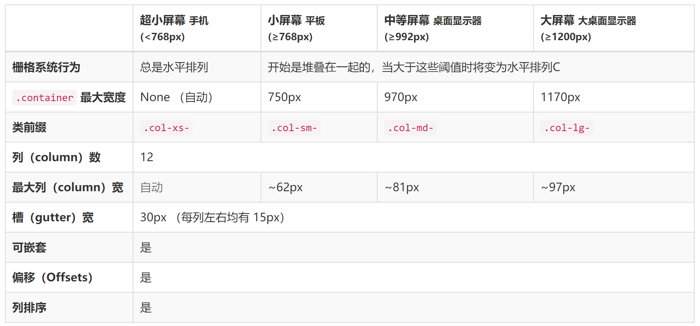

# bootstrap
*一种响应式前端框架*
* 有什么作用  
  复制粘贴，能够提高开发效率
* 什么是响应式页面  
  适应不同分辨率的设备，显示不同的样式，提高用户体验

## 入门
* 引入bootstrap核心css文件和js文件
  ```html
  <link rel="stylesheet" src="./css/bootstrap.css"/>
  <!-- JQuery必须要在bootstrap前引入，bootstrap依赖于JQuery -->
  <script type="tetx/javascript" src = "./js/jquery-1.11.0.js"></script>
  <script type="tetx/javascript" src = "./js/bootstrap.js"></script>
  ```

* 设置移动设备优先，确保缩放体验
  ```html
  <meta name="viewpoint" content = "width-device-width,initial-scale=1">
  ```
* 布局容器
  bootstrap需要为页面内容和栅格系统包裹一个.container容器  
  ```html
  .container类用于固定宽高并支持响应式布局的容器
  <div class=".containerss">
    ...
  </div>
```
  ```html
  .container-fluid 类用于100%宽高，占据全部视口的容器
  <div class="container-fluid">
    ...
  </div>
  ```

  ## 栅格系统
  *栅格系统通过一些列的行与列的组合来创建页面布局，我们的内容可以放在这些创建好的额布局中*
  ### 使用
  使用单一的.col-md-*栅格类就可以创建一个基本的栅格系统
  
  
  因为boostrap要考虑到屏幕分辨率的因素，所以对于不同的设备其栅格系统的参数是不同的
  

```html
栅格示例：
<div class = "container">
  <div class = "row">
    <div class = "col-md-12">
      一行为一个格子，这个格子占了12列
    </div>
  </div>
</div>
```

## 全局css样式
