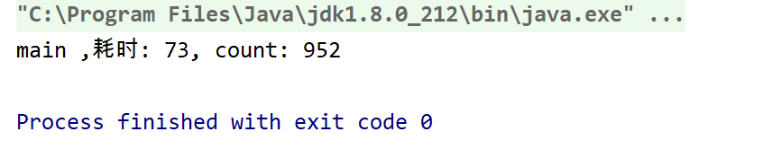
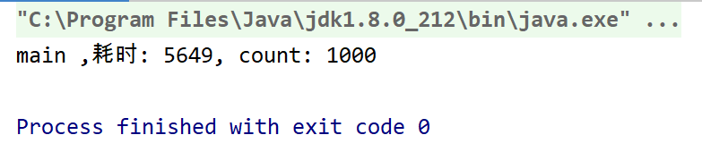
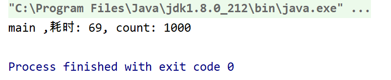
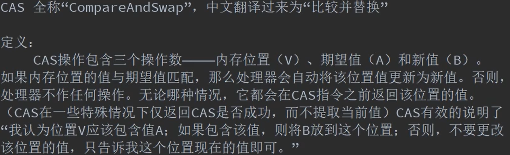
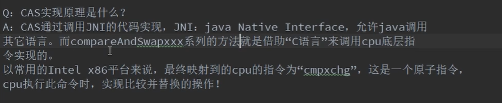
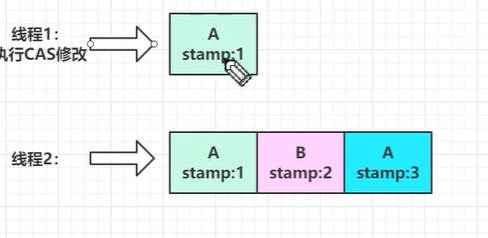

# CAS

### 1.演示案例:

100个用户访问某个网站,每个用户请求10次,网站统计总的请求次数

```java
import java.util.concurrent.CountDownLatch;
import java.util.concurrent.TimeUnit;

public class Demo {
    static int  count = 0;

    /**
     * @func 模拟用户请求,每个请求耗时五秒,网站统计用户到来的请求数
     * @throws InterruptedException
     * Q:结果中count不等于1000
     * A:count++操作经过jvm编译后变成了三个指令:
     * 1.将count取出赋值给A,A=count
     * 2.将A的值加一赋值给B,B= A+1
     * 3.将B的值赋值给count
     * 如果多个线程在某一时刻获得相同的A,那么相应的count值就会少1
     */
    public   static void request() throws InterruptedException {
        TimeUnit.MILLISECONDS.sleep(5);
        count ++;
    }

    public static void main(String[] args) throws InterruptedException {
        long startTime = System.currentTimeMillis();
        int threadize = 100;
        //设置栅栏,等到100个线程结束之后再执行后面的代码,100减到0
        CountDownLatch countDownLatch = new CountDownLatch(100);
        for (int i = 0; i <100 ; i++) {
            Thread t = new Thread(new Runnable() {
                @Override
                public void run() {
                    //每个用户请求10次网站
                    try {
                        for (int i = 0; i < 10; i++) {
                            request();
                        }
                    } catch (InterruptedException e) {
                        e.printStackTrace();
                    }finally {
                        countDownLatch.countDown();//减一
                    }

                }
            });
            t.start();
        }

        //100个线程结束之后再结束后面的代码,代码会在这里阻塞,直到100减到0才执行后面的代码
        countDownLatch.await();
        long endTime = System.currentTimeMillis();
        System.out.println(Thread.currentThread().getName()+ " ,耗时: "+(endTime - startTime)+", count: "+count);
    }
}

```

在没有对count加锁之前的执行结果是这样的:



count的值显然是不对的

对request方法加锁后结果是这样的:



结果虽然正确,但是耗时剧增,原因是锁的粒度太大,我们只需要对count加锁即可,因此要降低锁的粒度

如何做呢?

(每个线程)分以下三步:

1. 获取锁
2. 获取count的最新的值,记为LV
3. 判断LV是否等于A(期望值),如果相等,则将B的值(A+1)复制给count,并返回true,否则返回false,重复上述步骤
4. 释放锁


修改之后:

```java
import java.util.concurrent.CountDownLatch;
import java.util.concurrent.TimeUnit;

public class Demo2{
    static volatile int  count = 0;

    /**
     * @func 模拟用户请求,每个请求耗时五秒,网站统计用户到来的请求数
     * @throws InterruptedException
     * Q:结果中count不等于1000
     * A:count++操作经过jvm编译后变成了三个指令:
     * 1.将count取出赋值给A,A=count
     * 2.将A的值加一赋值给B,B= A+1
     * 3.将B的值赋值给count
     * 如果多个线程在某一时刻获得相同的A,那么相应的count值就会少1
     */
    public   static void request() throws InterruptedException {
        TimeUnit.MILLISECONDS.sleep(5);
       // count ++;
        int  expectCount;
        //若expectCount != count 则执行循环,不对count执行加1操作
        while(!compareAndSwap(expectCount = getCount(),expectCount+1));
    }

    /**
     *
     * @param expectCount 期望值
     * @param newCount 需要赋值给count的新值
     * @return
     */
    public static synchronized boolean compareAndSwap(int expectCount,int newCount){
        //判断count当前值是否等于count
        if(expectCount == getCount()){
            count  = newCount;
            return true;
        }
        return false;
    }

    public static int getCount(){
        return count;
    }
    public static void main(String[] args) throws InterruptedException {
        long startTime = System.currentTimeMillis();
        int threadize = 100;
        //设置栅栏,等到100个线程结束之后再执行后面的代码,100减到0
        CountDownLatch countDownLatch = new CountDownLatch(100);
        for (int i = 0; i <100 ; i++) {
            Thread t = new Thread(new Runnable() {
                @Override
                public void run() {
                    //每个用户请求10次网站
                    try {
                        for (int i = 0; i < 10; i++) {
                            request();
                        }
                    } catch (InterruptedException e) {
                        e.printStackTrace();
                    }finally {
                        countDownLatch.countDown();//减一
                    }

                }
            });
            t.start();
        }

        //100个线程结束之后再结束后面的代码,代码会在这里阻塞,直到100减到0才执行后面的代码
        countDownLatch.await();
        long endTime = System.currentTimeMillis();
        System.out.println(Thread.currentThread().getName()+ " ,耗时: "+(endTime - startTime)+", count: "+count);
    }
}
```

执行结果:



可以见到,结果正确,耗时大大减少

合理的加锁,不仅能够保证多线程执行结果的正确性,还能够减少大粒度锁带来的高耗时


### 2.CAS原理



JDK中使用了本地方法对CAS提供支持




Q:现代计算机动辄上百个核心,xmpxchg如何保证多核心下的线程安全?

A:系统底层会判断当前系统是否是多核心系统,如果是,就给总线加上锁,加锁成功之后会执行CAS操作,也就是说CAS的原子性是平台级别的


Q:什么是ABA问题?

A:CAS需要在操作值的时候检查值是否发生了变化,如果没有发生变化则更新.

但是如果一个值原来是A,线程连续进行了两次修改,即A-->B-->A,那么执行CAS操作时会发现值没有发生变化,误以为这个值从刚开始就没有被操作过,这显然是不对的.这就是ABA问题


Q:如何解决ABA问题
A:就简单的方法是给值加上一个版本号,每次值发生变化就修改它的版本号,CAS操作不仅会比较值是否相同也会对比版本号前后是否相同

JAVA中ABA问题的解决方案是:AtmoicStapedReference,主要包含一个对象引用以及一个可以自动更新的整数"stamp"的pair对象来解决ABA问题

比较期望引用和新值引用 && 比较期望引用的版本号和新值版本号(两个都一致才修改值)

