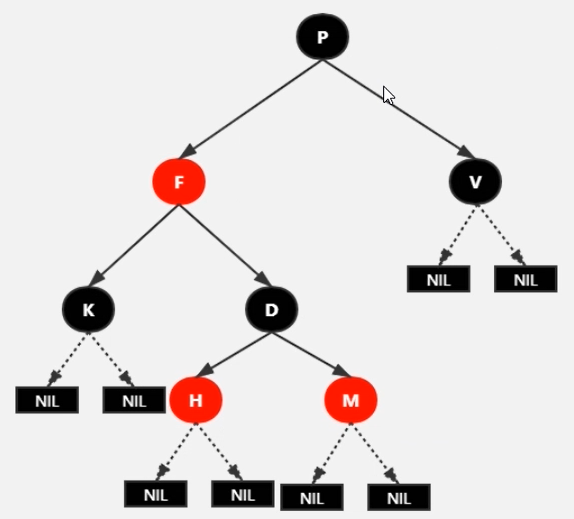
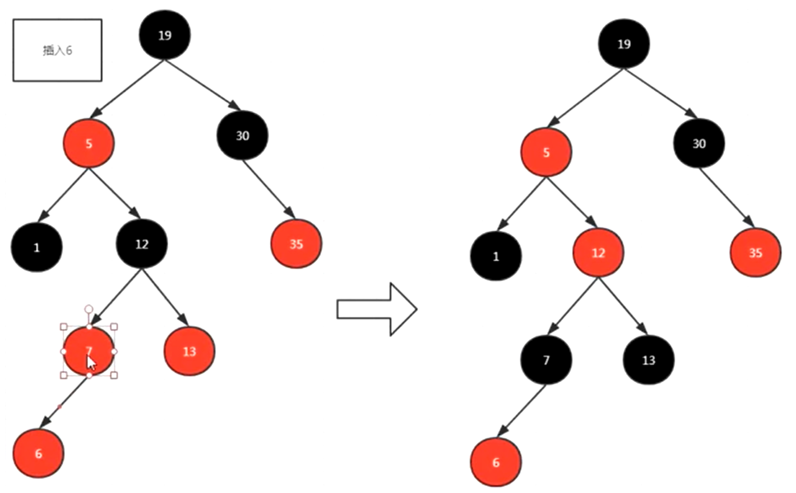
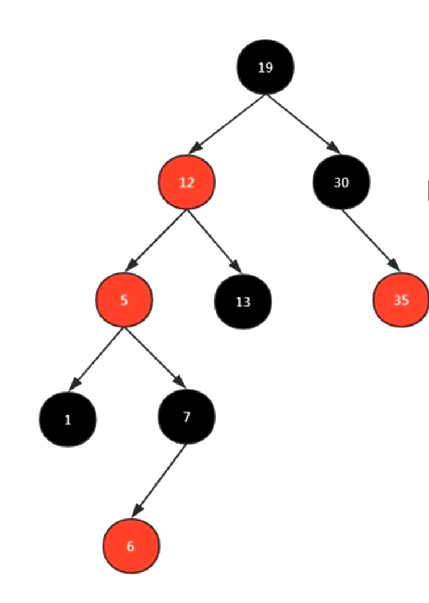
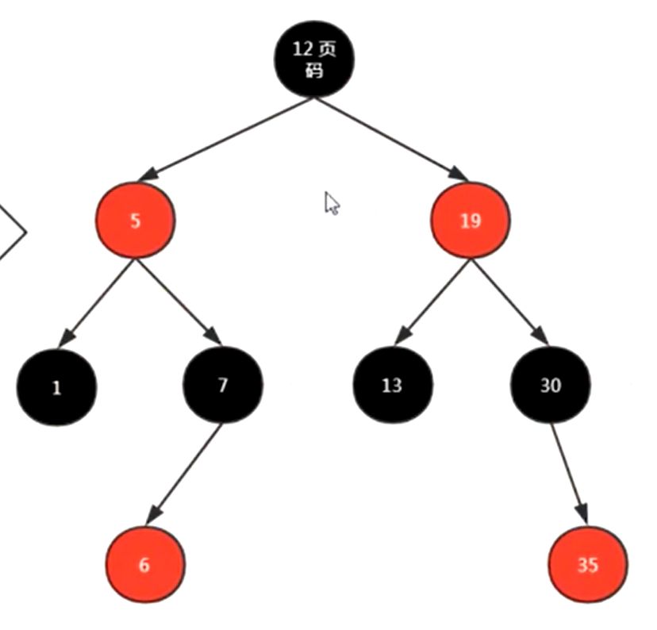
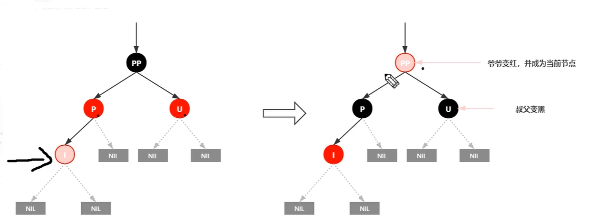
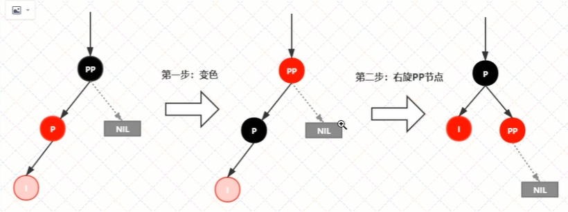
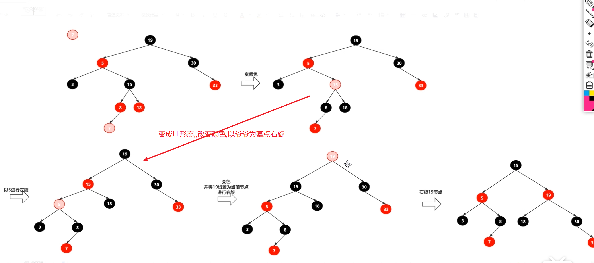

# 红黑树

常见的查找算法:

1. 暴力:遍历
2. 二分:有序
3. 哈希
4. 索引
5. 平衡树
6. B+树
7. 红黑树
8. 二叉搜索树


### 一.底层数据结构

特殊的二叉查找树(jdk1.8推出了红黑树)


### 二.红黑树的性质

1. 每个节点不是红色就是黑色

2. 根节点是黑色

3. 每个叶子节点是黑色

4. 每个红色节点的两个子节点是黑色,不能有两个红色节点相连

5. 任意一个节点到每个叶子节点的路径都包括相同数量的黑色节点,俗称"黑高"

   


### 三.红黑树的变换规则

所有插入的节点默认是红色,如果插入这个红色节点后打破了上述5个规则就进行变换,按照如下规则变换

1. 改变颜色:最简单,红变黑,黑变红

   变颜色的情况:

   * 当前节点的父亲是红色,且当前节点的叔叔节点也是红色
     * 把父亲节点和叔叔节点设置为黑色
     * 把爷爷节点设置为红色



1. 左旋

   当前节点的父节点是红色,叔叔节点是黑色,且当前节点在父节点的右边,左旋.

   **将以父节点为根节点的子树左旋,以父节点为基点**



1. 右旋

   当前节点的父节点是红色,叔叔节点是黑色,且当前节点在父节点的左边,右旋

   * 首先将父节点变成黑色,把爷爷节点变成红色
   * **将以爷爷节点作为根节点的树右旋,以爷爷节点做基点**




### 四.红黑树插入节点情景分析

1. 红黑树为空树

   直接将节点插入后,将其由红色变为黑色

2. 插入节点的key已经存在

   更新当前节点的值

3. 插入节点的父节点是黑色

   直接找到插入位置插入即可

4. 插入节点的父节点是红色

* 父节点红色,叔叔节点红色,爷爷节点黑色

  将父亲节点和叔叔节点变为黑色,爷爷节点变为红色



* (LL)父节点红色,叔叔节点为null或者黑色,插入节点在父节点的左边(**父节点是爷爷节点的左节点**)

  将父节点变为黑色,爷爷节点变为红色,以父节点为根节点右旋

  

* (LR)父节点为红色,叔叔节点不存在或者黑色,插入在父节点的右边(**父节点是爷爷节点的左节点**)

  * 以插入节点为根左旋
  * 将插入节点变为黑色,以插入节点为根节点右旋

  

  

* (RR)父节点红色,叔叔节点为null或者黑色,插入节点在父节点的右边(**父节点是爷爷节点的右节点**)

  将父节点变为黑色,爷爷节点变为红色,以父节点为根节点左旋

* (RL)父节点红色,叔叔节点为null或者黑色,插入节点在父节点的左边(**父节点是爷爷节点的右节点**)

  * 以插入节点为根右旋
  * 将插入节点变为黑色,以插入节点为根节点左旋


以下是一次总变换:




**总结**

```java
/**
     * 插入后需要修复平衡的情景:
     * |---情景1:红黑树为空树,将根节点染为黑色
     * |---情景2:插入节点的key已经存在,不需要处理
     * |---情景3:插入节点的父节点为黑色,不需要处理
     * |---情景4:插入节点的父节点为红色
     *      |---情景4.1:叔叔节点存在,且为红色,将父节点和叔叔节点染为黑色,将爷爷节点染为红色,以爷爷节点为当前节点,并进行下一轮操作
     *      |---情景4.2:叔叔节点不存在,或者为黑色,父节点在爷爷节点的左边
     *          |---4.2.1:插入节点在父节点的左边(LL),将父节点染为黑色,爷爷节点染为红色,以爷爷节点为基点右旋
     *          |---4.2.2:插入节点在父节点的右边(LR),先以父节点为基点左旋,指定父节点为当前节点进行下一轮操作
     *      |---情景4.3:叔叔节点不存在,或者为黑色,父节点在爷爷节点的右边
     *          |---4.3.1:插入节点在父节点的右边(RR),将父节点染为黑色,将爷爷节点染为红色,以爷爷节点为基点左旋
     *          |---4.3.2:插入节点在父节点的左边(RL),先以父节点为基点右旋,指定父节点为当前节点进行下一轮操作
     * @param node
     */
```

